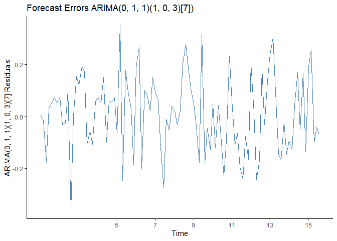
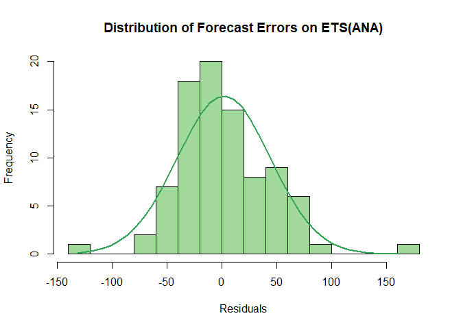
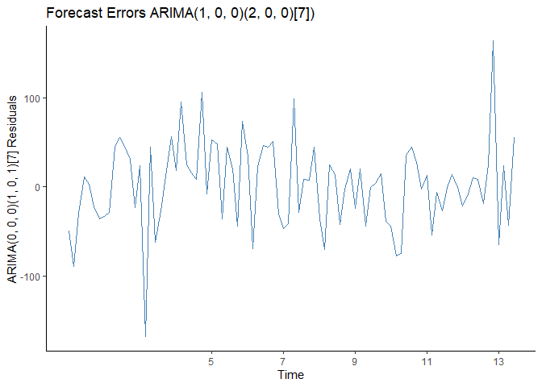

This is the R Notebook that will be utilised for the analysis, extrapolation and forecasting of lettuce demand for a fast food resturant in various locations. 

This report contains various sections:

  1. Data Importing
  2. Data Pre-Processing
  3. Lettuce Demand Forecasting
      a. Resturant 4904
      b. Resturant 12631
      c. Resturant 46673
      d. Resturant 20974
  4. Conclusion
      
The dataset used is provided by one of the largest fast-food restaurant chains in the US. It includes (1) transaction information such as menu items that were purchased and quantities of each item; (2) ingredient lists for individual menu items; (3) metadata on restaurants, including location, and store type. The data observation window is from early March, 2015 to 06/15/2015 and includes transactional data from 2 stores in Berkeley, CA and 2 stores in New York, NY.

The report aims to to forecast the daily demand of lettuce for the next two weeks (from 06/16/2015 to 06/29/2015) to help the managers make inventory replenishment decisions. This will be done through the use of Holt-Winters, ETS and ARIMA methods. Each will be compared with eachother to find an optimal forecasting method for a specific store.


## Data Importing
This section of code creates a working directory and imports each csv file provided and creates dataframes for each individual file


```r
## Set working directory to csv file folder
setwd("C:\\Users\\Jaume\\Documents\\ICBS - MSc Business Analytics\\Logistics & Supply Chain\\individual_assignment")

## Import each csv file
ingredients <- read.csv('ingredients.csv')
menu_items <- read.csv('menu_items.csv')
menuitem <- read.csv('menuitem.csv')
portion_uom_types <- read.csv('portion_uom_types.csv')
pos_ordersale <- read.csv('pos_ordersale.csv')
recipe_ingedient_assignments <- read.csv('recipe_ingredient_assignments.csv')
recipe_sub_recipe_assignments <- read.csv('recipe_sub_recipe_assignments.csv')
recipes <- read.csv('recipes.csv')
sub_recipe_ingr_assignments <- read.csv('sub_recipe_ingr_assignments.csv')
sub_recipes <- read.csv('sub_recipes.csv')
```


## Data Pre-Processing
The goal is to forecast demand for one specific ingredient: lettuce, for each of the four individual restaurants. The data has been provided in 10 different csvs and above each csv has been processed into a dataframe. This section aims at manipulating, processing and joining different dataframes so as to build a dataframe for each of the four resturants that has two columns; a column with the date (daily) and a second column with the amount of lettuce used (daily). The lettuce amount will be in ounces as the US, where these resturants are located, use the imperial system where the ounze measurement is relevant. 


```r
## Merge 
ingredients_merged <- merge(ingredients, portion_uom_types)

## Return row in ingredietns_merged displaying Lettuce ingredient by its IngredientId and in ounces
ingredients[ingredients$IngredientId == 27, ]
```

```
##                                         IngredientName
## 27 Lettuce                                            
##                      IngredientShortDescription IngredientId PortionUOMTypeId
## 27 Lettuce                                                27               15
```


```r
## Now, the exact quantity of lettuce from each recipe must be calculated
## For every recipe we will return the RecipeId which should be unique and the corresponding amount of Lettuce used in each one
total_recipe_lettuce <- recipe_ingedient_assignments[recipe_ingedient_assignments$IngredientId == 27, c(1, 3)]

## For every sub recipe we will return the RecipeId which should be unique and the corresponding amount of Lettuce used in each one
## This will be done in mulitple steps. Firstly, return rows in sub_recipe_ingr_assignments by its IngredientId and in ounces
lettuce_sub_recipe <- sub_recipe_ingr_assignments[sub_recipe_ingr_assignments$IngredientId == 27, ]

recipes_with_sub_recipe_lettuce <- inner_join(lettuce_sub_recipe, 
                                              recipe_sub_recipe_assignments,
                                              by = "SubRecipeId")

## The amount of of lettuce in each single subrecipe included in a recipe needs to be calculated. This is done buy multiplying the Factor by the Quantity and adding that to a created new row in recipes_with_sub_recipe_lettuce called Lettuce_Amount
recipes_with_sub_recipe_lettuce$Lettuce_Amount <- recipes_with_sub_recipe_lettuce$Quantity * recipes_with_sub_recipe_lettuce$Factor

## Since one recipe is allowed to have have multiple subrecipes it is important to group the individual SubRecipeId Lettuce_amount into a total Lettuce_Amount which corresponds to an individual RecipeId
total_sub_recipe_lettuce <- aggregate(cbind(Lettuce_Amount) ~ RecipeId, sum, data = recipes_with_sub_recipe_lettuce)
```


```r
## Here we will group both the total_sub_recipe_lettuce and total_recipe_lettuce data structures so as to find the total quantity of lettuce per recipe that each needs.
## This will be done in multiple steps. Firstly, the total_sub_recipe_lettuce columns need to be renamed
colnames(total_sub_recipe_lettuce) <- c('RecipeId', 'Quantity')

## Rowbinding of both total_sub_recipe_lettuce and total_recipe_lettuce data structures is done to merge them both
merged_total_lettuce <- rbind(total_recipe_lettuce, total_sub_recipe_lettuce)
final_total_lettuce_per_recipe <- aggregate(cbind(Quantity) ~ RecipeId, sum, data = merged_total_lettuce)

## We will create a csv file containing the total recipe per lettuce from the final_total_lettuce_per_recipe structure
write.csv(final_total_lettuce_per_recipe, file = 'total_lettuce_per_recipe.csv')
```


```r
## We have now determined the amount of lettuce needed per recipe. The next step is to take into account each item on the menu and ensure that in the future calculations we are only including data that has lettuce
## Inner joing menuitem on menu_items by Id and MenuItemId. The idea here is to merge both tables and pass finally connect it to final_total_lettuce_per_recipe by the RecipeId column
menuitem_1 <- inner_join(menuitem,
                       menu_items,
                       by = c('Id' = 'MenuItemId'))
menuitem_2 <- inner_join(menuitem_1,
                       final_total_lettuce_per_recipe,
                       by = 'RecipeId')

## Rename the last column (column 20) on menuitems_2 to be more understandable. The column will be renamed from Quantity.y to Lettuce_Quantity 
colnames(menuitem_2)[20] <- 'Lettuce_Quantity'
```


```r
## The menuitem_2 dataframe contains transaction information from March 5th, 2015 to June 15th, 2015. Each transaction now has a value for how much lettuce (in ounces) was involved. There is also a quantity value on each transaction that will need to be multiplied by the lettuce quantity
menuitem_2$Total_Lettuce_Quantity <- menuitem_2$Quantity.x * menuitem_2$Lettuce_Quantity
```

The process above has created a dataframe called 'menuitem_2' which has various features. Amongst the features their are the two desired features described in the introduction of this section. The total quantity of lettuce per day in each individual restuarant can now be calculated by aggregating on relevant columns and StoreNumbers.


```r
## The total quantity of lettuce per day in each individual restuarant can now be calculated by referencing the resturant store numbers 
store_4904 <- aggregate(cbind(Total_Lettuce_Quantity) ~ date, sum, data = menuitem_2[menuitem_2$StoreNumber == 4904, c(15, 21)])
store_12631 <- aggregate(cbind(Total_Lettuce_Quantity) ~ date, sum, data = menuitem_2[menuitem_2$StoreNumber == 12631, c(15,21)])
store_20974 <- aggregate(cbind(Total_Lettuce_Quantity) ~ date, sum, data = menuitem_2[menuitem_2$StoreNumber == 20974, c(15,21)])
store_46673 <- aggregate(cbind(Total_Lettuce_Quantity) ~ date, sum, data = menuitem_2[menuitem_2$StoreNumber == 46673, c(15,21)])

kable(list(head(store_4904, 10), head(store_12631, 10), head(store_20974, 10), head(store_46673, 10)),"html", caption = 'First 10 Days of Data for Store 4904, 12631, 20974 and 46673') %>%
  kable_styling()
```

<table class="kable_wrapper table" style="margin-left: auto; margin-right: auto;">
<caption>First 10 Days of Data for Store 4904, 12631, 20974 and 46673</caption>
<tbody>
  <tr>
   <td> 

<table>
 <thead>
  <tr>
   <th style="text-align:left;"> date </th>
   <th style="text-align:right;"> Total_Lettuce_Quantity </th>
  </tr>
 </thead>
<tbody>
  <tr>
   <td style="text-align:left;"> 15-03-13 </td>
   <td style="text-align:right;"> 176 </td>
  </tr>
  <tr>
   <td style="text-align:left;"> 15-03-14 </td>
   <td style="text-align:right;"> 182 </td>
  </tr>
  <tr>
   <td style="text-align:left;"> 15-03-15 </td>
   <td style="text-align:right;"> 347 </td>
  </tr>
  <tr>
   <td style="text-align:left;"> 15-03-16 </td>
   <td style="text-align:right;"> 400 </td>
  </tr>
  <tr>
   <td style="text-align:left;"> 15-03-17 </td>
   <td style="text-align:right;"> 406 </td>
  </tr>
  <tr>
   <td style="text-align:left;"> 15-03-18 </td>
   <td style="text-align:right;"> 382 </td>
  </tr>
  <tr>
   <td style="text-align:left;"> 15-03-19 </td>
   <td style="text-align:right;"> 324 </td>
  </tr>
  <tr>
   <td style="text-align:left;"> 15-03-20 </td>
   <td style="text-align:right;"> 192 </td>
  </tr>
  <tr>
   <td style="text-align:left;"> 15-03-21 </td>
   <td style="text-align:right;"> 274 </td>
  </tr>
  <tr>
   <td style="text-align:left;"> 15-03-22 </td>
   <td style="text-align:right;"> 370 </td>
  </tr>
</tbody>
</table>

 </td>
   <td> 

<table>
 <thead>
  <tr>
   <th style="text-align:left;"> date </th>
   <th style="text-align:right;"> Total_Lettuce_Quantity </th>
  </tr>
 </thead>
<tbody>
  <tr>
   <td style="text-align:left;"> 15-03-05 </td>
   <td style="text-align:right;"> 232 </td>
  </tr>
  <tr>
   <td style="text-align:left;"> 15-03-06 </td>
   <td style="text-align:right;"> 227 </td>
  </tr>
  <tr>
   <td style="text-align:left;"> 15-03-07 </td>
   <td style="text-align:right;"> 181 </td>
  </tr>
  <tr>
   <td style="text-align:left;"> 15-03-08 </td>
   <td style="text-align:right;"> 221 </td>
  </tr>
  <tr>
   <td style="text-align:left;"> 15-03-09 </td>
   <td style="text-align:right;"> 229 </td>
  </tr>
  <tr>
   <td style="text-align:left;"> 15-03-10 </td>
   <td style="text-align:right;"> 237 </td>
  </tr>
  <tr>
   <td style="text-align:left;"> 15-03-11 </td>
   <td style="text-align:right;"> 235 </td>
  </tr>
  <tr>
   <td style="text-align:left;"> 15-03-12 </td>
   <td style="text-align:right;"> 244 </td>
  </tr>
  <tr>
   <td style="text-align:left;"> 15-03-13 </td>
   <td style="text-align:right;"> 218 </td>
  </tr>
  <tr>
   <td style="text-align:left;"> 15-03-14 </td>
   <td style="text-align:right;"> 205 </td>
  </tr>
</tbody>
</table>

 </td>
   <td> 

<table>
 <thead>
  <tr>
   <th style="text-align:left;"> date </th>
   <th style="text-align:right;"> Total_Lettuce_Quantity </th>
  </tr>
 </thead>
<tbody>
  <tr>
   <td style="text-align:left;"> 15-03-06 </td>
   <td style="text-align:right;"> 4 </td>
  </tr>
  <tr>
   <td style="text-align:left;"> 15-03-10 </td>
   <td style="text-align:right;"> 0 </td>
  </tr>
  <tr>
   <td style="text-align:left;"> 15-03-13 </td>
   <td style="text-align:right;"> 29 </td>
  </tr>
  <tr>
   <td style="text-align:left;"> 15-03-16 </td>
   <td style="text-align:right;"> 6 </td>
  </tr>
  <tr>
   <td style="text-align:left;"> 15-03-17 </td>
   <td style="text-align:right;"> 8 </td>
  </tr>
  <tr>
   <td style="text-align:left;"> 15-03-18 </td>
   <td style="text-align:right;"> 4 </td>
  </tr>
  <tr>
   <td style="text-align:left;"> 15-03-20 </td>
   <td style="text-align:right;"> 164 </td>
  </tr>
  <tr>
   <td style="text-align:left;"> 15-03-21 </td>
   <td style="text-align:right;"> 112 </td>
  </tr>
  <tr>
   <td style="text-align:left;"> 15-03-22 </td>
   <td style="text-align:right;"> 168 </td>
  </tr>
  <tr>
   <td style="text-align:left;"> 15-03-23 </td>
   <td style="text-align:right;"> 222 </td>
  </tr>
</tbody>
</table>

 </td>
   <td> 

<table>
 <thead>
  <tr>
   <th style="text-align:left;"> date </th>
   <th style="text-align:right;"> Total_Lettuce_Quantity </th>
  </tr>
 </thead>
<tbody>
  <tr>
   <td style="text-align:left;"> 15-03-05 </td>
   <td style="text-align:right;"> 152 </td>
  </tr>
  <tr>
   <td style="text-align:left;"> 15-03-06 </td>
   <td style="text-align:right;"> 100 </td>
  </tr>
  <tr>
   <td style="text-align:left;"> 15-03-07 </td>
   <td style="text-align:right;"> 54 </td>
  </tr>
  <tr>
   <td style="text-align:left;"> 15-03-08 </td>
   <td style="text-align:right;"> 199 </td>
  </tr>
  <tr>
   <td style="text-align:left;"> 15-03-09 </td>
   <td style="text-align:right;"> 166 </td>
  </tr>
  <tr>
   <td style="text-align:left;"> 15-03-10 </td>
   <td style="text-align:right;"> 143 </td>
  </tr>
  <tr>
   <td style="text-align:left;"> 15-03-11 </td>
   <td style="text-align:right;"> 162 </td>
  </tr>
  <tr>
   <td style="text-align:left;"> 15-03-12 </td>
   <td style="text-align:right;"> 116 </td>
  </tr>
  <tr>
   <td style="text-align:left;"> 15-03-13 </td>
   <td style="text-align:right;"> 136 </td>
  </tr>
  <tr>
   <td style="text-align:left;"> 15-03-14 </td>
   <td style="text-align:right;"> 68 </td>
  </tr>
</tbody>
</table>

 </td>
  </tr>
</tbody>
</table>


## Lettuce Demand Forecasting
Now that each dataframe has been created, the process of identifying a timeseries trends, visualising key timeseries features, identifying good forecasting methods, optimizing the forecasting methods and finally forecasting out-of-sample lettuce demand for 14 days can begin.

This section will take a look at the entire process mentioned above. A detailed analysis will be written out for the forecast process beloning to StoreNumber 4904. The other forecasts for the three following stores, 12631, 44673 and 20974, have been completed in the same way as the forecast for StoreNumber 4904 but won't have such a detailed description. The code for stores 12631, 44673 and 20974 is commented and should faciliate the reader through the process. 


## Resturant 4904: Berkeley, California
The dataframe created for StoreNumber 4904 has two columns, a date column and a lettuce quantity column. This type of dataframe can be converted into a time series object in R using the ts() function. A timeseries is a series of data points ordered in time. In a time series, time is often the independent variable and the goal is usually to make a forecast for the future, exactly what we are trying to do here. The ts() function converts a numeric vector into a R time series object. 


```r
## The daily quantity of lettuce used by each of the four stores, 2 in Berkley and 2 in New York, has been determined. Using this historic data the next step is to forecast the daily amounf of lettuce needed 
## Focusing on the first StoreNumber (4904) we must create the timeseries that will be used for the forecasting
ts_store_4904 <- ts(store_4904[, 2], frequency = 7, start = c(03, 13))
autoplot(ts_store_4904, main="Lettuce Demand in Store 4904 ", xlab="Time Horizon",
         ylab="Lettuce Quantity (ounces)", col = "darkblue", frame.plot = FALSE)+
  theme(panel.grid.major = element_blank(), panel.grid.minor = element_blank(), 
        panel.background = element_blank(), axis.line = element_line(colour = "black"))
```


### STL Decomposition and Visualisation
The best way to see if there are any seasonal, cyclical or trends in the time series the data must be visualised. This is completed using STL decomposition. STL is a versatile and robust method for decomposing time series. STL is an acronym for “Seasonal and Trend decomposition using Loess”, while Loess is a method for estimating nonlinear relationships. 

The bar on the seasonal pattern is larger than the grey bar on the data panel. This indicates that the seasonal signal is large relative to the variation in the data. The trend panel is the largest box compared to the data and seasonal boxes, this indicates that the variation attributed to the trend is much smaller than the seasonal components and is consequently only a small part of the variation in the data series. The variation attributed to the trend is considerably smaller than the stochastic component (the remainders). As such, we can deduce that these data do not exhibit a trend.

The ggsubseriesplot creates mini time plots for each season. Here, the mean for each season is shown as a blue horizontal line. This stores lettuce demand seems to be highest on Sunday, and throughout the beginning of the week, dropping demand for lettuce significantly on Friday and Saturday. 


```r
## Viusalising the data, with its seasonal, trend and remainder component. 
plot(stl(ts_store_4904, s.window = "period"), main="Seasonal Decomposition of Time Series Store 4904") ## 
```


```r
## Various other ggplot2 package plots are used to gain understanding of the data
ggsubseriesplot(ts_store_4904, main = 'Time Series Sub-Series Plot',
                ylab = 'Lettuce Quantity (in Ounces)', xlab = 'Time Horizon') +
  theme(panel.grid.major = element_blank(), panel.grid.minor = element_blank(), 
        panel.background = element_blank(), axis.line = element_line(colour = "black"))
```


```r
ggAcf(ts_store_4904, main = 'Autocorrelation Function (ACF) on Time Series') +
  theme(panel.grid.major = element_blank(), panel.grid.minor = element_blank(), 
        panel.background = element_blank(), axis.line = element_line(colour = "black"))
```


### Initial Holt-Winters and ETS Functions 
The Holt-Winters functions is the first forecasting tool that will be used to evaluate the data at hand. It is quite powerful and it can handle complicated seasonal patterns by finding the central value, and the adding in the effects of slope and seasonality. The model is able to predict the future value by computing the combined effect of the preceeding influences. The model requires several parameters: one for each smoothing (ɑ, β, γ), the length of a season, and the number of periods in a season.

A Holt-Winters function with default parameters, other than beta = FALSE, which forces the function to use exponential smoothing on the time series. The exponential smoothing forecasts a prediction in such a way that it is a weighted sum of past observations. The model explicitly uses an exponentially decreasing weight for past observations.

An ETS model is also created in order to be able to compare and contrast the Holt-Winters against another model. This is done so as to have more results and come up with a model that is better able to forecast the demand of lettuce. ETS reffers to the Error, Trend and Seasonal components of a time series, these form exponential smoothing methods. Each term can be combined either additively, multiplicatively, or be left out of the model through the "N" = none, "A" = additive, "M" = multiplicative and "Z" = automatically parameters of the model.

Initially, a "ZZZ" model is created in order to have R automatically fit the Error, Trend and Seasonality values of the time series. This initial model will return letters which will be used throughout the remaineder of the sotre numbher 4904 forecast process.

The Holt-Winters model, the fitted ETS model and the actual time series are plotted for visual interpretability.


```r
## Initial Holt-Winters with exponential smoothing
HW_store_4904 <- HoltWinters(ts_store_4904, beta = FALSE)

## Initial ETS model with automatic fitting for the E, T, S
ets_store_4904 <- ets(ts_store_4904, model = 'ZZZ')
ets_store_4904 ## Automatic model concludes a A,N,A model is best for this data
```

```
## ETS(A,N,A) 
## 
## Call:
##  ets(y = ts_store_4904, model = "ZZZ") 
## 
##   Smoothing parameters:
##     alpha = 0.1774 
##     gamma = 1e-04 
## 
##   Initial states:
##     l = 326.7586 
##     s = 6.7708 45.7372 57.1993 34.777 34.4967 -89.1465
##            -89.8345
## 
##   sigma:  44.3439
## 
##      AIC     AICc      BIC 
## 1163.638 1166.257 1189.177
```

```r
plot(HW_store_4904, main="Holt-Winters - ETS (A,N,A) in-sample performance", 
     xlab="Time Horizon", ylab="Lettuce Demand (Ounces)", lty = 1, col = "black", frame.plot = FALSE)
lines(fitted(ets_store_4904), col = "blue", lty = 2)
legend("bottom", legend=c("Actual","HW", "ETS"), col=c("black", "red", "blue"), box.lty=0, lty=c(1,1,2), cex=0.8)
```


The results of the inital Holt-Winters is a exponential smooithing without trend and with additive seasonal component. The smoothing constraints outputed by the model are ɑ = 0.136, β = 0 and γ = 0.222. The Alpha value determines the weighting of past data values in setting the baseline (magnitude) for the forecast, with higher values of Alpha leading to the increased weight being given to the most recent observations, while lower values of Alpha implying a more uniform weighting. Beta determines the degree to which recent data trends should be valued compared to older trends when making the forecast. Gamma is the seasonal component of the forecast and the higher the value, the more weight is given to the most recent the seasonal component is weighed. 

All parameters have low results concluding that the estimate at the current time interval is based on a uniform weighting of observations and less weight is designated to the most recent observations. 

The ETS model returns an additive error level and seasonal component. For the optimal values of the smoothing parameters it provides a value for Alpha = 0.177 and Gamma = 1e-04. The ETS model also returns inital states values, one for the level and various for the start values of seasonal components. The smoothing parameters and returned intial states will be utilised to initate a future Holt-Winters model.


```r
## Second Holt-Winters with improved parameters using the ets model above. Alpha, Gamma, and Initial States determined 
HW2_store_4904 <- HoltWinters(ts_store_4904, beta = FALSE, optim.start = c(alpha = 0.1774, gamma = 0.0), l.start = 326.75, s.start = c(6.77, 45.73, 57.19, 34.77, 34.49, -89.14, -89.83))
HW2_store_4904
```

```
## Holt-Winters exponential smoothing without trend and with additive seasonal component.
## 
## Call:
## HoltWinters(x = ts_store_4904, beta = FALSE, l.start = 326.75,     s.start = c(6.77, 45.73, 57.19, 34.77, 34.49, -89.14, -89.83),     optim.start = c(alpha = 0.1774, gamma = 0))
## 
## Smoothing parameters:
##  alpha: 0.08694902
##  beta : FALSE
##  gamma: 0.5843394
## 
## Coefficients:
##          [,1]
## a  309.954388
## s1  36.407625
## s2  -4.835727
## s3 -34.334080
## s4 -82.992994
## s5 -90.218532
## s6  53.537529
## s7  19.355894
```

```r
##  RMSE for the first and second Holt-Winters model
sqrt(HW_store_4904$SSE/(length(ts_store_4904)-2))
```

```
## [1] 45.87948
```

```r
sqrt(HW2_store_4904$SSE / (length(ts_store_4904)-2))
```

```
## [1] 57.27851
```

```r
## Sum of square erros / by number of observation-2 (we used first two for initilisation)

## Accuracy
accuracy_ets_store_4904_k <- data.frame(accuracy(ets_store_4904))
accuracy_ets_store_4904_k %>%  kable(caption = "Training Set Accuracy of ETS", align = 'c') %>%  kable_styling(full_width = F)
```

<table class="table" style="width: auto !important; margin-left: auto; margin-right: auto;">
<caption>Training Set Accuracy of ETS</caption>
 <thead>
  <tr>
   <th style="text-align:left;">   </th>
   <th style="text-align:center;"> ME </th>
   <th style="text-align:center;"> RMSE </th>
   <th style="text-align:center;"> MAE </th>
   <th style="text-align:center;"> MPE </th>
   <th style="text-align:center;"> MAPE </th>
   <th style="text-align:center;"> MASE </th>
   <th style="text-align:center;"> ACF1 </th>
  </tr>
 </thead>
<tbody>
  <tr>
   <td style="text-align:left;"> Training set </td>
   <td style="text-align:center;"> -1.462834 </td>
   <td style="text-align:center;"> 42.19116 </td>
   <td style="text-align:center;"> 32.03027 </td>
   <td style="text-align:center;"> -2.441996 </td>
   <td style="text-align:center;"> 10.99704 </td>
   <td style="text-align:center;"> 0.7089194 </td>
   <td style="text-align:center;"> -0.0322976 </td>
  </tr>
</tbody>
</table>

The second Holt-Winters model is created with the initial states and smoothing parameters from the ETS model. This is done to again, increase the number of models tested, in order to fit the data better and come up with a closer optimal final model.

These models are compares using the root-mean-square error. The lower the RMSE, the better and the lowest RMSE will be selected as the model moving forward. The first Holt-Winters has an RMSE of 45.879 and the second Holt-Winters, with initial starts, does worse with and RMSE of 57.278. The best model is the ETS one, achieving an RMSE called through the accuracy() function of 42.191.

Both the ETS model and the first Holt-Winters model will be used on the training data. The accuracy test will be repeated and a final model selected.

### Training and Test set
When building out forecasts it is essential to utilise a training set, a subset to train the model and a test set, a subset to test the model. The test set must meet two conditions: it must belarge enough to yield statistically meaningful results and it must be representative of the data set as a whole. The reason this is done is to avoid look-ahead bias. Look-ahead bias is a type of bias that occurs a forecast relies on data or information that was not yet available or known during the time period being studied and would lead to inaccurate results for generalizing the lettuce demand. 

The test set needs to be the most recent part of the data as the idea is to simulate a production environment, where after the model is trained it would be evaluated on data it had not seen. Throughout this forecasting project an 80:20 split is used. That is, 80% of the time series data will be attributed to the training set and the most recent 20% will be used for the test set.


```r
## Training and test sets
## When building out your forecast it is important to take your data set and divide it into training and test sets. To avoid biased evaluations we must ensure that training sets contains observations that occurred prior to the ones in validation sets.
## I will use the standard practise 80:20 split, that is, 80% of the dataset will be used for training and the remainding 20% will be used to evaluate the model, a test set

## Size of training set is 80% of time series (76 days)
training_ts_store_4904 <- ts(store_4904[1:(nrow(store_4904) * 0.8), 2], frequency = 7)
length(training_ts_store_4904)
```

```
## [1] 76
```

```r
## Size of test set is 20% of time series (19 days)
test_ts_store_4904 <- store_4904[((nrow(store_4904) * 0.8) + 1) : nrow(store_4904), 2]
length(test_ts_store_4904)
```

```
## [1] 19
```

```r
length(test_ts_store_4904) + length(training_ts_store_4904) ## Length of training set and test set combined
```

```
## [1] 95
```

```r
length(ts_store_4904) ## Length of time series 
```

```
## [1] 95
```

### Creating, Forecasting and Visualizing Holt-Winters on Training Set
The initial Holt-Winters model will now be trained on in-sample data and it will forecast 19 days past the last day of the training data. This is done using the forecast()function which takes the model and a argument, h, the number of periods it should forecast. 

The data is visualised using autoplot(), a ggplot function. The fitted model is shown in red and the forecast is represented in blue. The alpha argument on the forecast() function specifies the prediction level. It is set by default to alpha = 0.05, which is a 95% prediction interval and will be used throughout this project. This is a sensible and widely used prediction interval. An alpha of 0.05 means that the Holt-Winters model will estimate the upper and lower values around the forecast where there is a only a 5% chance that the real value will not be in that range. Put another way, the 95% prediction interval suggests that there is a high likelihood that the real observation will be within the range. This interval is shown in the light blue shaded regions. An 85% confidence interval is the darker blue shaded region. While the darkest blue solid line is the mean value of the forecasted data points.  


```r
## Creating Holt-Winters filtering of the training time series for store 4904. Beta is set to false to force exponential smoothing 
training_HW_store_4904 <- HoltWinters(training_ts_store_4904, beta = FALSE)
forecast_HW1_store_4904 <- forecast(training_HW_store_4904, h = 19)

autoplot(forecast_HW1_store_4904, main = 'Training Set Holt-Winters Forecast', 
         ylab = 'Lettuce Quantity (in Ounces)', xlab = 'Time Horizon', xlab = 'Time Horizon') + 
  autolayer(fitted(forecast_HW1_store_4904), series = 'Fitted', na.rm=TRUE) +
  scale_x_continuous(breaks = seq(0, 16, by = 2)) +
  scale_y_continuous(breaks = c(150, 200, 250, 300, 350, 400, 450)) +
  theme(panel.grid.major = element_blank(), panel.grid.minor = element_blank(), 
        panel.background = element_blank(), axis.line = element_line(colour = "black"))
```


### Creating, Forecasting and Visualizing ETS(ANA) on Training Set
The initial ETS model with a model paramet = 'ANA', a	 model	 with	 an	additive	level	and	seasonal component, will now be trained on in-sample data and it will forecast 19 days past the last day of the training data. This is done using the forecast()function which takes the model and a argument, h, the number of periods it should forecast. 

The data is visualised using autoplot(), a ggplot function. The fitted model is shown in red and the forecast is represented in blue. The alpha argument on the forecast() function specifies the prediction level. It is set by default to alpha = 0.05, which is a 95% prediction interval and will be used throughout this project. This is a sensible and widely used prediction interval. An alpha of 0.05 means that the Holt-Winters model will estimate the upper and lower values around the forecast where there is a only a 5% chance that the real value will not be in that range. Put another way, the 95% prediction interval suggests that there is a high likelihood that the real observation will be within the range. This interval is shown in the light blue shaded regions. An 85% confidence interval is the darker blue shaded region. While the darkest blue solid line is the mean value of the forecasted data points.  


```r
## ETS models use maximum likelihood, the probability of the data arising from the specified model. ETS automatically chooses the best type of model. Convenient for forecasting timeseries that have trends or seasonality. Lets explore...
training_ets_store_4904 <- ets(training_ts_store_4904, model = 'ANA')
forecast_ets_store_4904 <- forecast(training_ets_store_4904, h = 19)

autoplot(forecast_ets_store_4904, main = 'Training Set ETS(A,N,A) Forecast',
         ylab = 'Lettuce Quantity (in Ounces)', xlab = 'Time Horizon', xlab = 'Time Horizon') + 
  autolayer(fitted(forecast_ets_store_4904), series = 'Fitted', na.rm=TRUE) +
  scale_x_continuous(breaks = seq(0, 16, by = 2))+
  scale_y_continuous(breaks = c(150, 200, 250, 300, 350, 400, 450)) +
  theme(panel.grid.major = element_blank(), panel.grid.minor = element_blank(),
        panel.background = element_blank(), axis.line = element_line(colour = "black"))
```


### Out-Of-Sample Model Comparison
Using the accuracy() function with an argument "f", for forecast, that holds an object with class "forecast" and a second argument "x" containing actual values of the same length as object, both models are evaluated individually. 

The performance metric used for evaluation is the RMSE. By looking at the results of each accuracy test, it can be concluded that the ETS(ANA) model (RMSE = 55.959) is superior to the Holt-Winters model (RMSE = 79.378) as it has a lower RMSE on the out-of-sample data. The ETS model not only fits the data better, but it also seems to predict it better. Because the ETS model has both a better in-sample and out-of-sample RMSE score and preformance it is selected as the better model and will be tested again later, during the ARIMA forecast process.


```r
## Accuracy Comparison of ETS and Holt-Winter
accuracy_ets_HW_4904 <- rbind(accuracy(forecast_HW1_store_4904, test_ts_store_4904),
                              accuracy(forecast_ets_store_4904, test_ts_store_4904))

accuracy_ets_HW_4904_k <- data.frame(accuracy_ets_HW_4904, row.names = c('Train', 'Test', 'Train_2', 'Test_2'))

accuracy_ets_HW_4904_k %>%  kable(caption = "Accuracy of Best ETS and HW", align = 'c') %>%  kable_styling(full_width = F) %>%
  pack_rows("Holt-Winters", 1, 2) %>%
  pack_rows("ETS(A,N,A)", 3, 4) 
```

<table class="table" style="width: auto !important; margin-left: auto; margin-right: auto;">
<caption>Accuracy of Best ETS and HW</caption>
 <thead>
  <tr>
   <th style="text-align:left;">   </th>
   <th style="text-align:center;"> ME </th>
   <th style="text-align:center;"> RMSE </th>
   <th style="text-align:center;"> MAE </th>
   <th style="text-align:center;"> MPE </th>
   <th style="text-align:center;"> MAPE </th>
   <th style="text-align:center;"> MASE </th>
   <th style="text-align:center;"> ACF1 </th>
  </tr>
 </thead>
<tbody>
  <tr grouplength="2"><td colspan="8" style="border-bottom: 1px solid;"><strong>Holt-Winters</strong></td></tr>
<tr>
   <td style="text-align:left; padding-left: 2em;" indentlevel="1"> Train </td>
   <td style="text-align:center;"> -2.548379 </td>
   <td style="text-align:center;"> 45.58731 </td>
   <td style="text-align:center;"> 34.84900 </td>
   <td style="text-align:center;"> -2.391619 </td>
   <td style="text-align:center;"> 11.67495 </td>
   <td style="text-align:center;"> 0.5615975 </td>
   <td style="text-align:center;"> -0.1221758 </td>
  </tr>
  <tr>
   <td style="text-align:left; padding-left: 2em;" indentlevel="1"> Test </td>
   <td style="text-align:center;"> 35.044007 </td>
   <td style="text-align:center;"> 79.37825 </td>
   <td style="text-align:center;"> 59.58024 </td>
   <td style="text-align:center;"> 8.879674 </td>
   <td style="text-align:center;"> 18.78438 </td>
   <td style="text-align:center;"> 0.9601457 </td>
   <td style="text-align:center;"> NA </td>
  </tr>
  <tr grouplength="2"><td colspan="8" style="border-bottom: 1px solid;"><strong>ETS(A,N,A)</strong></td></tr>
<tr>
   <td style="text-align:left; padding-left: 2em;" indentlevel="1"> Train_2 </td>
   <td style="text-align:center;"> -3.960539 </td>
   <td style="text-align:center;"> 41.26204 </td>
   <td style="text-align:center;"> 31.63586 </td>
   <td style="text-align:center;"> -3.438702 </td>
   <td style="text-align:center;"> 10.98139 </td>
   <td style="text-align:center;"> 0.5098172 </td>
   <td style="text-align:center;"> -0.0893617 </td>
  </tr>
  <tr>
   <td style="text-align:left; padding-left: 2em;" indentlevel="1"> Test_2 </td>
   <td style="text-align:center;"> 34.049448 </td>
   <td style="text-align:center;"> 55.95950 </td>
   <td style="text-align:center;"> 44.43286 </td>
   <td style="text-align:center;"> 10.551570 </td>
   <td style="text-align:center;"> 14.25775 </td>
   <td style="text-align:center;"> 0.7160432 </td>
   <td style="text-align:center;"> NA </td>
  </tr>
</tbody>
</table>

### Final ETS Model
The final ETS(ANA) model is trained on the entire time series relating to store number 4904. This is done in order to give the most accurate 14 day lettuce demand forecast for the store. Again, the forecast() function is used, this time with an "h" argument of 14. 

The ETS model and the forecast is presented visually below.


```r
## The ETS model is supieror to the Holt-Winter model because ME, RMSE, MAE, MAPE, and MASE are all lower when comparing the models. The ETS model will be trained on all the data and finally used to forecast the 14 day period (06/16/2015 to 06/29/2015)
final_ets_store_4904 <- forecast(ets_store_4904, h = 14)

final_ets_store_4904_k <- data.frame(final_ets_store_4904, 
                                     row.names = c('16/06/15', '17/06/15', '18/06/15', '19/06/15', '20/06/15', '21/06/15', '22/06/15',
                                                   '23/06/15', '24/06/15', '25/06/15', '26/06/15', '27/06/15', '28/06/15', '29/06/15'))
final_ets_store_4904_k %>%  kable(caption = "Final 14 Day ETS Forecast", align = 'c') %>%  kable_styling(full_width = F)
```

<table class="table" style="width: auto !important; margin-left: auto; margin-right: auto;">
<caption>Final 14 Day ETS Forecast</caption>
 <thead>
  <tr>
   <th style="text-align:left;">   </th>
   <th style="text-align:center;"> Point.Forecast </th>
   <th style="text-align:center;"> Lo.80 </th>
   <th style="text-align:center;"> Hi.80 </th>
   <th style="text-align:center;"> Lo.95 </th>
   <th style="text-align:center;"> Hi.95 </th>
  </tr>
 </thead>
<tbody>
  <tr>
   <td style="text-align:left;"> 16/06/15 </td>
   <td style="text-align:center;"> 359.2945 </td>
   <td style="text-align:center;"> 302.4655 </td>
   <td style="text-align:center;"> 416.1235 </td>
   <td style="text-align:center;"> 272.3820 </td>
   <td style="text-align:center;"> 446.2069 </td>
  </tr>
  <tr>
   <td style="text-align:left;"> 17/06/15 </td>
   <td style="text-align:center;"> 347.8354 </td>
   <td style="text-align:center;"> 290.1187 </td>
   <td style="text-align:center;"> 405.5521 </td>
   <td style="text-align:center;"> 259.5654 </td>
   <td style="text-align:center;"> 436.1055 </td>
  </tr>
  <tr>
   <td style="text-align:left;"> 18/06/15 </td>
   <td style="text-align:center;"> 308.8660 </td>
   <td style="text-align:center;"> 250.2751 </td>
   <td style="text-align:center;"> 367.4569 </td>
   <td style="text-align:center;"> 219.2589 </td>
   <td style="text-align:center;"> 398.4731 </td>
  </tr>
  <tr>
   <td style="text-align:left;"> 19/06/15 </td>
   <td style="text-align:center;"> 212.2648 </td>
   <td style="text-align:center;"> 152.8125 </td>
   <td style="text-align:center;"> 271.7171 </td>
   <td style="text-align:center;"> 121.3403 </td>
   <td style="text-align:center;"> 303.1892 </td>
  </tr>
  <tr>
   <td style="text-align:left;"> 20/06/15 </td>
   <td style="text-align:center;"> 212.9511 </td>
   <td style="text-align:center;"> 152.6498 </td>
   <td style="text-align:center;"> 273.2525 </td>
   <td style="text-align:center;"> 120.7282 </td>
   <td style="text-align:center;"> 305.1741 </td>
  </tr>
  <tr>
   <td style="text-align:left;"> 21/06/15 </td>
   <td style="text-align:center;"> 336.5967 </td>
   <td style="text-align:center;"> 275.4580 </td>
   <td style="text-align:center;"> 397.7353 </td>
   <td style="text-align:center;"> 243.0932 </td>
   <td style="text-align:center;"> 430.1002 </td>
  </tr>
  <tr>
   <td style="text-align:left;"> 22/06/15 </td>
   <td style="text-align:center;"> 336.8785 </td>
   <td style="text-align:center;"> 274.9129 </td>
   <td style="text-align:center;"> 398.8440 </td>
   <td style="text-align:center;"> 242.1103 </td>
   <td style="text-align:center;"> 431.6466 </td>
  </tr>
  <tr>
   <td style="text-align:left;"> 23/06/15 </td>
   <td style="text-align:center;"> 359.2945 </td>
   <td style="text-align:center;"> 296.5138 </td>
   <td style="text-align:center;"> 422.0751 </td>
   <td style="text-align:center;"> 263.2798 </td>
   <td style="text-align:center;"> 455.3092 </td>
  </tr>
  <tr>
   <td style="text-align:left;"> 24/06/15 </td>
   <td style="text-align:center;"> 347.8354 </td>
   <td style="text-align:center;"> 284.2501 </td>
   <td style="text-align:center;"> 411.4207 </td>
   <td style="text-align:center;"> 250.5901 </td>
   <td style="text-align:center;"> 445.0807 </td>
  </tr>
  <tr>
   <td style="text-align:left;"> 25/06/15 </td>
   <td style="text-align:center;"> 308.8660 </td>
   <td style="text-align:center;"> 244.4861 </td>
   <td style="text-align:center;"> 373.2459 </td>
   <td style="text-align:center;"> 210.4055 </td>
   <td style="text-align:center;"> 407.3265 </td>
  </tr>
  <tr>
   <td style="text-align:left;"> 26/06/15 </td>
   <td style="text-align:center;"> 212.2648 </td>
   <td style="text-align:center;"> 147.1000 </td>
   <td style="text-align:center;"> 277.4295 </td>
   <td style="text-align:center;"> 112.6038 </td>
   <td style="text-align:center;"> 311.9257 </td>
  </tr>
  <tr>
   <td style="text-align:left;"> 27/06/15 </td>
   <td style="text-align:center;"> 212.9511 </td>
   <td style="text-align:center;"> 147.0108 </td>
   <td style="text-align:center;"> 278.8915 </td>
   <td style="text-align:center;"> 112.1041 </td>
   <td style="text-align:center;"> 313.7982 </td>
  </tr>
  <tr>
   <td style="text-align:left;"> 28/06/15 </td>
   <td style="text-align:center;"> 336.5967 </td>
   <td style="text-align:center;"> 269.8898 </td>
   <td style="text-align:center;"> 403.3035 </td>
   <td style="text-align:center;"> 234.5773 </td>
   <td style="text-align:center;"> 438.6160 </td>
  </tr>
  <tr>
   <td style="text-align:left;"> 29/06/15 </td>
   <td style="text-align:center;"> 336.8785 </td>
   <td style="text-align:center;"> 269.4129 </td>
   <td style="text-align:center;"> 404.3440 </td>
   <td style="text-align:center;"> 233.6988 </td>
   <td style="text-align:center;"> 440.0581 </td>
  </tr>
</tbody>
</table>

```r
autoplot(final_ets_store_4904, main = 'Final 14 Day ETS (A,N,A) Forecast', 
         ylab = 'Lettuce Quantity (in Ounces)', xlab = 'Time Horizon', xlab = 'Time Horizon') + 
  autolayer(fitted(final_ets_store_4904), series = 'Fitted', na.rm=TRUE) +
  scale_x_continuous(breaks = seq(0, 22, by = 2)) + 
  theme(panel.grid.major = element_blank(), panel.grid.minor = element_blank(), 
        panel.background = element_blank(), axis.line = element_line(colour = "black")) +
  scale_y_continuous(breaks = c(100, 150, 200, 250, 300, 350, 400, 450, 500, 550))
```


### Forecast Further Improvements
The ETS model that has been used and plotted now needs to be examined in more detail in order to determine if further improvements may be made. There are varuious steps and plots that need to be studied in order to come to a conclusion. Firstly, the checkresiduals() function sees if the residuals from the time series model look like white noise. White noise occurs when the variables are independent and identically distributed with a mean of zero. This means that all variables have the same variance σ^2^ and each value has a zero correlation with all other values in the series. The residuals from a time series forecast model should ideally be white noise as this means that all of the signal information in the time series has been harnessed by the model in order to make predictions. All that is left is the random fluctuations that cannot be modeled.

There are various methods to see if the residuals from the forecast model are indeed white nosie. By looking at the residuals plot, shown by the checkresiduals() function and then plotted again for better interpretability, it seems that the forecast errors have a constant variance and a mean of 0. This statement is validated further by examining the histogram. The histogram plot shows the forecast errors with an overlaid normal curve that has a mean of zero and roughly the same distribution as the forecast errors.  

The Ljung-Box	test statistic considers the first "h" autocorrelations values together. A significant test (small p-value) indicates the data are probably not white noise. It is a way to test for the absence of serial autocorrelation and we desire a small p-value in order to conclude our model is sufficiently forecasted. The test is perfomed on lags 1 - 20 and the the null hypothesis is the independence of the time series. The Box.test() results in a test statistic of 26.507 and a p-value of 0.1497. These are large values and the null hypotheisis of indipenditely distributed forecast errors is accepted. 

The autocorrelation plot (ACF)is a visual way to show serial correlation in data that changes over time and will be the final test used to see if the residuals are white noise. The plot goes hand in hand with the Ljung-Box test. Using ggplots, ggACF() function, lags 1 - 19 are visually displayed. Autocorrelation is where an error at one point in time travels to a subsequent point in time. The blue lines are based on the sampling distribution for autocorrelation assuming the data is white noise. Any spike between the blue lines should be ignored as they are not statistically significant. Spikes out of the blue lines might indicate something interesting in the data that could be used to build a forecasting analysis. Obsebserving this ACF plot allows us to see that only one lag (lag = 12) is significant as it touches the blue lines. Out of the first 20 lags, one is expected to exceed the 95% confidence interval marked by the blue lines, and one lag does just that and this is attributed to randomness.


```r
## Ljung-Box Test
Box.test(final_ets_store_4904$residuals, lag = 20, type = 'Ljung-Box')
```

```
## 
## 	Box-Ljung test
## 
## data:  final_ets_store_4904$residuals
## X-squared = 26.507, df = 20, p-value = 0.1497
```

```r
## These plots are descriptive but they can be improved to increase interpretability by plotting and optimising each one individually
## Lets focus on the residuals plot in order to determine if they have constant variance (desired)
autoplot(final_ets_store_4904$residuals, main = 'Forecast Errors ETS (A,N,A)', ylab = 'ETS (A,N,A) Residuals', col = 'steelblue') + 
  scale_x_continuous(breaks = seq(5, 22, by = 2)) + 
  theme(panel.grid.major = element_blank(), panel.grid.minor = element_blank(), panel.background = element_blank(), axis.line = element_line(colour = "black"))
```


```r
## Next lets look at the ACF plot
ggAcf(final_ets_store_4904$residuals, main = 'Autocorrelation Function (ACF) on ETS (A,N,A) Residuals') + 
  theme(panel.grid.major = element_blank(), panel.grid.minor = element_blank(), panel.background = element_blank(), axis.line = element_line(colour = "black")) + 
  scale_x_continuous(breaks = seq(1, 22, by = 2))
```


```r
## Histogram of residuals
h <- hist(final_ets_store_4904$residuals, breaks = 20, col = '#a1d99b', main = 'Distribution of Forecast Errors on ETS(ANA)', ylab = 'Residuals')
xfit<-seq(min(final_ets_store_4904$residuals),max(final_ets_store_4904$residuals),length=40)
yfit<-dnorm(xfit,mean=mean(final_ets_store_4904$residuals),sd=sd(final_ets_store_4904$residuals))
yfit <- yfit*diff(h$mids[1:2])*length(final_ets_store_4904$residuals)
lines(xfit, yfit, col="#31a354", lwd=2)
```


The four tests above help conclude that the ETS(ANA) model is an suficient predictive model with no possible further improvments when trying to predict the lettuce demand for store number 4904.

### ARIMA Forecast Models
The next step in the project is to develop and ARIMA model that is able to forecast lettuce demand. The ARIMA model will then be compared with the final ETS model above to determine what the truest and most accurate forecast model is. ARIMA stands for AutoRegressive Integrated Moving Average. It is a class of model that captures a suite of different standard temporal structures in time series data. The "AR" represents autoregression: a model that uses the dependent relationship between an observation and some number of lagged observations. The "I" is the integrated part: the use of differencing of raw observations (e.g. subtracting an observation from an observation at the previous time step) in order to make the time series stationary. The "MA" is the moving average: a model that uses the dependency between an observation and a residual error from a moving average model applied to lagged observations.

Each part listed above is a parameter in the ARIMA model and these parameters need to be estimated and determined. Test such as the ADF,  augmented Dickey–Fuller, test tests the null hypothesis that a unit root is present in a time series sample. The KPSS, or  Kwiatkowski–Phillips–Schmidt–Shin, tests are used for testing a null hypothesis that an observable time series is stationary around a deterministic trend against the alternative of a unit root. The Phillips–Perron (PP) Test is a modification of the Dickey Fuller test, and corrects for autocorrelation and heteroscedasticity in the errors. A unit root isa stochastic trend in a time series, sometimes called a “random walk with drift”; If a time series has a unit root, it shows a systematic pattern that is unpredictable. The tests listed above help determine if the unit root is present.

The ndiffs() function estimate the number of differences required to make a given time series stationary. It uses a unit root test to determine the number of differences required for time series x to be made stationary. The nsdiffs() function estimates the number of differences required to make a given time series stationary. It uses a seasonal unit root tests to determine the number of seasonal differences required for time series x to be made stationary.

The outlined tests are completed below in order to determine any trends that might or might not have to be taken into account in the ARIMA model.


```r
## Arima Model
## Testing if timeseries of store is stationary
adf.test(ts_store_4904) ## Augmented Dickey–Fuller (ADF) t-statistic test to find if the series has a unit root (a series with a trend line will have a unit root and result in a large p-value)
```

```
## 
## 	Augmented Dickey-Fuller Test
## 
## data:  ts_store_4904
## Dickey-Fuller = -5.8332, Lag order = 4, p-value = 0.01
## alternative hypothesis: stationary
```

```r
kpss.test(ts_store_4904, null = 'Trend') ## Kwiatkowski-Phillips-Schmidt-Shin (KPSS) tests he null hypothesis of trend stationarity (a low p-value will indicate a signal that is not trend stationary, has a unit root) 
```

```
## 
## 	KPSS Test for Trend Stationarity
## 
## data:  ts_store_4904
## KPSS Trend = 0.12855, Truncation lag parameter = 3, p-value = 0.08232
```

```r
pp.test(ts_store_4904)
```

```
## 
## 	Phillips-Perron Unit Root Test
## 
## data:  ts_store_4904
## Dickey-Fuller Z(alpha) = -53.838, Truncation lag parameter = 3, p-value
## = 0.01
## alternative hypothesis: stationary
```

```r
ndiffs(ts_store_4904)
```

```
## [1] 0
```

```r
nsdiffs(ts_store_4904)
```

```
## [1] 1
```

Because its level and variance look constant over the time horizon, the time series looks to be a trend stationary in its mean and variance. It has also been determined that the time series has a seasonal component. This information will be utilised and the first order differnece will be computed in order to make the time series stationary in both the trend and seasonal components. This last bit of information is determined using the nsdiff() function which outputs a 1 when there is a seasonal unit root.

The differntiated time series for store 4904 is plotted below. The AFC and PACF will be analysed to gain further insight into how to construct the ARIMA model. The time series is differntiated because a time series with a constant mean, variance, and autocorrelation, i.e. a stationary one, is much easier to work with - since future values of the series become more predictable. The first difference, which is what is executed below, the function is returing the difference between a value and the one for the time period immediately previous to it.


```r
## Differencing is a way of making a time series stationary; this means that you remove any systematic patterns such as trend and seasonality from the data
diff_ts_store_4904 <- diff(ts_store_4904, lag = frequency(ts_store_4904), differences = 1)
autoplot(diff_ts_store_4904, main = 'Differentiated Time Series', ylab = 'Residuals', xlab = 'Time Horizon') + 
  theme(panel.grid.major = element_blank(), panel.grid.minor = element_blank(), panel.background = element_blank(), axis.line = element_line(colour = "black"))
```


### Differentiating 
Looking at the ACF plot, the autocorrelation seems to disapeer continously. Especially after lag 8 where it seems to vanish. A relative order of the non-seasonal MA component could be q ≤ 6. It is interesting to note that the ACF seems to decay in a sinosodial method leading to a possible non-seasonal AR component (p ≤ 2).

The PACF, on the contrary, does not seem to disapeer exponentially, a seasonal AR part can be ignored (P = 0). The order of the seasonal MA component can be selected to be Q = 1 because of the three spikes at the start of the PACF plot that pass the significane lines. 

Various ARIMA models with different structures will be examined below in order to determine the optimal one for forecast.


```r
acf(diff_ts_store_4904, lag.max = 100, main = "Autocorrelation Function of Seasonal Differenced Time Series", frame.plot = FALSE) 
```


```r
pacf(diff_ts_store_4904, lag.max = 100, main = " Partial Autocorrelation Function of Seasonal Differenced Time Series", frame.plot = FALSE)
```


```r
## Initial auto.arima model that finds 'best model' 
auto.arima(ts_store_4904, trace = TRUE, ic = 'bic', approximation = FALSE) 
```

```
## 
##  ARIMA(2,0,2)(1,1,1)[7] with drift         : Inf
##  ARIMA(0,0,0)(0,1,0)[7] with drift         : 975.1199
##  ARIMA(1,0,0)(1,1,0)[7] with drift         : 971.3568
##  ARIMA(0,0,1)(0,1,1)[7] with drift         : 955.3112
##  ARIMA(0,0,0)(0,1,0)[7]                    : 970.7546
##  ARIMA(0,0,1)(0,1,0)[7] with drift         : 979.2737
##  ARIMA(0,0,1)(1,1,1)[7] with drift         : Inf
##  ARIMA(0,0,1)(0,1,2)[7] with drift         : Inf
##  ARIMA(0,0,1)(1,1,0)[7] with drift         : 971.4688
##  ARIMA(0,0,1)(1,1,2)[7] with drift         : Inf
##  ARIMA(0,0,0)(0,1,1)[7] with drift         : 952.4019
##  ARIMA(0,0,0)(1,1,1)[7] with drift         : Inf
##  ARIMA(0,0,0)(0,1,2)[7] with drift         : Inf
##  ARIMA(0,0,0)(1,1,0)[7] with drift         : 967.1891
##  ARIMA(0,0,0)(1,1,2)[7] with drift         : 957.6589
##  ARIMA(1,0,0)(0,1,1)[7] with drift         : 954.2797
##  ARIMA(1,0,1)(0,1,1)[7] with drift         : 951.5078
##  ARIMA(1,0,1)(0,1,0)[7] with drift         : 980.8004
##  ARIMA(1,0,1)(1,1,1)[7] with drift         : Inf
##  ARIMA(1,0,1)(0,1,2)[7] with drift         : Inf
##  ARIMA(1,0,1)(1,1,0)[7] with drift         : 972.1851
##  ARIMA(1,0,1)(1,1,2)[7] with drift         : Inf
##  ARIMA(2,0,1)(0,1,1)[7] with drift         : 954.5253
##  ARIMA(1,0,2)(0,1,1)[7] with drift         : 954.8311
##  ARIMA(0,0,2)(0,1,1)[7] with drift         : 953.327
##  ARIMA(2,0,0)(0,1,1)[7] with drift         : 951.185
##  ARIMA(2,0,0)(0,1,0)[7] with drift         : 976.554
##  ARIMA(2,0,0)(1,1,1)[7] with drift         : Inf
##  ARIMA(2,0,0)(0,1,2)[7] with drift         : Inf
##  ARIMA(2,0,0)(1,1,0)[7] with drift         : 968.2869
##  ARIMA(2,0,0)(1,1,2)[7] with drift         : Inf
##  ARIMA(3,0,0)(0,1,1)[7] with drift         : 955.6256
##  ARIMA(3,0,1)(0,1,1)[7] with drift         : 960.0243
##  ARIMA(2,0,0)(0,1,1)[7]                    : 948.2249
##  ARIMA(2,0,0)(0,1,0)[7]                    : 972.1143
##  ARIMA(2,0,0)(1,1,1)[7]                    : 951.1026
##  ARIMA(2,0,0)(0,1,2)[7]                    : 950.8132
##  ARIMA(2,0,0)(1,1,0)[7]                    : 963.8844
##  ARIMA(2,0,0)(1,1,2)[7]                    : 954.2687
##  ARIMA(1,0,0)(0,1,1)[7]                    : 953.3361
##  ARIMA(3,0,0)(0,1,1)[7]                    : 952.4749
##  ARIMA(2,0,1)(0,1,1)[7]                    : 950.5061
##  ARIMA(1,0,1)(0,1,1)[7]                    : 947.412
##  ARIMA(1,0,1)(0,1,0)[7]                    : 976.3683
##  ARIMA(1,0,1)(1,1,1)[7]                    : Inf
##  ARIMA(1,0,1)(0,1,2)[7]                    : Inf
##  ARIMA(1,0,1)(1,1,0)[7]                    : 967.7704
##  ARIMA(1,0,1)(1,1,2)[7]                    : Inf
##  ARIMA(0,0,1)(0,1,1)[7]                    : 954.3844
##  ARIMA(1,0,2)(0,1,1)[7]                    : 950.8088
##  ARIMA(0,0,0)(0,1,1)[7]                    : 951.2728
##  ARIMA(0,0,2)(0,1,1)[7]                    : 951.6668
##  ARIMA(2,0,2)(0,1,1)[7]                    : 953.6076
## 
##  Best model: ARIMA(1,0,1)(0,1,1)[7]
```

```
## Series: ts_store_4904 
## ARIMA(1,0,1)(0,1,1)[7] 
## 
## Coefficients:
##          ar1      ma1     sma1
##       0.9442  -0.7642  -0.8873
## s.e.  0.0677   0.1092   0.1537
## 
## sigma^2 estimated as 2101:  log likelihood=-464.75
## AIC=937.5   AICc=937.98   BIC=947.41
```

### Manual ARIMA Functions
The next step is to utilise the information the differentiated ACF and PACF plots have provided along with the best models the auto.arima() function has provided in order to create multiple ARIMA models that will be used to forecast the lettuce demand and compared with each other using the accuracy() function. 

ARIMA modes have 3 parameters "p", "d" and "q". The "p" parameter is the number of lag observations included in the model, also called the lag order. The "d" parameter is the number of times that the raw observations are differenced, also called the degree of differencing. The "q" parameter is the size of the moving average window, also called the order of moving average. These are represented as such: ARIMA(p,d,q). ARIMA models are also capable of modelling a wide range of seasonal data and this is represented with the "P", "D" and "Q" parameters. Which represent exactly the same as their respective lowercase parameters do, except it is for the seasonal component. 

All the tests above, along with the best model of the auto.arima() should be a possible form or variation of ARIMA(p,0,q)(P,1,Q). The section below tests variations of the possible base form.


```r
## The best model is determined to be ARIMA(1,0,1)(0,1,1)[7] 
arima1_store_4904 <- Arima(ts_store_4904, order = c(1, 0 ,0), seasonal = list(order = c(0, 1, 1), period = 7))
arima2_store_4904 <- Arima(ts_store_4904, order = c(1, 0 ,1), seasonal = list(order = c(0, 1, 1), period = 7))
arima3_store_4904 <- Arima(ts_store_4904, order = c(1, 0 ,2), seasonal = list(order = c(0, 1, 1), period = 7))
arima4_store_4904 <- Arima(ts_store_4904, order = c(1, 0 ,3), seasonal = list(order = c(0, 1, 1), period = 7))
arima5_store_4904 <- Arima(ts_store_4904, order = c(1, 0 ,4), seasonal = list(order = c(0, 1, 1), period = 7))
arima6_store_4904 <- Arima(ts_store_4904, order = c(1, 0 ,5), seasonal = list(order = c(0, 1, 1), period = 7))
arima7_store_4904 <- Arima(ts_store_4904, order = c(1, 0 ,6), seasonal = list(order = c(0, 1, 1), period = 7))
arima8_store_4904 <- Arima(ts_store_4904, order = c(0, 0 ,1), seasonal = list(order = c(0, 1, 1), period = 7))
arima9_store_4904 <- Arima(ts_store_4904, order = c(0, 0 ,3), seasonal = list(order = c(0, 1, 1), period = 7))
arima10_store_4904 <- Arima(ts_store_4904, order = c(0, 0 ,5), seasonal = list(order = c(0, 1, 1), period = 7))
arima11_store_4904 <- Arima(ts_store_4904, order = c(0, 0 ,7), seasonal = list(order = c(0, 1, 1), period = 7))
```

The forecast function is used on each ARIMA model and used with a 14 number period forecast


```r
## 14 day ARIMA forecast
forecast_arima1_store_4904 <- forecast(arima1_store_4904, h = 14)
forecast_arima2_store_4904 <- forecast(arima2_store_4904, h = 14)
forecast_arima3_store_4904 <- forecast(arima3_store_4904, h = 14)
forecast_arima4_store_4904 <- forecast(arima4_store_4904, h = 14)
forecast_arima5_store_4904 <- forecast(arima5_store_4904, h = 14)
forecast_arima6_store_4904 <- forecast(arima6_store_4904, h = 14)
forecast_arima7_store_4904 <- forecast(arima7_store_4904, h = 14)
forecast_arima8_store_4904 <- forecast(arima8_store_4904, h = 14)
forecast_arima9_store_4904 <- forecast(arima9_store_4904, h = 14)
forecast_arima10_store_4904 <- forecast(arima9_store_4904, h = 14)
forecast_arima11_store_4904 <- forecast(arima9_store_4904, h = 14)
```

### In-Sample Comparison
Using the accuracy() function with an argument "f", for forecast, that holds an object with class "forecast" and no second argument, containing evaluates the "forecast" object training set accuracy measures of the forecasts based on f["x"]-fitted(f).

The performance metric used for evaluation is the RMSE. By looking at the results of each one, the lowest RMSE is from ARIMA7 (38.76), while ARIMA6 and ARIMA5 are next two best with RMSE scores of 41.01 and 41.52 respectively. The best three ARIMA models will be improved and visually displayed.


```r
## Accuracy stores Training Sets
accuracy_arima_4904 <- rbind(accuracy(forecast_arima1_store_4904), accuracy(forecast_arima2_store_4904), accuracy(forecast_arima3_store_4904),
           accuracy(forecast_arima4_store_4904), accuracy(forecast_arima5_store_4904), accuracy(forecast_arima6_store_4904),
           accuracy(forecast_arima7_store_4904), accuracy(forecast_arima8_store_4904), accuracy(forecast_arima9_store_4904),
           accuracy(forecast_arima10_store_4904), accuracy(forecast_arima11_store_4904))

accuracy_arima_4904_k <- data.frame(accuracy_arima_4904, 
                                     row.names = c('ARIMA(1,0,0)(0,1,1)', 'ARIMA(1,0,1)(0,1,1)', 'ARIMA(1,0,2)(0,1,1)',
                                                   'ARIMA(1,0,3)(0,1,1)', 'ARIMA(1,0,4)(0,1,1)', 'ARIMA(1,0,5)(0,1,1)',
                                                   'ARIMA(1,0,6)(0,1,1)', 'ARIMA(0,0,1)(0,1,1)', 'ARIMA(0,0,3)(0,1,1)',
                                                   'ARIMA(0,0,5)(0,1,1)','ARIMA(0,0,7)(0,1,1)'))

accuracy_arima_4904_k %>%  kable(caption = "Accuracy of ARIMA Model", align = 'c') %>%  kable_styling(full_width = F)
```

<table class="table" style="width: auto !important; margin-left: auto; margin-right: auto;">
<caption>Accuracy of ARIMA Model</caption>
 <thead>
  <tr>
   <th style="text-align:left;">   </th>
   <th style="text-align:center;"> ME </th>
   <th style="text-align:center;"> RMSE </th>
   <th style="text-align:center;"> MAE </th>
   <th style="text-align:center;"> MPE </th>
   <th style="text-align:center;"> MAPE </th>
   <th style="text-align:center;"> MASE </th>
   <th style="text-align:center;"> ACF1 </th>
  </tr>
 </thead>
<tbody>
  <tr>
   <td style="text-align:left;"> ARIMA(1,0,0)(0,1,1) </td>
   <td style="text-align:center;"> -3.5168678 </td>
   <td style="text-align:center;"> 47.06256 </td>
   <td style="text-align:center;"> 33.81302 </td>
   <td style="text-align:center;"> -2.839186 </td>
   <td style="text-align:center;"> 11.53530 </td>
   <td style="text-align:center;"> 0.7483768 </td>
   <td style="text-align:center;"> -0.0622338 </td>
  </tr>
  <tr>
   <td style="text-align:left;"> ARIMA(1,0,1)(0,1,1) </td>
   <td style="text-align:center;"> -0.9749887 </td>
   <td style="text-align:center;"> 43.35704 </td>
   <td style="text-align:center;"> 30.87064 </td>
   <td style="text-align:center;"> -1.475590 </td>
   <td style="text-align:center;"> 10.31033 </td>
   <td style="text-align:center;"> 0.6832535 </td>
   <td style="text-align:center;"> -0.0758337 </td>
  </tr>
  <tr>
   <td style="text-align:left;"> ARIMA(1,0,2)(0,1,1) </td>
   <td style="text-align:center;"> -1.1233676 </td>
   <td style="text-align:center;"> 43.60544 </td>
   <td style="text-align:center;"> 31.72584 </td>
   <td style="text-align:center;"> -1.476476 </td>
   <td style="text-align:center;"> 10.50023 </td>
   <td style="text-align:center;"> 0.7021815 </td>
   <td style="text-align:center;"> -0.0070168 </td>
  </tr>
  <tr>
   <td style="text-align:left;"> ARIMA(1,0,3)(0,1,1) </td>
   <td style="text-align:center;"> -0.8994696 </td>
   <td style="text-align:center;"> 43.03021 </td>
   <td style="text-align:center;"> 31.26748 </td>
   <td style="text-align:center;"> -1.404716 </td>
   <td style="text-align:center;"> 10.38860 </td>
   <td style="text-align:center;"> 0.6920368 </td>
   <td style="text-align:center;"> -0.0140520 </td>
  </tr>
  <tr>
   <td style="text-align:left;"> ARIMA(1,0,4)(0,1,1) </td>
   <td style="text-align:center;"> -1.3894364 </td>
   <td style="text-align:center;"> 41.52092 </td>
   <td style="text-align:center;"> 31.17684 </td>
   <td style="text-align:center;"> -1.453847 </td>
   <td style="text-align:center;"> 10.22265 </td>
   <td style="text-align:center;"> 0.6900308 </td>
   <td style="text-align:center;"> 0.0346087 </td>
  </tr>
  <tr>
   <td style="text-align:left;"> ARIMA(1,0,5)(0,1,1) </td>
   <td style="text-align:center;"> -1.3745679 </td>
   <td style="text-align:center;"> 41.01599 </td>
   <td style="text-align:center;"> 30.65817 </td>
   <td style="text-align:center;"> -1.441955 </td>
   <td style="text-align:center;"> 10.08978 </td>
   <td style="text-align:center;"> 0.6785512 </td>
   <td style="text-align:center;"> 0.0288637 </td>
  </tr>
  <tr>
   <td style="text-align:left;"> ARIMA(1,0,6)(0,1,1) </td>
   <td style="text-align:center;"> -1.4553374 </td>
   <td style="text-align:center;"> 38.76575 </td>
   <td style="text-align:center;"> 29.25771 </td>
   <td style="text-align:center;"> -1.374295 </td>
   <td style="text-align:center;"> 9.59764 </td>
   <td style="text-align:center;"> 0.6475550 </td>
   <td style="text-align:center;"> 0.0055590 </td>
  </tr>
  <tr>
   <td style="text-align:left;"> ARIMA(0,0,1)(0,1,1) </td>
   <td style="text-align:center;"> -3.6250193 </td>
   <td style="text-align:center;"> 47.57062 </td>
   <td style="text-align:center;"> 34.32185 </td>
   <td style="text-align:center;"> -2.911506 </td>
   <td style="text-align:center;"> 11.69128 </td>
   <td style="text-align:center;"> 0.7596384 </td>
   <td style="text-align:center;"> 0.0287719 </td>
  </tr>
  <tr>
   <td style="text-align:left;"> ARIMA(0,0,3)(0,1,1) </td>
   <td style="text-align:center;"> -2.9118490 </td>
   <td style="text-align:center;"> 45.19671 </td>
   <td style="text-align:center;"> 33.24896 </td>
   <td style="text-align:center;"> -2.457122 </td>
   <td style="text-align:center;"> 11.19152 </td>
   <td style="text-align:center;"> 0.7358925 </td>
   <td style="text-align:center;"> 0.0030347 </td>
  </tr>
  <tr>
   <td style="text-align:left;"> ARIMA(0,0,5)(0,1,1) </td>
   <td style="text-align:center;"> -2.9118490 </td>
   <td style="text-align:center;"> 45.19671 </td>
   <td style="text-align:center;"> 33.24896 </td>
   <td style="text-align:center;"> -2.457122 </td>
   <td style="text-align:center;"> 11.19152 </td>
   <td style="text-align:center;"> 0.7358925 </td>
   <td style="text-align:center;"> 0.0030347 </td>
  </tr>
  <tr>
   <td style="text-align:left;"> ARIMA(0,0,7)(0,1,1) </td>
   <td style="text-align:center;"> -2.9118490 </td>
   <td style="text-align:center;"> 45.19671 </td>
   <td style="text-align:center;"> 33.24896 </td>
   <td style="text-align:center;"> -2.457122 </td>
   <td style="text-align:center;"> 11.19152 </td>
   <td style="text-align:center;"> 0.7358925 </td>
   <td style="text-align:center;"> 0.0030347 </td>
  </tr>
</tbody>
</table>


```r
## Autoplot of store 4904 timeseries and the best three ARIMA forecasts
autoplot(ts_store_4904, main = 'ARIMA In-Sample Performance', ylab = 'Lettuce Quantity (in Ounces)', 
         xlab = 'Time Horizon') +
  autolayer(fitted(forecast_arima5_store_4904), series = 'ARIMA5', na.rm=TRUE) +
  autolayer(fitted(forecast_arima6_store_4904), series = 'ARIMA6', na.rm=TRUE) +
  autolayer(fitted(forecast_arima7_store_4904), series = 'ARIMA7', na.rm=TRUE, linetype = "dashed") +
  scale_color_manual(values = c('#7fc97f' ,'#beaed4', '#fdc086')) +
  theme(panel.grid.major = element_blank(), panel.grid.minor = element_blank(), panel.background = element_blank(), axis.line = element_line(colour = "black"))
```


### Creating, Forecasting and Visualizing ARIMA(p,0,q)(P,1,Q) on Training Set
Following the same Training-Test Set approach introduced in the computations of the Exponential Smoothing models, the in-sample and out-of-sample performance of the above ARIMA models need to be compared in order to find the best one that best fits. More specifically, every model is trained on the Training set (first 76 days of time-series, 80% of the entire time series for store number 4904) then predicts the demand for the next 19 days. The evaluation of the predictions is based on the Test set (last 19 days of initial time-series, 20% of the entire time series for store number 4904) and based on those values the forecast errors of each model are computed. 


```r
## Training set arima 
training_arima5_store_4904 <- arima(training_ts_store_4904, order = c(1, 0 ,4), 
                                    seasonal = list(order = c(0, 1, 1), period = 7))
training_arima6_store_4904 <- arima(training_ts_store_4904, order = c(1, 0 ,5), 
                                    seasonal = list(order = c(0, 1, 1), period = 7))
training_arima7_store_4904 <- arima(training_ts_store_4904, order = c(1, 0 ,6), 
                                    seasonal = list(order = c(0, 1, 1), period = 7))
```


```r
## Forecast using the training set
forecast_arima5_store_4904 <- forecast(training_arima5_store_4904, h = 19)
forecast_arima6_store_4904 <- forecast(training_arima6_store_4904, h = 19)
forecast_arima7_store_4904 <- forecast(training_arima7_store_4904, h = 19)
```

The ARIMA model with the lowest RMSE and also has the lowest BIC score. ARIMA5 will be used moving forward.	The	ARIMA	(1,0,4)(0,1,1)[7]	is	selected	as	a	final	candidate	for	the	final	prediction.


```r
## Test models on out-of sample test set to determine final, best, model
accuracy_final_arima_4904 <- rbind(accuracy(forecast_arima5_store_4904, test_ts_store_4904),
                              accuracy(forecast_arima6_store_4904, test_ts_store_4904),
                              accuracy(forecast_arima7_store_4904, test_ts_store_4904))

accuracy_final_arima_4904_k <- data.frame(accuracy_final_arima_4904, row.names = c('Train', 'Test', 'Train_2', 'Test_2', 'Train_3', 'Test_3'))

accuracy_final_arima_4904_k %>%  kable(caption = "Accuracy of ARIMA Models", align = 'c') %>%  kable_styling(full_width = F) %>%
  pack_rows("ARIMA(1,0,4)(0,1,1)", 1, 2) %>%
  pack_rows("ARIMA(1,0,5)(0,1,1)", 3, 4) %>%
  pack_rows("ARIMA(1,0,6)(0,1,1))", 5, 6)
```

<table class="table" style="width: auto !important; margin-left: auto; margin-right: auto;">
<caption>Accuracy of ARIMA Models</caption>
 <thead>
  <tr>
   <th style="text-align:left;">   </th>
   <th style="text-align:center;"> ME </th>
   <th style="text-align:center;"> RMSE </th>
   <th style="text-align:center;"> MAE </th>
   <th style="text-align:center;"> MPE </th>
   <th style="text-align:center;"> MAPE </th>
   <th style="text-align:center;"> MASE </th>
   <th style="text-align:center;"> ACF1 </th>
  </tr>
 </thead>
<tbody>
  <tr grouplength="2"><td colspan="8" style="border-bottom: 1px solid;"><strong>ARIMA(1,0,4)(0,1,1)</strong></td></tr>
<tr>
   <td style="text-align:left; padding-left: 2em;" indentlevel="1"> Train </td>
   <td style="text-align:center;"> -0.8871507 </td>
   <td style="text-align:center;"> 38.25960 </td>
   <td style="text-align:center;"> 28.96175 </td>
   <td style="text-align:center;"> -1.1062780 </td>
   <td style="text-align:center;"> 9.497403 </td>
   <td style="text-align:center;"> 0.4667235 </td>
   <td style="text-align:center;"> -0.0010247 </td>
  </tr>
  <tr>
   <td style="text-align:left; padding-left: 2em;" indentlevel="1"> Test </td>
   <td style="text-align:center;"> 5.9626277 </td>
   <td style="text-align:center;"> 51.12148 </td>
   <td style="text-align:center;"> 39.30753 </td>
   <td style="text-align:center;"> 0.4774666 </td>
   <td style="text-align:center;"> 12.911979 </td>
   <td style="text-align:center;"> 0.6334475 </td>
   <td style="text-align:center;"> NA </td>
  </tr>
  <tr grouplength="2"><td colspan="8" style="border-bottom: 1px solid;"><strong>ARIMA(1,0,5)(0,1,1)</strong></td></tr>
<tr>
   <td style="text-align:left; padding-left: 2em;" indentlevel="1"> Train_2 </td>
   <td style="text-align:center;"> -0.8896773 </td>
   <td style="text-align:center;"> 38.27888 </td>
   <td style="text-align:center;"> 28.95556 </td>
   <td style="text-align:center;"> -1.1131906 </td>
   <td style="text-align:center;"> 9.501269 </td>
   <td style="text-align:center;"> 0.4666238 </td>
   <td style="text-align:center;"> -0.0028392 </td>
  </tr>
  <tr>
   <td style="text-align:left; padding-left: 2em;" indentlevel="1"> Test_2 </td>
   <td style="text-align:center;"> 5.8682496 </td>
   <td style="text-align:center;"> 51.25445 </td>
   <td style="text-align:center;"> 39.34175 </td>
   <td style="text-align:center;"> 0.4359746 </td>
   <td style="text-align:center;"> 12.928832 </td>
   <td style="text-align:center;"> 0.6339990 </td>
   <td style="text-align:center;"> NA </td>
  </tr>
  <tr grouplength="2"><td colspan="8" style="border-bottom: 1px solid;"><strong>ARIMA(1,0,6)(0,1,1))</strong></td></tr>
<tr>
   <td style="text-align:left; padding-left: 2em;" indentlevel="1"> Train_3 </td>
   <td style="text-align:center;"> -0.9485309 </td>
   <td style="text-align:center;"> 38.28872 </td>
   <td style="text-align:center;"> 29.02164 </td>
   <td style="text-align:center;"> -1.1323529 </td>
   <td style="text-align:center;"> 9.525181 </td>
   <td style="text-align:center;"> 0.4676887 </td>
   <td style="text-align:center;"> -0.0012031 </td>
  </tr>
  <tr>
   <td style="text-align:left; padding-left: 2em;" indentlevel="1"> Test_3 </td>
   <td style="text-align:center;"> 4.7282455 </td>
   <td style="text-align:center;"> 51.72278 </td>
   <td style="text-align:center;"> 39.18150 </td>
   <td style="text-align:center;"> -0.0787037 </td>
   <td style="text-align:center;"> 12.823222 </td>
   <td style="text-align:center;"> 0.6314165 </td>
   <td style="text-align:center;"> NA </td>
  </tr>
</tbody>
</table>

```r
best_arima_forecast_store_4904 <- forecast_arima5_store_4904
```

### Final ARIMA Model
The best ARIMA model is trained once again on the entire time series of store 4904 in order to provide the most accurate forecast for the 14 day lettuce demand. The model final forecast for the lettuce demand using the ARIMA(1, 0, 4)(0, 1, 1)[7] is modeled below


```r
## Best model plotted
best_arima_store_4904 <- arima(ts_store_4904, order = c(1, 0 ,4), seasonal = list(order = c(0, 1, 1), period = 7))
forecast_best_arima_store_4904 <- forecast(best_arima_store_4904, h = 14)

forecast_best_arima_store_4904_k <- data.frame(forecast_best_arima_store_4904, 
                                               row.names = c('16/06/15', '17/06/15', '18/06/15', '19/06/15', '20/06/15', '21/06/15', '22/06/15',
                                                             '23/06/15', '24/06/15', '25/06/15', '26/06/15', '27/06/15', '28/06/15',
                                                             '29/06/15'))
forecast_best_arima_store_4904_k %>%  kable(caption = "Final 14 Day ARIMA Forecast", align = 'c') %>%  kable_styling(full_width = F)
```

<table class="table" style="width: auto !important; margin-left: auto; margin-right: auto;">
<caption>Final 14 Day ARIMA Forecast</caption>
 <thead>
  <tr>
   <th style="text-align:left;">   </th>
   <th style="text-align:center;"> Point.Forecast </th>
   <th style="text-align:center;"> Lo.80 </th>
   <th style="text-align:center;"> Hi.80 </th>
   <th style="text-align:center;"> Lo.95 </th>
   <th style="text-align:center;"> Hi.95 </th>
  </tr>
 </thead>
<tbody>
  <tr>
   <td style="text-align:left;"> 16/06/15 </td>
   <td style="text-align:center;"> 334.4266 </td>
   <td style="text-align:center;"> 279.1216 </td>
   <td style="text-align:center;"> 389.7317 </td>
   <td style="text-align:center;"> 249.8448 </td>
   <td style="text-align:center;"> 419.0084 </td>
  </tr>
  <tr>
   <td style="text-align:left;"> 17/06/15 </td>
   <td style="text-align:center;"> 312.4617 </td>
   <td style="text-align:center;"> 257.1290 </td>
   <td style="text-align:center;"> 367.7944 </td>
   <td style="text-align:center;"> 227.8377 </td>
   <td style="text-align:center;"> 397.0857 </td>
  </tr>
  <tr>
   <td style="text-align:left;"> 18/06/15 </td>
   <td style="text-align:center;"> 278.7957 </td>
   <td style="text-align:center;"> 223.1911 </td>
   <td style="text-align:center;"> 334.4003 </td>
   <td style="text-align:center;"> 193.7557 </td>
   <td style="text-align:center;"> 363.8356 </td>
  </tr>
  <tr>
   <td style="text-align:left;"> 19/06/15 </td>
   <td style="text-align:center;"> 219.6486 </td>
   <td style="text-align:center;"> 164.0313 </td>
   <td style="text-align:center;"> 275.2658 </td>
   <td style="text-align:center;"> 134.5894 </td>
   <td style="text-align:center;"> 304.7078 </td>
  </tr>
  <tr>
   <td style="text-align:left;"> 20/06/15 </td>
   <td style="text-align:center;"> 224.2726 </td>
   <td style="text-align:center;"> 163.2739 </td>
   <td style="text-align:center;"> 285.2713 </td>
   <td style="text-align:center;"> 130.9832 </td>
   <td style="text-align:center;"> 317.5620 </td>
  </tr>
  <tr>
   <td style="text-align:left;"> 21/06/15 </td>
   <td style="text-align:center;"> 351.5904 </td>
   <td style="text-align:center;"> 287.4793 </td>
   <td style="text-align:center;"> 415.7015 </td>
   <td style="text-align:center;"> 253.5409 </td>
   <td style="text-align:center;"> 449.6398 </td>
  </tr>
  <tr>
   <td style="text-align:left;"> 22/06/15 </td>
   <td style="text-align:center;"> 338.3017 </td>
   <td style="text-align:center;"> 272.3336 </td>
   <td style="text-align:center;"> 404.2697 </td>
   <td style="text-align:center;"> 237.4122 </td>
   <td style="text-align:center;"> 439.1911 </td>
  </tr>
  <tr>
   <td style="text-align:left;"> 23/06/15 </td>
   <td style="text-align:center;"> 355.5654 </td>
   <td style="text-align:center;"> 285.3982 </td>
   <td style="text-align:center;"> 425.7325 </td>
   <td style="text-align:center;"> 248.2540 </td>
   <td style="text-align:center;"> 462.8768 </td>
  </tr>
  <tr>
   <td style="text-align:left;"> 24/06/15 </td>
   <td style="text-align:center;"> 334.5639 </td>
   <td style="text-align:center;"> 263.7869 </td>
   <td style="text-align:center;"> 405.3409 </td>
   <td style="text-align:center;"> 226.3198 </td>
   <td style="text-align:center;"> 442.8080 </td>
  </tr>
  <tr>
   <td style="text-align:left;"> 25/06/15 </td>
   <td style="text-align:center;"> 300.7780 </td>
   <td style="text-align:center;"> 229.4617 </td>
   <td style="text-align:center;"> 372.0944 </td>
   <td style="text-align:center;"> 191.7091 </td>
   <td style="text-align:center;"> 409.8469 </td>
  </tr>
  <tr>
   <td style="text-align:left;"> 26/06/15 </td>
   <td style="text-align:center;"> 228.5028 </td>
   <td style="text-align:center;"> 156.9184 </td>
   <td style="text-align:center;"> 300.0872 </td>
   <td style="text-align:center;"> 119.0239 </td>
   <td style="text-align:center;"> 337.9817 </td>
  </tr>
  <tr>
   <td style="text-align:left;"> 27/06/15 </td>
   <td style="text-align:center;"> 231.2477 </td>
   <td style="text-align:center;"> 158.9692 </td>
   <td style="text-align:center;"> 303.5263 </td>
   <td style="text-align:center;"> 120.7073 </td>
   <td style="text-align:center;"> 341.7882 </td>
  </tr>
  <tr>
   <td style="text-align:left;"> 28/06/15 </td>
   <td style="text-align:center;"> 357.0852 </td>
   <td style="text-align:center;"> 284.3797 </td>
   <td style="text-align:center;"> 429.7907 </td>
   <td style="text-align:center;"> 245.8917 </td>
   <td style="text-align:center;"> 468.2787 </td>
  </tr>
  <tr>
   <td style="text-align:left;"> 29/06/15 </td>
   <td style="text-align:center;"> 342.6304 </td>
   <td style="text-align:center;"> 269.6618 </td>
   <td style="text-align:center;"> 415.5989 </td>
   <td style="text-align:center;"> 231.0346 </td>
   <td style="text-align:center;"> 454.2261 </td>
  </tr>
</tbody>
</table>

```r
autoplot(forecast_best_arima_store_4904, main = 'Final 14 Day ARIMA(1, 0, 4)(0, 1, 1)[7] Forecast', 
         ylab = 'Lettuce Quantity (in Ounces)', xlab = 'Time Horizon', xlab = 'Time Horizon') + 
  autolayer(fitted(forecast_best_arima_store_4904), series = 'Fitted', na.rm=TRUE) +
  scale_x_continuous(breaks = seq(0, 22, by = 2)) + 
  theme(panel.grid.major = element_blank(), panel.grid.minor = element_blank(), 
        panel.background = element_blank(), axis.line = element_line(colour = "black")) +
  scale_y_continuous(breaks = c(100, 150, 200, 250, 300, 350, 400, 450, 500, 550))
```


### Forecast Further Improvements
The model must be checked by a residual analysis to see for further improvements. Much like the ETS model, there needs to be no correlations between the forecast errors of the model in the time series.

By looking at the residuals plot, shown by the checkresiduals() function and then plotted again for better interpretability, it seems that the forecast errors have almost a constant variance and a mean of 0. This statement is validated further by examining the histogram. The histogram plot shows the forecast errors with an overlaid normal curve that has a mean of zero and roughly the same distribution as the forecast errors. It is interesting to note that it looks like a slight right skweness may exist.  

The Ljung-Box	test statistic considers the first "h" autocorrelations values together. A significant test (small p-value) indicates the data are probably not white noise. The test is perfomed on lags 1 - 20 and the the null hypothesis is the independence of the time series. The Box.test() results in a test statistic of 24.747 and a p-value of 0.211. These are large values and the null hypotheisis of indipenditely distributed forecast errors is accepted. 

Using ggplots, ggACF() function, lags 1 - 19 are visually displayed. Autocorrelation is where an error at one point in time travels to a subsequent point in time. Obsebserving this ACF plot allows us to see that no lag is  significant as no lag touches the blue lines. Therefore it can be concluded that 	that	there	is	no	serial	autocorrelation	between	lags	1-19.


```r
## Ljung-Box Test
Box.test(forecast_best_arima_store_4904$residuals, lag = 20, type = 'Ljung-Box')
```

```
## 
## 	Box-Ljung test
## 
## data:  forecast_best_arima_store_4904$residuals
## X-squared = 24.747, df = 20, p-value = 0.2113
```

```r
## These plots are descriptive but they can be improved to increase interpretability by plotting and optimising each one individually
## Lets focus on the residuals plot in order to determine if they have constant variance (desired)
autoplot(forecast_best_arima_store_4904$residuals, main = 'Forecast Errors ARIMA(1, 0, 4)(0, 1, 1)[7]', ylab = '(1, 0, 4)(0, 1, 1)[7] Residuals', xlab = 'Time Horizon', col = 'steelblue') + 
  scale_x_continuous(breaks = seq(5, 22, by = 2)) + 
  theme(panel.grid.major = element_blank(), panel.grid.minor = element_blank(), 
        panel.background = element_blank(), axis.line = element_line(colour = "black"))
```


```r
## Next lets look at the ACF plot
ggAcf(forecast_best_arima_store_4904$residuals, main = 'Autocorrelation Function (ACF) on ARIMA(1, 0, 4)(0, 1, 1)[7] Residuals') + 
  theme(panel.grid.major = element_blank(), panel.grid.minor = element_blank(), 
        panel.background = element_blank(), axis.line = element_line(colour = "black")) + 
  scale_x_continuous(breaks = seq(1, 100, by = 2))
```


```r
## Histogram
h <- hist(forecast_best_arima_store_4904$residuals, breaks = 20, col = '#a1d99b', 
          main = 'Distribution of Forecast Errors on ETS(ANA)', xlab = 'Residuals')
xfit<-seq(min(forecast_best_arima_store_4904$residuals),max(forecast_best_arima_store_4904$residuals),length=40)
yfit<-dnorm(xfit,mean=mean(forecast_best_arima_store_4904$residuals),sd=sd(forecast_best_arima_store_4904$residuals))
yfit <- yfit*diff(h$mids[1:2])*length(forecast_best_arima_store_4904$residuals)
lines(xfit, yfit, col="#31a354", lwd=2)
```


The four tests above help conclude that the ARIMA(1, 0, 4)(0, 1, 1)[7] model is a suficient predictive model with no possible further improvments when trying to predict the lettuce demand for store number 4904.

### Final Forecast for Resturant 4904: ETS(A,N,A) vs. ARIMA(1, 0, 4)(0, 1, 1)[7]
The candidate models have been determined to the ETS(A,N,A) and the ARIMA(1, 0, 4)(0, 1, 1)[7] as these had the best in-sample and out-of-sample scores for their respective model classes.

The models are now compared against eachother below and the model with the lowest RMSE will be determined the best model for lettuce demand forecasting for store 4904.


```r
## Checking which model based on RMSE (ETS or ARIMA)
accuracy_final_model_all_4904 <- rbind(accuracy(forecast_ets_store_4904, test_ts_store_4904),
                              accuracy(best_arima_forecast_store_4904, test_ts_store_4904))

accuracy_final_model_all_4904_k <- data.frame(accuracy_final_model_all_4904, 
                                               row.names = c('Train', 'Test', 'Train_2', 'Test_2'))

accuracy_final_model_all_4904_k %>%  kable(caption = "Accuracy of Best ETS and ARIMA", align = 'c') %>%  
  kable_styling(full_width = F) %>%
  pack_rows("ETS(A,N,A)", 1, 2) %>%
  pack_rows("ARIMA(1,0,4)(0,1,1)", 3, 4) 
```

<table class="table" style="width: auto !important; margin-left: auto; margin-right: auto;">
<caption>Accuracy of Best ETS and ARIMA</caption>
 <thead>
  <tr>
   <th style="text-align:left;">   </th>
   <th style="text-align:center;"> ME </th>
   <th style="text-align:center;"> RMSE </th>
   <th style="text-align:center;"> MAE </th>
   <th style="text-align:center;"> MPE </th>
   <th style="text-align:center;"> MAPE </th>
   <th style="text-align:center;"> MASE </th>
   <th style="text-align:center;"> ACF1 </th>
  </tr>
 </thead>
<tbody>
  <tr grouplength="2"><td colspan="8" style="border-bottom: 1px solid;"><strong>ETS(A,N,A)</strong></td></tr>
<tr>
   <td style="text-align:left; padding-left: 2em;" indentlevel="1"> Train </td>
   <td style="text-align:center;"> -3.9605391 </td>
   <td style="text-align:center;"> 41.26204 </td>
   <td style="text-align:center;"> 31.63586 </td>
   <td style="text-align:center;"> -3.4387017 </td>
   <td style="text-align:center;"> 10.981393 </td>
   <td style="text-align:center;"> 0.5098172 </td>
   <td style="text-align:center;"> -0.0893617 </td>
  </tr>
  <tr>
   <td style="text-align:left; padding-left: 2em;" indentlevel="1"> Test </td>
   <td style="text-align:center;"> 34.0494478 </td>
   <td style="text-align:center;"> 55.95950 </td>
   <td style="text-align:center;"> 44.43286 </td>
   <td style="text-align:center;"> 10.5515702 </td>
   <td style="text-align:center;"> 14.257751 </td>
   <td style="text-align:center;"> 0.7160432 </td>
   <td style="text-align:center;"> NA </td>
  </tr>
  <tr grouplength="2"><td colspan="8" style="border-bottom: 1px solid;"><strong>ARIMA(1,0,4)(0,1,1)</strong></td></tr>
<tr>
   <td style="text-align:left; padding-left: 2em;" indentlevel="1"> Train_2 </td>
   <td style="text-align:center;"> -0.8871507 </td>
   <td style="text-align:center;"> 38.25960 </td>
   <td style="text-align:center;"> 28.96175 </td>
   <td style="text-align:center;"> -1.1062780 </td>
   <td style="text-align:center;"> 9.497403 </td>
   <td style="text-align:center;"> 0.4667235 </td>
   <td style="text-align:center;"> -0.0010247 </td>
  </tr>
  <tr>
   <td style="text-align:left; padding-left: 2em;" indentlevel="1"> Test_2 </td>
   <td style="text-align:center;"> 5.9626277 </td>
   <td style="text-align:center;"> 51.12148 </td>
   <td style="text-align:center;"> 39.30753 </td>
   <td style="text-align:center;"> 0.4774666 </td>
   <td style="text-align:center;"> 12.911979 </td>
   <td style="text-align:center;"> 0.6334475 </td>
   <td style="text-align:center;"> NA </td>
  </tr>
</tbody>
</table>

ARIMA(1, 0, 4)(0, 1, 1)[7] appears to fit the data better than the ETS model and similarly has better forecasting power than the ETS model. This is based on the in-sample (Training set) and out-of-sample (Test set) RMSE scores. It is therefore selected as the final forecast model for store number 4904. It is trained on the entire time series in order to enhance its forecasting power, and made to forecast 14 days.

The final forecast of lettuce demand for store number 4904 from 06/16/2015 to 06/29/2015 is saved on a csv file.


```r
## Best model
final_store_4904 <- forecast(arima5_store_4904, h = 14)

autoplot(final_store_4904, main = 'Forecasted Lettuce Demand of Restaurant 4904', ylab = 'Lettuce Quantity (in Ounces)', xlab = 'Time Horizon') + 
  autolayer(fitted(final_ets_store_4904), series = 'Fitted', na.rm=TRUE) +
  scale_x_continuous(breaks = seq(0, 22, by = 2)) + 
  theme(panel.grid.major = element_blank(), panel.grid.minor = element_blank(), panel.background = element_blank(), axis.line = element_line(colour = "black")) +
  scale_y_continuous(breaks = c(100, 150, 200, 250, 300, 350, 400, 450, 500, 550))
```


```r
## Write to csv
write.csv(final_store_4904, 'store_4904_forecast.csv')

## Final Forecast (Table)
final_store_4904_k <- data.frame(final_store_4904, 
                                 row.names = c('16/06/15', '17/06/15', '18/06/15', '19/06/15', '20/06/15', '21/06/15', '22/06/15', '23/06/15',
                                               '24/06/15', '25/06/15', '26/06/15', '27/06/15', '28/06/15', '29/06/15'))
final_store_4904_k %>%  kable(caption = "Final 14 Day ARIMA Forecast", align = 'c') %>%  kable_styling(full_width = F)
```

<table class="table" style="width: auto !important; margin-left: auto; margin-right: auto;">
<caption>Final 14 Day ARIMA Forecast</caption>
 <thead>
  <tr>
   <th style="text-align:left;">   </th>
   <th style="text-align:center;"> Point.Forecast </th>
   <th style="text-align:center;"> Lo.80 </th>
   <th style="text-align:center;"> Hi.80 </th>
   <th style="text-align:center;"> Lo.95 </th>
   <th style="text-align:center;"> Hi.95 </th>
  </tr>
 </thead>
<tbody>
  <tr>
   <td style="text-align:left;"> 16/06/15 </td>
   <td style="text-align:center;"> 334.4266 </td>
   <td style="text-align:center;"> 277.1338 </td>
   <td style="text-align:center;"> 391.7195 </td>
   <td style="text-align:center;"> 246.8048 </td>
   <td style="text-align:center;"> 422.0485 </td>
  </tr>
  <tr>
   <td style="text-align:left;"> 17/06/15 </td>
   <td style="text-align:center;"> 312.4617 </td>
   <td style="text-align:center;"> 255.1403 </td>
   <td style="text-align:center;"> 369.7832 </td>
   <td style="text-align:center;"> 224.7961 </td>
   <td style="text-align:center;"> 400.1273 </td>
  </tr>
  <tr>
   <td style="text-align:left;"> 18/06/15 </td>
   <td style="text-align:center;"> 278.7957 </td>
   <td style="text-align:center;"> 221.1925 </td>
   <td style="text-align:center;"> 336.3988 </td>
   <td style="text-align:center;"> 190.6992 </td>
   <td style="text-align:center;"> 366.8921 </td>
  </tr>
  <tr>
   <td style="text-align:left;"> 19/06/15 </td>
   <td style="text-align:center;"> 219.6486 </td>
   <td style="text-align:center;"> 162.0324 </td>
   <td style="text-align:center;"> 277.2648 </td>
   <td style="text-align:center;"> 131.5322 </td>
   <td style="text-align:center;"> 307.7650 </td>
  </tr>
  <tr>
   <td style="text-align:left;"> 20/06/15 </td>
   <td style="text-align:center;"> 224.2726 </td>
   <td style="text-align:center;"> 161.0815 </td>
   <td style="text-align:center;"> 287.4637 </td>
   <td style="text-align:center;"> 127.6302 </td>
   <td style="text-align:center;"> 320.9150 </td>
  </tr>
  <tr>
   <td style="text-align:left;"> 21/06/15 </td>
   <td style="text-align:center;"> 351.5904 </td>
   <td style="text-align:center;"> 285.1750 </td>
   <td style="text-align:center;"> 418.0057 </td>
   <td style="text-align:center;"> 250.0168 </td>
   <td style="text-align:center;"> 453.1639 </td>
  </tr>
  <tr>
   <td style="text-align:left;"> 22/06/15 </td>
   <td style="text-align:center;"> 338.3017 </td>
   <td style="text-align:center;"> 269.9626 </td>
   <td style="text-align:center;"> 406.6407 </td>
   <td style="text-align:center;"> 233.7861 </td>
   <td style="text-align:center;"> 442.8173 </td>
  </tr>
  <tr>
   <td style="text-align:left;"> 23/06/15 </td>
   <td style="text-align:center;"> 355.5654 </td>
   <td style="text-align:center;"> 282.8763 </td>
   <td style="text-align:center;"> 428.2545 </td>
   <td style="text-align:center;"> 244.3970 </td>
   <td style="text-align:center;"> 466.7338 </td>
  </tr>
  <tr>
   <td style="text-align:left;"> 24/06/15 </td>
   <td style="text-align:center;"> 334.5639 </td>
   <td style="text-align:center;"> 261.2430 </td>
   <td style="text-align:center;"> 407.8848 </td>
   <td style="text-align:center;"> 222.4293 </td>
   <td style="text-align:center;"> 446.6985 </td>
  </tr>
  <tr>
   <td style="text-align:left;"> 25/06/15 </td>
   <td style="text-align:center;"> 300.7780 </td>
   <td style="text-align:center;"> 226.8985 </td>
   <td style="text-align:center;"> 374.6576 </td>
   <td style="text-align:center;"> 187.7890 </td>
   <td style="text-align:center;"> 413.7671 </td>
  </tr>
  <tr>
   <td style="text-align:left;"> 26/06/15 </td>
   <td style="text-align:center;"> 228.5028 </td>
   <td style="text-align:center;"> 154.3455 </td>
   <td style="text-align:center;"> 302.6601 </td>
   <td style="text-align:center;"> 115.0890 </td>
   <td style="text-align:center;"> 341.9166 </td>
  </tr>
  <tr>
   <td style="text-align:left;"> 27/06/15 </td>
   <td style="text-align:center;"> 231.2477 </td>
   <td style="text-align:center;"> 156.3714 </td>
   <td style="text-align:center;"> 306.1241 </td>
   <td style="text-align:center;"> 116.7342 </td>
   <td style="text-align:center;"> 345.7612 </td>
  </tr>
  <tr>
   <td style="text-align:left;"> 28/06/15 </td>
   <td style="text-align:center;"> 357.0852 </td>
   <td style="text-align:center;"> 281.7665 </td>
   <td style="text-align:center;"> 432.4039 </td>
   <td style="text-align:center;"> 241.8952 </td>
   <td style="text-align:center;"> 472.2752 </td>
  </tr>
  <tr>
   <td style="text-align:left;"> 29/06/15 </td>
   <td style="text-align:center;"> 342.6304 </td>
   <td style="text-align:center;"> 267.0392 </td>
   <td style="text-align:center;"> 418.2215 </td>
   <td style="text-align:center;"> 227.0237 </td>
   <td style="text-align:center;"> 458.2371 </td>
  </tr>
</tbody>
</table>


## Resturant 12631: New York, New York
The dataframe created for StoreNumber 12631 has two columns, a date column and a lettuce quantity column. This type of dataframe can be converted into a time series object in R using the ts() function. A timeseries is a series of data points ordered in time. In a time series, time is often the independent variable and the goal is usually to make a forecast for the future, exactly what we are trying to do here. The ts() function converts a numeric vector into a R time series object.


```r
## The steps above must be repeated for the remaining stores. This section will focus on store number 12631
ts_store_12631 <- ts(store_12631[, 2], frequency = 7, start (03, 05))
autoplot(ts_store_12631,  main="Lettuce Demand in Store 12631", xlab="Time Horizon", ylab="Lettuce Quantity (ounces)", 
         col = "darkblue", frame.plot = FALSE)  + 
  theme(panel.grid.major = element_blank(), panel.grid.minor = element_blank(), panel.background = element_blank(), axis.line = element_line(colour = "black"))
```


### STL Decomposition and Visualisation
The bar on the trend pattern is larger than the grey bar on the data panel. This indicates that the tredn signal is large relative to the variation in the data. The seasonal panel is the largest box compared to the data and trend boxes, this indicates that the variation attributed to the seasonal is much smaller than the trend components and is consequently only a small part of the variation in the data series. The variation attributed to the seasonal is considerably smaller than the stochastic component (the remainders). 


```r
## Seasonal Decompsotion of Time Series 
plot(stl(ts_store_12631, s.window = "period"), main="Seasonal Decomposition of Time Series Lettuce Demand of Store 12631", xaxt = 'n')
```


```r
ggsubseriesplot(ts_store_12631, main = 'Time Series Sub-Series Plot', ylab = 'Lettuce Quantity (in Ounces)', 
                xlab = 'Time Horizon') +
  theme(panel.grid.major = element_blank(), panel.grid.minor = element_blank(), panel.background = element_blank(), 
        axis.line = element_line(colour = "black"))
```


```r
ggAcf(ts_store_12631, main = 'Autocorrelation Function (ACF) on Time Series') +
  theme(panel.grid.major = element_blank(), panel.grid.minor = element_blank(), 
        panel.background = element_blank(), axis.line = element_line(colour = "black"))
```


### Initial Holt-Winters and ETS Functions
Initially, a “ZZZ” model is created in order to have R automatically fit the Error, Trend and Seasonality values of the time series. This initial model will return letters which will be used throughout the remaineder of the sotre numbher 12631 forecast process.

The Holt-Winters model, the fitted ETS model and the actual time series are plotted for visual interpretability.


```r
## Holt-Winters and ETS
HW_store_12631 <- HoltWinters(ts_store_12631, seasonal = 'multiplicative', beta = FALSE)

ets_store_12631 <- ets(ts_store_12631, model = 'ZZZ')
ets_store_12631
```

```
## ETS(M,Ad,M) 
## 
## Call:
##  ets(y = ts_store_12631, model = "ZZZ") 
## 
##   Smoothing parameters:
##     alpha = 1e-04 
##     beta  = 1e-04 
##     gamma = 0.002 
##     phi   = 0.9745 
## 
##   Initial states:
##     l = 213.5467 
##     b = 1.9142 
##     s = 1.028 0.9728 0.9128 0.9858 0.8681 1.1111
##            1.1214
## 
##   sigma:  0.1408
## 
##      AIC     AICc      BIC 
## 1232.106 1236.196 1266.357
```

```r
plot(HW_store_12631, main="Holt-Winters - ETS (M,A,M) in-sample performance", xlab="Time Horizon", ylab="Estimated (fitted) values of lettuce demand (ounces)", lty = 1, col = "black", frame.plot = FALSE)            #dark line:original data, red line: our estimation
lines(fitted(ets_store_12631), col = "blue", lty = 2)
legend("bottom", legend=c("Actual","HW", "ETS"), col=c("black", "red", "blue"), box.lty=0, lty=c(1,1,2), cex=0.8)
```


### Training and Test Set
The test set needs to be the most recent part of the data as the idea is to simulate a production environment, where after the model is trained it would be evaluated on data it had not seen. Throughout this forecasting project an 80:20 split is used. That is, 80% of the time series data will be attributed to the training set and the most recent 20% will be used for the test set.


```r
## Training and Test sets
training_ts_store_12631 <-  ts(store_12631[1:83,2], frequency = 7)
length(training_ts_store_12631)
```

```
## [1] 83
```

```r
test_ts_store_12631 <- store_12631[84:nrow(store_12631), 2]
length(test_ts_store_12631)
```

```
## [1] 20
```

```r
length(test_ts_store_12631) + length(training_ts_store_12631)
```

```
## [1] 103
```

```r
length(ts_store_12631)
```

```
## [1] 103
```

### Creating, Forecasting and Visualizing Holt-Winters on Training Set
The initial Holt-Winters model will now be trained on in-sample data and it will forecast 20 days past the last day of the training data. This is done using the forecast()function which takes the model and a argument, h, the number of periods it should forecast.


```r
## Creating Holt-Winters filtering of the training time series for store 12631. Beta is set to false to force exponential smoothing 
training_HW_store_12631 <- HoltWinters(training_ts_store_12631, beta = FALSE)
forecast_HW1_store_12631 <- forecast(training_HW_store_12631, h = 20)

autoplot(forecast_HW1_store_12631, main = 'Training Set Holt-Winters Forecast 12631', 
         ylab = 'Lettuce Quantity (in Ounces)', xlab = 'Time Horizon') + 
  autolayer(fitted(forecast_HW1_store_12631), series = 'Fitted', na.rm=TRUE) +
  scale_x_continuous(breaks = seq(0, 16, by = 2)) +
  scale_y_continuous(breaks = c(150, 200, 250, 300, 350, 400, 450))  + 
  theme(panel.grid.major = element_blank(), panel.grid.minor = element_blank(), 
        panel.background = element_blank(), axis.line = element_line(colour = "black"))
```


### Creating, Forecasting and Visualizing ETS(MNM) on Training Set
The initial ETS model with a model paramet = ‘MNM’, a model with an additive level and seasonal component, will now be trained on in-sample data and it will forecast 20 days past the last day of the training data. This is done using the forecast()function which takes the model and a argument, h, the number of periods it should forecast.


```r
## ## ETS models use maximum likelihood, the probability of the data arising from the specified model. ETS automatically chooses the best type of model. Convenient for forecasting timeseries that have trends or seasonality. Lets explore...
training_ets_store_12631 <- ets(training_ts_store_12631, model = 'MNM')
forecast_ets_store_12631 <- forecast(training_ets_store_12631, h = 20)

autoplot(forecast_ets_store_12631, main = 'Training Set ETS(M,N,M) Forecast 12631', 
         ylab = 'Lettuce Quantity (in Ounces)', xlab = 'Time Horizon') + 
  autolayer(fitted(forecast_ets_store_12631), series = 'Fitted', na.rm=TRUE) +
  scale_x_continuous(breaks = seq(0, 16, by = 2)) +
  scale_y_continuous(breaks = c(150, 200, 250, 300, 350, 400, 450)) +
  theme(panel.grid.major = element_blank(), panel.grid.minor = element_blank(), 
        panel.background = element_blank(), axis.line = element_line(colour = "black"))
```


### Out-Of-Sample Model Comparison
The performance metric used for evaluation is the RMSE. By looking at the results of each accuracy test. The ETS model not only fits the data better, but it also seems to predict it better. Because the ETS model has both a better in-sample and out-of-sample RMSE score and preformance it is selected as the better model and will be tested again later, during the ARIMA forecast process.


```r
## Accuracy Comparison of ETS and Holt-Winter
accuracy_ets_HW_12631 <- rbind(accuracy(forecast_HW1_store_12631, test_ts_store_12631),
                              accuracy(forecast_ets_store_12631, test_ts_store_12631))

accuracy_ets_HW_12631_k <- data.frame(accuracy_ets_HW_12631, row.names = c('Train', 'Test', 'Train_2', 'Test_2'))

accuracy_ets_HW_12631_k %>%  kable(caption = "Accuracy of Best ETS and HW", align = 'c') %>%  kable_styling(full_width = F) %>%
  pack_rows("Holt-Winters", 1, 2) %>%
  pack_rows("ETS(M,N,A)", 3, 4) 
```

<table class="table" style="width: auto !important; margin-left: auto; margin-right: auto;">
<caption>Accuracy of Best ETS and HW</caption>
 <thead>
  <tr>
   <th style="text-align:left;">   </th>
   <th style="text-align:center;"> ME </th>
   <th style="text-align:center;"> RMSE </th>
   <th style="text-align:center;"> MAE </th>
   <th style="text-align:center;"> MPE </th>
   <th style="text-align:center;"> MAPE </th>
   <th style="text-align:center;"> MASE </th>
   <th style="text-align:center;"> ACF1 </th>
  </tr>
 </thead>
<tbody>
  <tr grouplength="2"><td colspan="8" style="border-bottom: 1px solid;"><strong>Holt-Winters</strong></td></tr>
<tr>
   <td style="text-align:left; padding-left: 2em;" indentlevel="1"> Train </td>
   <td style="text-align:center;"> 3.909424 </td>
   <td style="text-align:center;"> 39.42823 </td>
   <td style="text-align:center;"> 30.26639 </td>
   <td style="text-align:center;"> -0.4732446 </td>
   <td style="text-align:center;"> 11.53176 </td>
   <td style="text-align:center;"> 0.7150226 </td>
   <td style="text-align:center;"> -0.0319454 </td>
  </tr>
  <tr>
   <td style="text-align:left; padding-left: 2em;" indentlevel="1"> Test </td>
   <td style="text-align:center;"> 8.425483 </td>
   <td style="text-align:center;"> 44.98655 </td>
   <td style="text-align:center;"> 39.46408 </td>
   <td style="text-align:center;"> 0.5980453 </td>
   <td style="text-align:center;"> 13.98513 </td>
   <td style="text-align:center;"> 0.9323118 </td>
   <td style="text-align:center;"> NA </td>
  </tr>
  <tr grouplength="2"><td colspan="8" style="border-bottom: 1px solid;"><strong>ETS(M,N,A)</strong></td></tr>
<tr>
   <td style="text-align:left; padding-left: 2em;" indentlevel="1"> Train_2 </td>
   <td style="text-align:center;"> 2.315941 </td>
   <td style="text-align:center;"> 34.81289 </td>
   <td style="text-align:center;"> 26.25819 </td>
   <td style="text-align:center;"> -0.6953271 </td>
   <td style="text-align:center;"> 10.12196 </td>
   <td style="text-align:center;"> 0.6203318 </td>
   <td style="text-align:center;"> -0.0291092 </td>
  </tr>
  <tr>
   <td style="text-align:left; padding-left: 2em;" indentlevel="1"> Test_2 </td>
   <td style="text-align:center;"> 7.773044 </td>
   <td style="text-align:center;"> 45.06510 </td>
   <td style="text-align:center;"> 38.11840 </td>
   <td style="text-align:center;"> 0.3299196 </td>
   <td style="text-align:center;"> 13.48555 </td>
   <td style="text-align:center;"> 0.9005211 </td>
   <td style="text-align:center;"> NA </td>
  </tr>
</tbody>
</table>

### Final ETS Model
The final ETS(MNM) model is trained on the entire time series relating to store number 12631. This is done in order to give the most accurate 14 day lettuce demand forecast for the store. Again, the forecast() function is used, this time with an “h” argument of 14.

The ETS model and the forecast is presented visually below.


```r
## The ETS model is supieror to the Holt-Winter model because ME, RMSE, MAE, MAPE, and MASE are all lower when comparing the models. The ETS model will be trained on all the data and finally used to forecast the 14 day period (06/16/2015 to 06/29/2015)
final_ets_store_12631 <- forecast(ets_store_12631, h = 14)

final_ets_store_12631_k <- data.frame(final_ets_store_12631, 
                                      row.names = c('16/06/15', '17/06/15', '18/06/15', '19/06/15', '20/06/15',
                                                    '21/06/15', '22/06/15', '23/06/15', '24/06/15', '25/06/15',
                                                    '26/06/15', '27/06/15', '28/06/15', '29/06/15'))
final_ets_store_12631_k %>%  kable(caption = "Final 14 Day ETS Forecast", align = 'c') %>%  kable_styling(full_width = F)
```

<table class="table" style="width: auto !important; margin-left: auto; margin-right: auto;">
<caption>Final 14 Day ETS Forecast</caption>
 <thead>
  <tr>
   <th style="text-align:left;">   </th>
   <th style="text-align:center;"> Point.Forecast </th>
   <th style="text-align:center;"> Lo.80 </th>
   <th style="text-align:center;"> Hi.80 </th>
   <th style="text-align:center;"> Lo.95 </th>
   <th style="text-align:center;"> Hi.95 </th>
  </tr>
 </thead>
<tbody>
  <tr>
   <td style="text-align:left;"> 16/06/15 </td>
   <td style="text-align:center;"> 274.2683 </td>
   <td style="text-align:center;"> 224.7805 </td>
   <td style="text-align:center;"> 323.7561 </td>
   <td style="text-align:center;"> 198.5832 </td>
   <td style="text-align:center;"> 349.9534 </td>
  </tr>
  <tr>
   <td style="text-align:left;"> 17/06/15 </td>
   <td style="text-align:center;"> 289.9449 </td>
   <td style="text-align:center;"> 237.6285 </td>
   <td style="text-align:center;"> 342.2614 </td>
   <td style="text-align:center;"> 209.9338 </td>
   <td style="text-align:center;"> 369.9560 </td>
  </tr>
  <tr>
   <td style="text-align:left;"> 18/06/15 </td>
   <td style="text-align:center;"> 316.5410 </td>
   <td style="text-align:center;"> 259.4257 </td>
   <td style="text-align:center;"> 373.6564 </td>
   <td style="text-align:center;"> 229.1907 </td>
   <td style="text-align:center;"> 403.8914 </td>
  </tr>
  <tr>
   <td style="text-align:left;"> 19/06/15 </td>
   <td style="text-align:center;"> 313.7897 </td>
   <td style="text-align:center;"> 257.1708 </td>
   <td style="text-align:center;"> 370.4086 </td>
   <td style="text-align:center;"> 227.1986 </td>
   <td style="text-align:center;"> 400.3808 </td>
  </tr>
  <tr>
   <td style="text-align:left;"> 20/06/15 </td>
   <td style="text-align:center;"> 245.1401 </td>
   <td style="text-align:center;"> 200.9080 </td>
   <td style="text-align:center;"> 289.3721 </td>
   <td style="text-align:center;"> 177.4930 </td>
   <td style="text-align:center;"> 312.7872 </td>
  </tr>
  <tr>
   <td style="text-align:left;"> 21/06/15 </td>
   <td style="text-align:center;"> 278.4584 </td>
   <td style="text-align:center;"> 228.2145 </td>
   <td style="text-align:center;"> 328.7023 </td>
   <td style="text-align:center;"> 201.6170 </td>
   <td style="text-align:center;"> 355.2998 </td>
  </tr>
  <tr>
   <td style="text-align:left;"> 22/06/15 </td>
   <td style="text-align:center;"> 257.8716 </td>
   <td style="text-align:center;"> 211.3423 </td>
   <td style="text-align:center;"> 304.4009 </td>
   <td style="text-align:center;"> 186.7112 </td>
   <td style="text-align:center;"> 329.0320 </td>
  </tr>
  <tr>
   <td style="text-align:left;"> 23/06/15 </td>
   <td style="text-align:center;"> 275.0112 </td>
   <td style="text-align:center;"> 225.3891 </td>
   <td style="text-align:center;"> 324.6332 </td>
   <td style="text-align:center;"> 199.1207 </td>
   <td style="text-align:center;"> 350.9016 </td>
  </tr>
  <tr>
   <td style="text-align:left;"> 24/06/15 </td>
   <td style="text-align:center;"> 290.7099 </td>
   <td style="text-align:center;"> 238.2552 </td>
   <td style="text-align:center;"> 343.1646 </td>
   <td style="text-align:center;"> 210.4873 </td>
   <td style="text-align:center;"> 370.9325 </td>
  </tr>
  <tr>
   <td style="text-align:left;"> 25/06/15 </td>
   <td style="text-align:center;"> 317.3545 </td>
   <td style="text-align:center;"> 260.0921 </td>
   <td style="text-align:center;"> 374.6169 </td>
   <td style="text-align:center;"> 229.7792 </td>
   <td style="text-align:center;"> 404.9298 </td>
  </tr>
  <tr>
   <td style="text-align:left;"> 26/06/15 </td>
   <td style="text-align:center;"> 314.5752 </td>
   <td style="text-align:center;"> 257.8143 </td>
   <td style="text-align:center;"> 371.3362 </td>
   <td style="text-align:center;"> 227.7668 </td>
   <td style="text-align:center;"> 401.3836 </td>
  </tr>
  <tr>
   <td style="text-align:left;"> 27/06/15 </td>
   <td style="text-align:center;"> 245.7378 </td>
   <td style="text-align:center;"> 201.3976 </td>
   <td style="text-align:center;"> 290.0780 </td>
   <td style="text-align:center;"> 177.9254 </td>
   <td style="text-align:center;"> 313.5503 </td>
  </tr>
  <tr>
   <td style="text-align:left;"> 28/06/15 </td>
   <td style="text-align:center;"> 279.1198 </td>
   <td style="text-align:center;"> 228.7563 </td>
   <td style="text-align:center;"> 329.4834 </td>
   <td style="text-align:center;"> 202.0954 </td>
   <td style="text-align:center;"> 356.1442 </td>
  </tr>
  <tr>
   <td style="text-align:left;"> 29/06/15 </td>
   <td style="text-align:center;"> 258.4683 </td>
   <td style="text-align:center;"> 211.8310 </td>
   <td style="text-align:center;"> 305.1055 </td>
   <td style="text-align:center;"> 187.1427 </td>
   <td style="text-align:center;"> 329.7938 </td>
  </tr>
</tbody>
</table>

```r
autoplot(final_ets_store_12631, main = 'Final 14 Day ETS (M,N,M) Forecast 12631', ylab = 'Lettuce Quantity (in Ounces)', xlab = 'Time Horizon') + 
  autolayer(fitted(final_ets_store_12631), series = 'Fitted', na.rm=TRUE) +
  scale_x_continuous(breaks = seq(0, 22, by = 2)) + 
  theme(panel.grid.major = element_blank(), panel.grid.minor = element_blank(), panel.background = element_blank(), axis.line = element_line(colour = "black")) +
  scale_y_continuous(breaks = c(100, 150, 200, 250, 300, 350, 400, 450, 500, 550))
```


### Forecast Further Improvements
The Ljung-Box test statistic considers the first “h” autocorrelations values together. A significant test (small p-value) indicates the data are probably not white noise. It is a way to test for the absence of serial autocorrelation and we desire a small p-value in order to conclude our model is sufficiently forecasted. The test is perfomed on lags 1 - 20 and the the null hypothesis is the independence of the time series. The Box.test() results in a test statistic of 17.696 and a p-value of 0.6074. These are large values and the null hypotheisis of indipenditely distributed forecast errors is accepted.

From the ACF plot, someone can conclude that there is no serial autocorrelation between at lages 1-19, since all lags are between the significant bounds.

In addition, the forecast errors are tested on whether they are normally distributed with a zero mean and a constant variable. The forecast errors’ constant variance is tested by a time plot of the in-sample forecast errors, whereas their normal distribution with zero mean by a histogram plot of the forecast errors, with an overlaid normal curve that has mean zero and the same standard deviation as the distribution of forecast errors, although the distribution might have some slight left skewness.


```r
## Ljung-Box 
Box.test(final_ets_store_12631$residuals, lag=20, type="Ljung-Box")
```

```
## 
## 	Box-Ljung test
## 
## data:  final_ets_store_12631$residuals
## X-squared = 17.696, df = 20, p-value = 0.6074
```

```r
## These plots are descriptive but they can be improved to increase interpretability by plotting and optimising each one individually
## Lets focus on the residuals plot in order to determine if they have constant variance (desired)
autoplot(final_ets_store_12631$residuals, main = 'Forecast Errors ETS (M,N,M)', ylab = 'ETS (M,N,M) Residuals', col = 'steelblue') + 
  scale_x_continuous(breaks = seq(5, 22, by = 2)) + 
  theme(panel.grid.major = element_blank(), panel.grid.minor = element_blank(), panel.background = element_blank(), axis.line = element_line(colour = "black"))
```


```r
## Next lets look at the ACF plot
ggAcf(final_ets_store_12631$residuals, main = 'Autocorrelation Function (ACF) on ETS (M,N,M) Residuals') + 
  theme(panel.grid.major = element_blank(), panel.grid.minor = element_blank(), panel.background = element_blank(), axis.line = element_line(colour = "black")) + 
  scale_x_continuous(breaks = seq(1, 22, by = 2))
```


```r
## Histogram of residuals
h <- hist(final_ets_store_12631$residuals, breaks = 20, col = '#a1d99b', 
          main = 'Distribution of Forecast Errors on ETS(MNM)', xlab = 'Residuals')
xfit<-seq(min(final_ets_store_12631$residuals),max(final_ets_store_12631$residuals),length=40)
yfit<-dnorm(xfit,mean=mean(final_ets_store_12631$residuals),sd=sd(final_ets_store_12631$residuals))
yfit <- yfit*diff(h$mids[1:2])*length(final_ets_store_12631$residuals)
lines(xfit, yfit, col="#31a354", lwd=2)
```


The four tests above help conclude that the ETS(ANA) model is an suficient predictive model with no possible further improvments when trying to predict the lettuce demand for store number 12631.

### ARIMA Forecast Models
The next step in the project is to develop and ARIMA model that is able to forecast lettuce demand. The ARIMA model will then be compared with the final ETS model above to determine what the truest and most accurate forecast model is.

The outlined tests are completed below in order to determine any trends that might or might not have to be taken into account in the ARIMA model.

```r
## Arima 12631
autoplot(ts_store_12631) + 
  theme(panel.grid.major = element_blank(), panel.grid.minor = element_blank(), panel.background = element_blank(), axis.line = element_line(colour = "black"))## The time series does not look stationary and appears to have multiplicative seasonality as the highs and low get more extreme as the time series goes on. This needs to be addressed by taking the logarithm of the time series to smoothen it out
```


```r
## Logarithm of TS
log_ts_store_12631 <- log(ts_store_12631)
autoplot(log_ts_store_12631) + 
  theme(panel.grid.major = element_blank(), panel.grid.minor = element_blank(), panel.background = element_blank(), axis.line = element_line(colour = "black"))
```


```r
## Differencing is a way of making a time series stationary; this means that you remove any systematic patterns such as trend and seasonality from the data
diff_log_ts_store_12631 <- diff(log_ts_store_12631, lag = frequency(log_ts_store_12631), differences = 1)
autoplot(diff_log_ts_store_12631) + 
  theme(panel.grid.major = element_blank(), panel.grid.minor = element_blank(), panel.background = element_blank(), axis.line = element_line(colour = "black"))
```


```r
## Arima Model
## Testing if timeseries of store is stationary
adf.test(ts_store_12631) ## Augmented Dickey–Fuller (ADF) t-statistic test to find if the series has a unit root (a series with a trend line will have a unit root and result in a large p-value)
```

```
## 
## 	Augmented Dickey-Fuller Test
## 
## data:  ts_store_12631
## Dickey-Fuller = -4.6933, Lag order = 4, p-value = 0.01
## alternative hypothesis: stationary
```

```r
kpss.test(ts_store_12631, null = 'Trend') ## Kwiatkowski-Phillips-Schmidt-Shin (KPSS) tests he null hypothesis of trend stationarity (a low p-value will indicate a signal that is not trend stationary, has a unit root) 
```

```
## 
## 	KPSS Test for Trend Stationarity
## 
## data:  ts_store_12631
## KPSS Trend = 0.19977, Truncation lag parameter = 4, p-value = 0.01609
```

```r
ndiffs(ts_store_12631)
```

```
## [1] 1
```

```r
nsdiffs(ts_store_12631)
```

```
## [1] 0
```

```r
pp.test(ts_store_12631)
```

```
## 
## 	Phillips-Perron Unit Root Test
## 
## data:  ts_store_12631
## Dickey-Fuller Z(alpha) = -83.052, Truncation lag parameter = 4, p-value
## = 0.01
## alternative hypothesis: stationary
```


```r
## Next lets look at the ACF plot for the differences
acf(diff_log_ts_store_12631, lag.max = 20)
```


```r
ggAcf(diff_log_ts_store_12631, main = 'Autocorrelation Function (ACF) of Seasonal Differenced Time-Series') + 
  theme(panel.grid.major = element_blank(), panel.grid.minor = element_blank(), panel.background = element_blank(), axis.line = element_line(colour = "black")) + 
  scale_x_continuous(breaks = seq(1, 100, by = 2))
```


```r
## The partial autocorrelation function gives the partial correlation of a stationary time series with its own lagged values, regressed the values of the time series at all shorter lags. It contrasts with the autocorrelation function, which does not control for other lags.
ggPacf(diff_log_ts_store_12631, main = 'Partial Autocorrelation Function (PACF) of Seasonal Differenced Time-Series') + 
  theme(panel.grid.major = element_blank(), panel.grid.minor = element_blank(), panel.background = element_blank(), axis.line = element_line(colour = "black")) + 
  scale_x_continuous(breaks = seq(1, 100, by = 2))
```


```r
## Initial auto.arima model that finds 'best model' 
auto.arima(ts_store_12631, trace = TRUE, ic = 'bic', approximation = FALSE, lambda = 0) ## Best model is determined to be: Best model: ARIMA(0,1,1)(0,0,2)[7] log likelihood=41.68 AIC=-75.35   AICc=-74.94   BIC=-64.85
```

```
## 
##  ARIMA(2,1,2)(1,0,1)[7] with drift         : Inf
##  ARIMA(0,1,0)           with drift         : -12.91423
##  ARIMA(1,1,0)(1,0,0)[7] with drift         : -38.898
##  ARIMA(0,1,1)(0,0,1)[7] with drift         : -60.34469
##  ARIMA(0,1,0)                              : -17.5392
##  ARIMA(0,1,1)           with drift         : -59.92277
##  ARIMA(0,1,1)(1,0,1)[7] with drift         : Inf
##  ARIMA(0,1,1)(0,0,2)[7] with drift         : -61.61351
##  ARIMA(0,1,1)(1,0,2)[7] with drift         : Inf
##  ARIMA(0,1,0)(0,0,2)[7] with drift         : -10.87872
##  ARIMA(1,1,1)(0,0,2)[7] with drift         : -57.49675
##  ARIMA(0,1,2)(0,0,2)[7] with drift         : -57.43068
##  ARIMA(1,1,0)(0,0,2)[7] with drift         : -32.82244
##  ARIMA(1,1,2)(0,0,2)[7] with drift         : Inf
##  ARIMA(0,1,1)(0,0,2)[7]                    : -64.85399
##  ARIMA(0,1,1)(0,0,1)[7]                    : -63.50695
##  ARIMA(0,1,1)(1,0,2)[7]                    : Inf
##  ARIMA(0,1,1)(1,0,1)[7]                    : Inf
##  ARIMA(0,1,0)(0,0,2)[7]                    : -15.50359
##  ARIMA(1,1,1)(0,0,2)[7]                    : -60.57924
##  ARIMA(0,1,2)(0,0,2)[7]                    : -60.5449
##  ARIMA(1,1,0)(0,0,2)[7]                    : -37.44729
##  ARIMA(1,1,2)(0,0,2)[7]                    : -56.00606
## 
##  Best model: ARIMA(0,1,1)(0,0,2)[7]
```

```
## Series: ts_store_12631 
## ARIMA(0,1,1)(0,0,2)[7] 
## Box Cox transformation: lambda= 0 
## 
## Coefficients:
##           ma1    sma1    sma2
##       -0.9211  0.1488  0.2135
## s.e.   0.0375  0.1146  0.0879
## 
## sigma^2 estimated as 0.02603:  log likelihood=41.68
## AIC=-75.35   AICc=-74.94   BIC=-64.85
```

### Manual ARIMA Functions
The next step is to utilise the information the differentiated ACF and PACF plots have provided along with the best models the auto.arima() function has provided in order to create multiple ARIMA models that will be used to forecast the lettuce demand and compared with each other using the accuracy() function.

All the tests above, along with the best model of the auto.arima() should be a possible form or variation of ARIMA(p,0,q)(P,0,Q). The section below tests variations of the possible base form.


```r
## Testing various Arima models using lambda = 0 to estimate log data
arima1_store_12631 <- Arima(ts_store_12631, order = c(0, 1, 1), seasonal = list(order = c (0, 0, 1), period = 7), include.drift = TRUE, lambda = 0)
arima2_store_12631 <- Arima(ts_store_12631, order = c(0, 1, 1), include.drift = TRUE)
arima3_store_12631 <- Arima(ts_store_12631, order = c(0, 1, 1), seasonal = list(order = c (0, 0, 2), period = 7), include.drift = TRUE, lambda = 0)
arima4_store_12631 <- Arima(ts_store_12631, order = c(1, 1, 1), seasonal = list(order = c (0, 0, 2), period = 7), include.drift = TRUE, lambda = 0)
arima5_store_12631 <- Arima(ts_store_12631, order = c(0, 1, 1), seasonal = list(order = c (0, 0, 2), period = 7), lambda = 0)
arima6_store_12631 <- Arima(ts_store_12631, order = c(0, 1, 1), seasonal = list(order = c (0, 0, 1), period = 7), lambda = 0)
arima7_store_12631 <- Arima(ts_store_12631, order = c(1, 1, 1), seasonal = list(order = c (0, 0, 2), period = 7), lambda = 0)
arima8_store_12631 <- Arima(ts_store_12631, order = c(1, 1, 2), seasonal = list(order = c (0, 0, 2), period = 7), lambda = 0)
arima9_store_12631 <- Arima(ts_store_12631, order = c(0, 1, 1), seasonal = list(order = c (0, 0, 3), period = 7), lambda = 0)
arima10_store_12631 <- Arima(ts_store_12631, order = c(0, 1, 1), seasonal = list(order = c (1, 0, 2), period = 7), lambda = 0)
arima11_store_12631 <- Arima(ts_store_12631, order = c(0, 1, 1), seasonal = list(order = c (1, 0, 3), period = 7), lambda = 0)
arima12_store_12631 <- Arima(ts_store_12631, order = c(0, 1, 1), seasonal = list(order = c (1, 0, 1), period = 7), lambda = 0)
```

The forecast function is used on each ARIMA model and used with a 14 number period forecast.


```r
## Forecast
forecast_arima1_store12631 <- forecast(arima1_store_12631, h = 14)
forecast_arima2_store12631 <- forecast(arima2_store_12631, h = 14)
forecast_arima3_store12631 <- forecast(arima3_store_12631, h = 14)
forecast_arima4_store12631 <- forecast(arima4_store_12631, h = 14)
forecast_arima5_store12631 <- forecast(arima5_store_12631, h = 14)
forecast_arima6_store12631 <- forecast(arima6_store_12631, h = 14)
forecast_arima7_store12631 <- forecast(arima7_store_12631, h = 14)
forecast_arima8_store12631 <- forecast(arima8_store_12631, h = 14)
forecast_arima9_store12631 <- forecast(arima9_store_12631, h = 14)
forecast_arima10_store12631 <- forecast(arima10_store_12631, h = 14)
forecast_arima11_store12631 <- forecast(arima11_store_12631, h = 14)
forecast_arima12_store12631 <- forecast(arima12_store_12631, h = 14)
```

### In-Sample Comparison
The performance metric used for evaluation is the RMSE. By looking at the results of each one, the lowest RMSE is from ARIMA11 (37.19971), while ARIMA10 and ARIMA12 are next two best with RMSE scores of 37.19998 and 37.79983 respectively. The best three ARIMA models will be improved and visually displayed.


```r
## Accuracy stores Training Sets
accuracy_arima_12631 <- rbind(accuracy(forecast_arima1_store12631), accuracy(forecast_arima2_store12631), accuracy(forecast_arima3_store12631),
           accuracy(forecast_arima4_store12631), accuracy(forecast_arima5_store12631), accuracy(forecast_arima6_store12631),
           accuracy(forecast_arima7_store12631), accuracy(forecast_arima8_store12631), accuracy(forecast_arima9_store12631),
           accuracy(forecast_arima10_store12631), accuracy(forecast_arima11_store12631), accuracy(forecast_arima12_store12631))

accuracy_arima_12631_k <- data.frame(accuracy_arima_12631, 
                                     row.names = c('ARIMA(0,1,1)(0,0,1)', 'ARIMA(0,1,1)', 'ARIMA(0,1,1)(0,1,2)',
                                                   'ARIMA(1,1,1)(0,0,2)', 'ARIMA(0,1,1)(0,0,2)', 'ARIMA(1,1,1)(1,0,1)',
                                                   'ARIMA(1,1,1)(0,0,3)', 'ARIMA(1,1,2)(0,0,2)', 'ARIMA(0,1,1)(0,0,3)',
                                                   'ARIMA(0,1,1)(1,0,2)','ARIMA(0,1,1)(1,0,3))','ARIMA(0,1,1)(1,0,1)'))

accuracy_arima_12631_k %>%  kable(caption = "Accuracy of ARIMA Model", align = 'c') %>%  kable_styling(full_width = F)
```

<table class="table" style="width: auto !important; margin-left: auto; margin-right: auto;">
<caption>Accuracy of ARIMA Model</caption>
 <thead>
  <tr>
   <th style="text-align:left;">   </th>
   <th style="text-align:center;"> ME </th>
   <th style="text-align:center;"> RMSE </th>
   <th style="text-align:center;"> MAE </th>
   <th style="text-align:center;"> MPE </th>
   <th style="text-align:center;"> MAPE </th>
   <th style="text-align:center;"> MASE </th>
   <th style="text-align:center;"> ACF1 </th>
  </tr>
 </thead>
<tbody>
  <tr>
   <td style="text-align:left;"> ARIMA(0,1,1)(0,0,1) </td>
   <td style="text-align:center;"> 3.5633860 </td>
   <td style="text-align:center;"> 43.76382 </td>
   <td style="text-align:center;"> 34.81604 </td>
   <td style="text-align:center;"> -1.0856561 </td>
   <td style="text-align:center;"> 13.16767 </td>
   <td style="text-align:center;"> 0.8860921 </td>
   <td style="text-align:center;"> 0.1392681 </td>
  </tr>
  <tr>
   <td style="text-align:left;"> ARIMA(0,1,1) </td>
   <td style="text-align:center;"> 0.4450082 </td>
   <td style="text-align:center;"> 44.73870 </td>
   <td style="text-align:center;"> 36.39339 </td>
   <td style="text-align:center;"> -2.3882782 </td>
   <td style="text-align:center;"> 13.95468 </td>
   <td style="text-align:center;"> 0.9262369 </td>
   <td style="text-align:center;"> 0.1124339 </td>
  </tr>
  <tr>
   <td style="text-align:left;"> ARIMA(0,1,1)(0,1,2) </td>
   <td style="text-align:center;"> 3.4145652 </td>
   <td style="text-align:center;"> 42.34925 </td>
   <td style="text-align:center;"> 33.79589 </td>
   <td style="text-align:center;"> -1.0325647 </td>
   <td style="text-align:center;"> 12.81670 </td>
   <td style="text-align:center;"> 0.8601286 </td>
   <td style="text-align:center;"> 0.0842057 </td>
  </tr>
  <tr>
   <td style="text-align:left;"> ARIMA(1,1,1)(0,0,2) </td>
   <td style="text-align:center;"> 3.9983884 </td>
   <td style="text-align:center;"> 42.18291 </td>
   <td style="text-align:center;"> 33.38731 </td>
   <td style="text-align:center;"> -0.8007963 </td>
   <td style="text-align:center;"> 12.65361 </td>
   <td style="text-align:center;"> 0.8497301 </td>
   <td style="text-align:center;"> 0.0200281 </td>
  </tr>
  <tr>
   <td style="text-align:left;"> ARIMA(0,1,1)(0,0,2) </td>
   <td style="text-align:center;"> 7.0034921 </td>
   <td style="text-align:center;"> 42.89061 </td>
   <td style="text-align:center;"> 33.63933 </td>
   <td style="text-align:center;"> 0.3433432 </td>
   <td style="text-align:center;"> 12.60878 </td>
   <td style="text-align:center;"> 0.8561442 </td>
   <td style="text-align:center;"> 0.0659552 </td>
  </tr>
  <tr>
   <td style="text-align:left;"> ARIMA(1,1,1)(1,0,1) </td>
   <td style="text-align:center;"> 7.4098161 </td>
   <td style="text-align:center;"> 44.32199 </td>
   <td style="text-align:center;"> 34.41518 </td>
   <td style="text-align:center;"> 0.3903418 </td>
   <td style="text-align:center;"> 12.85407 </td>
   <td style="text-align:center;"> 0.8758899 </td>
   <td style="text-align:center;"> 0.1209724 </td>
  </tr>
  <tr>
   <td style="text-align:left;"> ARIMA(1,1,1)(0,0,3) </td>
   <td style="text-align:center;"> 7.1497781 </td>
   <td style="text-align:center;"> 42.78976 </td>
   <td style="text-align:center;"> 33.34034 </td>
   <td style="text-align:center;"> 0.4049704 </td>
   <td style="text-align:center;"> 12.50718 </td>
   <td style="text-align:center;"> 0.8485347 </td>
   <td style="text-align:center;"> 0.0119671 </td>
  </tr>
  <tr>
   <td style="text-align:left;"> ARIMA(1,1,2)(0,0,2) </td>
   <td style="text-align:center;"> 7.1795455 </td>
   <td style="text-align:center;"> 42.77599 </td>
   <td style="text-align:center;"> 33.27478 </td>
   <td style="text-align:center;"> 0.4159928 </td>
   <td style="text-align:center;"> 12.48405 </td>
   <td style="text-align:center;"> 0.8468660 </td>
   <td style="text-align:center;"> 0.0101394 </td>
  </tr>
  <tr>
   <td style="text-align:left;"> ARIMA(0,1,1)(0,0,3) </td>
   <td style="text-align:center;"> 6.2773752 </td>
   <td style="text-align:center;"> 40.73170 </td>
   <td style="text-align:center;"> 32.81998 </td>
   <td style="text-align:center;"> 0.2651914 </td>
   <td style="text-align:center;"> 12.39066 </td>
   <td style="text-align:center;"> 0.8352910 </td>
   <td style="text-align:center;"> 0.0906894 </td>
  </tr>
  <tr>
   <td style="text-align:left;"> ARIMA(0,1,1)(1,0,2) </td>
   <td style="text-align:center;"> 1.3885979 </td>
   <td style="text-align:center;"> 38.61643 </td>
   <td style="text-align:center;"> 30.75290 </td>
   <td style="text-align:center;"> -1.3924824 </td>
   <td style="text-align:center;"> 11.73331 </td>
   <td style="text-align:center;"> 0.7826824 </td>
   <td style="text-align:center;"> 0.0572381 </td>
  </tr>
  <tr>
   <td style="text-align:left;"> ARIMA(0,1,1)(1,0,3)) </td>
   <td style="text-align:center;"> 5.2838272 </td>
   <td style="text-align:center;"> 39.51778 </td>
   <td style="text-align:center;"> 31.71325 </td>
   <td style="text-align:center;"> 0.0572001 </td>
   <td style="text-align:center;"> 11.95585 </td>
   <td style="text-align:center;"> 0.8071242 </td>
   <td style="text-align:center;"> 0.0913525 </td>
  </tr>
  <tr>
   <td style="text-align:left;"> ARIMA(0,1,1)(1,0,1) </td>
   <td style="text-align:center;"> 1.4687574 </td>
   <td style="text-align:center;"> 38.14180 </td>
   <td style="text-align:center;"> 30.24480 </td>
   <td style="text-align:center;"> -1.3469996 </td>
   <td style="text-align:center;"> 11.52922 </td>
   <td style="text-align:center;"> 0.7697511 </td>
   <td style="text-align:center;"> 0.0655965 </td>
  </tr>
</tbody>
</table>


```r
## Plotting the best three models (lowest training set RMSE)
autoplot(ts_store_12631) +
  autolayer(fitted(forecast_arima10_store12631), series = 'ARIMA10', na.rm=TRUE, linetype = "dashed") +
  autolayer(fitted(forecast_arima11_store12631), series = 'ARIMA11', na.rm=TRUE, linetype = 'dashed') +
  autolayer(fitted(forecast_arima12_store12631), series = 'ARIMA12', na.rm=TRUE, linetype = "dashed") +
  scale_color_manual(values = c('#7fc97f' ,'#beaed4', '#fdc086')) +
  theme(panel.grid.major = element_blank(), panel.grid.minor = element_blank(), panel.background = element_blank(), axis.line = element_line(colour = "black"))
```


### Creating, Forecasting and Visualizing ARIMA(p,1,q)(P,0,Q)[7] on Training Set
Following the same Training-Test Set approach introduced in the computations of the Exponential Smoothing models, the in-sample and out-of-sample performance of the above ARIMA models need to be compared in order to find the best one that best fits. More specifically, every model is trained on the Training set (first 80 days of time-series, 80% of the entire time series for store number 12631) then predicts the demand for the next 23 days. The evaluation of the predictions is based on the Test set (last 23 days of initial time-series, 20% of the entire time series for store number 12631) and based on those values the forecast errors of each model are computed.


```r
## Train best models on training set
training_arima10_store_12631 <- Arima(training_ts_store_12631, order = c(0, 1, 1), seasonal = list(order = c (1, 0, 2), period = 7), lambda = 0)
training_arima11_store_12631 <- Arima(training_ts_store_12631, order = c(0, 1, 1), seasonal = list(order = c (1, 0, 3), period = 7), lambda = 0)
training_arima12_store_12631 <- Arima(training_ts_store_12631, order = c(0, 1, 1), seasonal = list(order = c (1, 0, 1), period = 7), lambda = 0)

## Forecast using the best models
forecast_arima10_store12631 <- forecast(training_arima10_store_12631, h = 23)
forecast_arima11_store12631 <- forecast(training_arima11_store_12631, h = 23)
forecast_arima12_store12631 <- forecast(training_arima12_store_12631, h = 23)
```


```r
## Re-transform logged data
forecast_arima10_store12631$mean <-exp(forecast_arima10_store12631$model$sigma2/2) * forecast_arima10_store12631$mean
forecast_arima10_store12631$lower <-exp(forecast_arima10_store12631$model$sigma2/2) * (forecast_arima10_store12631$lower)
forecast_arima10_store12631$x <-exp(forecast_arima10_store12631$model$sigma2/2) * (forecast_arima10_store12631$x)
forecast_arima10_store12631$upper <-exp(forecast_arima10_store12631$model$sigma2/2) * (forecast_arima10_store12631$upper)
forecast_arima11_store12631$mean <-exp(forecast_arima11_store12631$model$sigma2/2) * forecast_arima11_store12631$mean
forecast_arima11_store12631$lower <-exp(forecast_arima11_store12631$model$sigma2/2) * (forecast_arima11_store12631$lower)
forecast_arima11_store12631$x <-exp(forecast_arima11_store12631$model$sigma2/2) * (forecast_arima11_store12631$x)
forecast_arima11_store12631$upper <-exp(forecast_arima11_store12631$model$sigma2/2) * (forecast_arima11_store12631$upper)
forecast_arima12_store12631$mean <-exp(forecast_arima12_store12631$model$sigma2/2) * forecast_arima12_store12631$mean
forecast_arima12_store12631$lower <-exp(forecast_arima12_store12631$model$sigma2/2) * (forecast_arima12_store12631$lower)
forecast_arima12_store12631$x <-exp(forecast_arima12_store12631$model$sigma2/2) * (forecast_arima12_store12631$x)
forecast_arima12_store12631$upper <-exp(forecast_arima12_store12631$model$sigma2/2) * (forecast_arima12_store12631$upper)
```


```r
## Test models on out-of sample test set to determine final, best, model
accuracy_final_arima_12631 <- rbind(accuracy(forecast_arima10_store12631, test_ts_store_12631),
                              accuracy(forecast_arima11_store12631, test_ts_store_12631),
                              accuracy(forecast_arima12_store12631, test_ts_store_12631))

accuracy_final_arima_12631_k <- data.frame(accuracy_final_arima_12631, row.names = c('Train', 'Test', 'Train_2', 'Test_2', 'Train_3', 'Test_3'))

accuracy_final_arima_12631_k %>%  kable(caption = "Accuracy of ARIMA Models", align = 'c') %>%  kable_styling(full_width = F) %>%
  pack_rows("ARIMA(0,1,1)(1,0,2)", 1, 2) %>%
  pack_rows("ARIMA(0,1,1)(1,0,3)", 3, 4) %>%
  pack_rows("ARIMA(0,1,1)(3,0,1))", 5, 6)
```

<table class="table" style="width: auto !important; margin-left: auto; margin-right: auto;">
<caption>Accuracy of ARIMA Models</caption>
 <thead>
  <tr>
   <th style="text-align:left;">   </th>
   <th style="text-align:center;"> ME </th>
   <th style="text-align:center;"> RMSE </th>
   <th style="text-align:center;"> MAE </th>
   <th style="text-align:center;"> MPE </th>
   <th style="text-align:center;"> MAPE </th>
   <th style="text-align:center;"> MASE </th>
   <th style="text-align:center;"> ACF1 </th>
  </tr>
 </thead>
<tbody>
  <tr grouplength="2"><td colspan="8" style="border-bottom: 1px solid;"><strong>ARIMA(0,1,1)(1,0,2)</strong></td></tr>
<tr>
   <td style="text-align:left; padding-left: 2em;" indentlevel="1"> Train </td>
   <td style="text-align:center;"> 4.717898 </td>
   <td style="text-align:center;"> 37.19998 </td>
   <td style="text-align:center;"> 28.36991 </td>
   <td style="text-align:center;"> 0.0649246 </td>
   <td style="text-align:center;"> 10.77377 </td>
   <td style="text-align:center;"> 0.6634248 </td>
   <td style="text-align:center;"> -0.0265477 </td>
  </tr>
  <tr>
   <td style="text-align:left; padding-left: 2em;" indentlevel="1"> Test </td>
   <td style="text-align:center;"> -1.021550 </td>
   <td style="text-align:center;"> 44.42225 </td>
   <td style="text-align:center;"> 39.35918 </td>
   <td style="text-align:center;"> -3.0742008 </td>
   <td style="text-align:center;"> 14.34246 </td>
   <td style="text-align:center;"> 0.9204068 </td>
   <td style="text-align:center;"> NA </td>
  </tr>
  <tr grouplength="2"><td colspan="8" style="border-bottom: 1px solid;"><strong>ARIMA(0,1,1)(1,0,3)</strong></td></tr>
<tr>
   <td style="text-align:left; padding-left: 2em;" indentlevel="1"> Train_2 </td>
   <td style="text-align:center;"> 4.746194 </td>
   <td style="text-align:center;"> 37.19971 </td>
   <td style="text-align:center;"> 28.36929 </td>
   <td style="text-align:center;"> 0.0762461 </td>
   <td style="text-align:center;"> 10.77096 </td>
   <td style="text-align:center;"> 0.6633261 </td>
   <td style="text-align:center;"> -0.0265100 </td>
  </tr>
  <tr>
   <td style="text-align:left; padding-left: 2em;" indentlevel="1"> Test_2 </td>
   <td style="text-align:center;"> -1.092099 </td>
   <td style="text-align:center;"> 44.42527 </td>
   <td style="text-align:center;"> 39.36144 </td>
   <td style="text-align:center;"> -3.1006328 </td>
   <td style="text-align:center;"> 14.34706 </td>
   <td style="text-align:center;"> 0.9203426 </td>
   <td style="text-align:center;"> NA </td>
  </tr>
  <tr grouplength="2"><td colspan="8" style="border-bottom: 1px solid;"><strong>ARIMA(0,1,1)(3,0,1))</strong></td></tr>
<tr>
   <td style="text-align:left; padding-left: 2em;" indentlevel="1"> Train_3 </td>
   <td style="text-align:center;"> 4.685559 </td>
   <td style="text-align:center;"> 37.79983 </td>
   <td style="text-align:center;"> 28.96409 </td>
   <td style="text-align:center;"> 0.0251396 </td>
   <td style="text-align:center;"> 11.00954 </td>
   <td style="text-align:center;"> 0.6771849 </td>
   <td style="text-align:center;"> -0.0298378 </td>
  </tr>
  <tr>
   <td style="text-align:left; padding-left: 2em;" indentlevel="1"> Test_3 </td>
   <td style="text-align:center;"> 1.647629 </td>
   <td style="text-align:center;"> 44.35126 </td>
   <td style="text-align:center;"> 39.18943 </td>
   <td style="text-align:center;"> -2.0683834 </td>
   <td style="text-align:center;"> 14.12420 </td>
   <td style="text-align:center;"> 0.9162551 </td>
   <td style="text-align:center;"> NA </td>
  </tr>
</tbody>
</table>

### Final ARIMA Model
The best ARIMA model is trained once again on the entire time series of store 20974 in order to provide the most accurate forecast for the 14 day lettuce demand. The model final forecast for the lettuce demand using the ARIMA(1, 0, 1)(1, 0, 3)[7] is modeled below.


```r
## Train best model on the entire dataset from store 12631]
best_arima11_store_12631 <- Arima(ts_store_12631, order = c(0, 1, 1), seasonal = list(order = c (1, 0, 3), period = 7), lambda = 0)
forecast_best_arima_store_12631 <- forecast(best_arima11_store_12631, h = 14)

# Best model table
forecast_best_arima_store_12631_k <- data.frame(forecast_best_arima_store_12631, 
                                                row.names = c('16/06/15', '17/06/15', '18/06/15', '19/06/15', '20/06/15', '21/06/15',
                                                              '22/06/15', '23/06/15', '24/06/15', '25/06/15', '26/06/15', '27/06/15',
                                                              '28/06/15', '29/06/15'))
forecast_best_arima_store_12631_k %>%  kable(caption = "Final 14 Day ARIMA Forecast", align = 'c') %>%  kable_styling(full_width = F)
```

<table class="table" style="width: auto !important; margin-left: auto; margin-right: auto;">
<caption>Final 14 Day ARIMA Forecast</caption>
 <thead>
  <tr>
   <th style="text-align:left;">   </th>
   <th style="text-align:center;"> Point.Forecast </th>
   <th style="text-align:center;"> Lo.80 </th>
   <th style="text-align:center;"> Hi.80 </th>
   <th style="text-align:center;"> Lo.95 </th>
   <th style="text-align:center;"> Hi.95 </th>
  </tr>
 </thead>
<tbody>
  <tr>
   <td style="text-align:left;"> 16/06/15 </td>
   <td style="text-align:center;"> 259.0793 </td>
   <td style="text-align:center;"> 213.6561 </td>
   <td style="text-align:center;"> 314.1596 </td>
   <td style="text-align:center;"> 192.9292 </td>
   <td style="text-align:center;"> 347.9106 </td>
  </tr>
  <tr>
   <td style="text-align:left;"> 17/06/15 </td>
   <td style="text-align:center;"> 260.2670 </td>
   <td style="text-align:center;"> 214.5387 </td>
   <td style="text-align:center;"> 315.7422 </td>
   <td style="text-align:center;"> 193.6799 </td>
   <td style="text-align:center;"> 349.7468 </td>
  </tr>
  <tr>
   <td style="text-align:left;"> 18/06/15 </td>
   <td style="text-align:center;"> 303.4156 </td>
   <td style="text-align:center;"> 249.9938 </td>
   <td style="text-align:center;"> 368.2532 </td>
   <td style="text-align:center;"> 225.6342 </td>
   <td style="text-align:center;"> 408.0101 </td>
  </tr>
  <tr>
   <td style="text-align:left;"> 19/06/15 </td>
   <td style="text-align:center;"> 287.5088 </td>
   <td style="text-align:center;"> 236.7813 </td>
   <td style="text-align:center;"> 349.1040 </td>
   <td style="text-align:center;"> 213.6583 </td>
   <td style="text-align:center;"> 386.8855 </td>
  </tr>
  <tr>
   <td style="text-align:left;"> 20/06/15 </td>
   <td style="text-align:center;"> 258.8298 </td>
   <td style="text-align:center;"> 213.0669 </td>
   <td style="text-align:center;"> 314.4217 </td>
   <td style="text-align:center;"> 192.2141 </td>
   <td style="text-align:center;"> 348.5325 </td>
  </tr>
  <tr>
   <td style="text-align:left;"> 21/06/15 </td>
   <td style="text-align:center;"> 255.1539 </td>
   <td style="text-align:center;"> 209.9470 </td>
   <td style="text-align:center;"> 310.0949 </td>
   <td style="text-align:center;"> 189.3548 </td>
   <td style="text-align:center;"> 343.8176 </td>
  </tr>
  <tr>
   <td style="text-align:left;"> 22/06/15 </td>
   <td style="text-align:center;"> 243.6042 </td>
   <td style="text-align:center;"> 200.3542 </td>
   <td style="text-align:center;"> 296.1904 </td>
   <td style="text-align:center;"> 180.6602 </td>
   <td style="text-align:center;"> 328.4785 </td>
  </tr>
  <tr>
   <td style="text-align:left;"> 23/06/15 </td>
   <td style="text-align:center;"> 271.5587 </td>
   <td style="text-align:center;"> 222.7481 </td>
   <td style="text-align:center;"> 331.0652 </td>
   <td style="text-align:center;"> 200.5682 </td>
   <td style="text-align:center;"> 367.6762 </td>
  </tr>
  <tr>
   <td style="text-align:left;"> 24/06/15 </td>
   <td style="text-align:center;"> 248.4863 </td>
   <td style="text-align:center;"> 203.7145 </td>
   <td style="text-align:center;"> 303.0978 </td>
   <td style="text-align:center;"> 183.3783 </td>
   <td style="text-align:center;"> 336.7107 </td>
  </tr>
  <tr>
   <td style="text-align:left;"> 25/06/15 </td>
   <td style="text-align:center;"> 298.4947 </td>
   <td style="text-align:center;"> 244.5831 </td>
   <td style="text-align:center;"> 364.2896 </td>
   <td style="text-align:center;"> 220.1055 </td>
   <td style="text-align:center;"> 404.8018 </td>
  </tr>
  <tr>
   <td style="text-align:left;"> 26/06/15 </td>
   <td style="text-align:center;"> 292.3060 </td>
   <td style="text-align:center;"> 239.3857 </td>
   <td style="text-align:center;"> 356.9253 </td>
   <td style="text-align:center;"> 215.3679 </td>
   <td style="text-align:center;"> 396.7295 </td>
  </tr>
  <tr>
   <td style="text-align:left;"> 27/06/15 </td>
   <td style="text-align:center;"> 257.3699 </td>
   <td style="text-align:center;"> 210.6636 </td>
   <td style="text-align:center;"> 314.4316 </td>
   <td style="text-align:center;"> 189.4747 </td>
   <td style="text-align:center;"> 349.5944 </td>
  </tr>
  <tr>
   <td style="text-align:left;"> 28/06/15 </td>
   <td style="text-align:center;"> 263.3360 </td>
   <td style="text-align:center;"> 215.4337 </td>
   <td style="text-align:center;"> 321.8895 </td>
   <td style="text-align:center;"> 193.7111 </td>
   <td style="text-align:center;"> 357.9859 </td>
  </tr>
  <tr>
   <td style="text-align:left;"> 29/06/15 </td>
   <td style="text-align:center;"> 246.1661 </td>
   <td style="text-align:center;"> 201.2816 </td>
   <td style="text-align:center;"> 301.0597 </td>
   <td style="text-align:center;"> 180.9358 </td>
   <td style="text-align:center;"> 334.9132 </td>
  </tr>
</tbody>
</table>

```r
## Best model plotted
autoplot(forecast_best_arima_store_12631, main = 'Final 14 Day ARIMA(0, 1, 1)(1, 0, 3)[7] Forecast', ylab = 'Lettuce Quantity (in Ounces)', xlab = 'Time Horizon') + 
  autolayer(fitted(forecast_best_arima_store_12631), series = 'Fitted', na.rm=TRUE) +
  scale_x_continuous(breaks = seq(0, 22, by = 2)) + 
  theme(panel.grid.major = element_blank(), panel.grid.minor = element_blank(), panel.background = element_blank(), axis.line = element_line(colour = "black")) +
  scale_y_continuous(breaks = c(100, 150, 200, 250, 300, 350, 400, 450, 500, 550))
```


### Forecast Further Improvements
The model must be checked by a residual analysis to see for further improvements. Much like the ETS model, there needs to be no correlations between the forecast errors of the model in the time series.

The Ljung-Box test statistic considers the first “h” autocorrelations values together. A significant test (small p-value) indicates the data are probably not white noise. The test is perfomed on lags 1 - 20 and the the null hypothesis is the independence of the time series. The Box.test() results in a test statistic of 13.58 and a p-value of 0.8507. These are large values and the null hypotheisis of indipenditely distributed forecast errors is accepted.

Using ggplots, ggACF() function, lags 1 - 19 are visually displayed. Obsebserving this ACF plot allows us to see that there is no serial autocorrelation between lags 1-19.

The forecast errors’ constant variance is tested by a time plot of the in-sample forecast errors, whereas their normal distribution with zero mean by a histogram plot of the forecast errors, with an overlaid normal curve that has mean zero and the same standard deviation as the distribution of forecast errors.


```r
## Ljung-Box Test
Box.test(forecast_best_arima_store_12631$residuals, lag = 20, type = 'Ljung-Box')
```

```
## 
## 	Box-Ljung test
## 
## data:  forecast_best_arima_store_12631$residuals
## X-squared = 13.589, df = 20, p-value = 0.8507
```

```r
## These plots are descriptive but they can be improved to increase interpretability by plotting and optimising each one individually
## Lets focus on the residuals plot in order to determine if they have constant variance (desired)

autoplot(forecast_best_arima_store_12631$residuals, main = 'Forecast Errors ARIMA(0, 1, 1)(1, 0, 3)[7])', 
         ylab = 'ARIMA(0, 1, 1)(1, 0, 3)[7] Residuals', col = 'steelblue') + 
  scale_x_continuous(breaks = seq(5, 22, by = 2)) + 
  theme(panel.grid.major = element_blank(), panel.grid.minor = element_blank(), 
        panel.background = element_blank(), axis.line = element_line(colour = "black"))
```



```r
## Next lets look at the ACF plot
ggAcf(forecast_best_arima_store_12631$residuals, main = 'Autocorrelation Function (ACF) on ARIMA(0, 1, 1)(1, 0, 3)[7] Residuals') + 
  theme(panel.grid.major = element_blank(), panel.grid.minor = element_blank(), 
        panel.background = element_blank(), axis.line = element_line(colour = "black")) + 
  scale_x_continuous(breaks = seq(1, 100, by = 2))
```


```r
h <- hist(forecast_best_arima_store_12631$residuals, breaks = 20, col = '#a1d99b', 
          main = 'Distribution of Forecast Errors on ARIMA(0, 1, 1)(1, 0, 3)[7]', xlab = 'Residuals')
xfit<-seq(min(forecast_best_arima_store_12631$residuals),max(forecast_best_arima_store_12631$residuals),length=40)
yfit<-dnorm(xfit,mean=mean(forecast_best_arima_store_12631$residuals),sd=sd(forecast_best_arima_store_12631$residuals))
yfit <- yfit*diff(h$mids[1:2])*length(forecast_best_arima_store_12631$residuals)
lines(xfit, yfit,col="#31a354", lwd=2)
```


The plotted residuals and the histogram show that the forecast errors have constant variance over time and are normally distributed with mean of zero. It is conclusive that ARIMA(0, 1, 1)(1, 0, 3)[7] provides an adequate preditive model for the lettuce demand of store 12631.

### Final Forecast for Resturant 12631: ETS(M,N,M) vs. ARIMA(0, 1, 1)(1, 0, 3)[7]
The candidate models have been determined to the ETS(M,N,M) and the ARIMA(0, 1, 1)(1, 0, 3)[7] as these had the best in-sample and out-of-sample scores for their respective model classes.

The models are now compared against eachother below and the model with the lowest RMSE will be determined the best model for lettuce demand forecasting for store 20974.


```r
## Checking which model based on RMSE (ETS or ARIMA)
accuracy_final_model_all_12631 <- rbind(accuracy(forecast_ets_store_12631, test_ts_store_12631),
                              accuracy(forecast_arima11_store12631, test_ts_store_12631))

accuracy_final_model_all_12631_k <- data.frame(accuracy_final_model_all_12631, 
                                               row.names = c('Train', 'Test', 'Train_2', 'Test_2'))

accuracy_final_model_all_12631_k %>%  kable(caption = "Accuracy of Best ETS and ARIMA", align = 'c') %>%  
  kable_styling(full_width = F) %>%
  pack_rows("ETS(M,N,M)", 1, 2) %>%
  pack_rows("ARIMA(0,1,1)(1,0,3)", 3, 4) 
```

<table class="table" style="width: auto !important; margin-left: auto; margin-right: auto;">
<caption>Accuracy of Best ETS and ARIMA</caption>
 <thead>
  <tr>
   <th style="text-align:left;">   </th>
   <th style="text-align:center;"> ME </th>
   <th style="text-align:center;"> RMSE </th>
   <th style="text-align:center;"> MAE </th>
   <th style="text-align:center;"> MPE </th>
   <th style="text-align:center;"> MAPE </th>
   <th style="text-align:center;"> MASE </th>
   <th style="text-align:center;"> ACF1 </th>
  </tr>
 </thead>
<tbody>
  <tr grouplength="2"><td colspan="8" style="border-bottom: 1px solid;"><strong>ETS(M,N,M)</strong></td></tr>
<tr>
   <td style="text-align:left; padding-left: 2em;" indentlevel="1"> Train </td>
   <td style="text-align:center;"> 2.315941 </td>
   <td style="text-align:center;"> 34.81289 </td>
   <td style="text-align:center;"> 26.25819 </td>
   <td style="text-align:center;"> -0.6953271 </td>
   <td style="text-align:center;"> 10.12196 </td>
   <td style="text-align:center;"> 0.6203318 </td>
   <td style="text-align:center;"> -0.0291092 </td>
  </tr>
  <tr>
   <td style="text-align:left; padding-left: 2em;" indentlevel="1"> Test </td>
   <td style="text-align:center;"> 7.773044 </td>
   <td style="text-align:center;"> 45.06510 </td>
   <td style="text-align:center;"> 38.11840 </td>
   <td style="text-align:center;"> 0.3299196 </td>
   <td style="text-align:center;"> 13.48555 </td>
   <td style="text-align:center;"> 0.9005211 </td>
   <td style="text-align:center;"> NA </td>
  </tr>
  <tr grouplength="2"><td colspan="8" style="border-bottom: 1px solid;"><strong>ARIMA(0,1,1)(1,0,3)</strong></td></tr>
<tr>
   <td style="text-align:left; padding-left: 2em;" indentlevel="1"> Train_2 </td>
   <td style="text-align:center;"> 4.746194 </td>
   <td style="text-align:center;"> 37.19971 </td>
   <td style="text-align:center;"> 28.36929 </td>
   <td style="text-align:center;"> 0.0762461 </td>
   <td style="text-align:center;"> 10.77096 </td>
   <td style="text-align:center;"> 0.6633261 </td>
   <td style="text-align:center;"> -0.0265100 </td>
  </tr>
  <tr>
   <td style="text-align:left; padding-left: 2em;" indentlevel="1"> Test_2 </td>
   <td style="text-align:center;"> -1.092099 </td>
   <td style="text-align:center;"> 44.42527 </td>
   <td style="text-align:center;"> 39.36144 </td>
   <td style="text-align:center;"> -3.1006328 </td>
   <td style="text-align:center;"> 14.34706 </td>
   <td style="text-align:center;"> 0.9203426 </td>
   <td style="text-align:center;"> NA </td>
  </tr>
</tbody>
</table>

ETS(M,N,M) appears to fit the data better than the ARIMA model and similarly has better forecasting power than the ARIMA model. This is based on the in-sample (Training set) and out-of-sample (Test set) RMSE scores. It is therefore selected as the final forecast model for store number 12631. It is trained on the entire time series in order to enhance its forecasting power, and made to forecast 14 days.

The final forecast of lettuce demand for store number 20794 from 06/16/2015 to 06/29/2015 is saved on a csv file.


```r
## Final model for store 12631
final_store_12631 <- forecast(ets_store_12631, h = 14)
autoplot(final_store_12631, main = 'Final 14 Day ETS(MNM) Forecast', ylab = 'Lettuce Quantity (in Ounces)', 
         xlab = 'Time Horizon') + 
  autolayer(fitted(final_store_12631), series = 'Fitted', na.rm=TRUE) +
  scale_x_continuous(breaks = seq(0, 22, by = 2)) + 
  theme(panel.grid.major = element_blank(), panel.grid.minor = element_blank(), 
        panel.background = element_blank(), axis.line = element_line(colour = "black")) +
  scale_y_continuous(breaks = c(100, 150, 200, 250, 300, 350, 400, 450, 500, 550))
```


```r
## Forecast results to csv
write.csv(final_store_12631, 'store_12631_forecast.csv')

## Final Forecast (Table)
final_store_12631_k <- data.frame(final_store_12631, 
                                  row.names = c('16/06/15', '17/06/15', '18/06/15', '19/06/15', '20/06/15', '21/06/15', '22/06/15',
                                                '23/06/15', '24/06/15', '25/06/15', '26/06/15', '27/06/15', '28/06/15', '29/06/15'))
final_store_12631_k %>%  kable(caption = "Final 14 Day ETS (ANA) Forecast", align = 'c') %>%  kable_styling(full_width = F)
```

<table class="table" style="width: auto !important; margin-left: auto; margin-right: auto;">
<caption>Final 14 Day ETS (ANA) Forecast</caption>
 <thead>
  <tr>
   <th style="text-align:left;">   </th>
   <th style="text-align:center;"> Point.Forecast </th>
   <th style="text-align:center;"> Lo.80 </th>
   <th style="text-align:center;"> Hi.80 </th>
   <th style="text-align:center;"> Lo.95 </th>
   <th style="text-align:center;"> Hi.95 </th>
  </tr>
 </thead>
<tbody>
  <tr>
   <td style="text-align:left;"> 16/06/15 </td>
   <td style="text-align:center;"> 274.2683 </td>
   <td style="text-align:center;"> 224.7805 </td>
   <td style="text-align:center;"> 323.7561 </td>
   <td style="text-align:center;"> 198.5832 </td>
   <td style="text-align:center;"> 349.9534 </td>
  </tr>
  <tr>
   <td style="text-align:left;"> 17/06/15 </td>
   <td style="text-align:center;"> 289.9449 </td>
   <td style="text-align:center;"> 237.6285 </td>
   <td style="text-align:center;"> 342.2614 </td>
   <td style="text-align:center;"> 209.9338 </td>
   <td style="text-align:center;"> 369.9560 </td>
  </tr>
  <tr>
   <td style="text-align:left;"> 18/06/15 </td>
   <td style="text-align:center;"> 316.5410 </td>
   <td style="text-align:center;"> 259.4257 </td>
   <td style="text-align:center;"> 373.6564 </td>
   <td style="text-align:center;"> 229.1907 </td>
   <td style="text-align:center;"> 403.8914 </td>
  </tr>
  <tr>
   <td style="text-align:left;"> 19/06/15 </td>
   <td style="text-align:center;"> 313.7897 </td>
   <td style="text-align:center;"> 257.1708 </td>
   <td style="text-align:center;"> 370.4086 </td>
   <td style="text-align:center;"> 227.1986 </td>
   <td style="text-align:center;"> 400.3808 </td>
  </tr>
  <tr>
   <td style="text-align:left;"> 20/06/15 </td>
   <td style="text-align:center;"> 245.1401 </td>
   <td style="text-align:center;"> 200.9080 </td>
   <td style="text-align:center;"> 289.3721 </td>
   <td style="text-align:center;"> 177.4930 </td>
   <td style="text-align:center;"> 312.7872 </td>
  </tr>
  <tr>
   <td style="text-align:left;"> 21/06/15 </td>
   <td style="text-align:center;"> 278.4584 </td>
   <td style="text-align:center;"> 228.2145 </td>
   <td style="text-align:center;"> 328.7023 </td>
   <td style="text-align:center;"> 201.6170 </td>
   <td style="text-align:center;"> 355.2998 </td>
  </tr>
  <tr>
   <td style="text-align:left;"> 22/06/15 </td>
   <td style="text-align:center;"> 257.8716 </td>
   <td style="text-align:center;"> 211.3423 </td>
   <td style="text-align:center;"> 304.4009 </td>
   <td style="text-align:center;"> 186.7112 </td>
   <td style="text-align:center;"> 329.0320 </td>
  </tr>
  <tr>
   <td style="text-align:left;"> 23/06/15 </td>
   <td style="text-align:center;"> 275.0112 </td>
   <td style="text-align:center;"> 225.3891 </td>
   <td style="text-align:center;"> 324.6332 </td>
   <td style="text-align:center;"> 199.1207 </td>
   <td style="text-align:center;"> 350.9016 </td>
  </tr>
  <tr>
   <td style="text-align:left;"> 24/06/15 </td>
   <td style="text-align:center;"> 290.7099 </td>
   <td style="text-align:center;"> 238.2552 </td>
   <td style="text-align:center;"> 343.1646 </td>
   <td style="text-align:center;"> 210.4873 </td>
   <td style="text-align:center;"> 370.9325 </td>
  </tr>
  <tr>
   <td style="text-align:left;"> 25/06/15 </td>
   <td style="text-align:center;"> 317.3545 </td>
   <td style="text-align:center;"> 260.0921 </td>
   <td style="text-align:center;"> 374.6169 </td>
   <td style="text-align:center;"> 229.7792 </td>
   <td style="text-align:center;"> 404.9298 </td>
  </tr>
  <tr>
   <td style="text-align:left;"> 26/06/15 </td>
   <td style="text-align:center;"> 314.5752 </td>
   <td style="text-align:center;"> 257.8143 </td>
   <td style="text-align:center;"> 371.3362 </td>
   <td style="text-align:center;"> 227.7668 </td>
   <td style="text-align:center;"> 401.3836 </td>
  </tr>
  <tr>
   <td style="text-align:left;"> 27/06/15 </td>
   <td style="text-align:center;"> 245.7378 </td>
   <td style="text-align:center;"> 201.3976 </td>
   <td style="text-align:center;"> 290.0780 </td>
   <td style="text-align:center;"> 177.9254 </td>
   <td style="text-align:center;"> 313.5503 </td>
  </tr>
  <tr>
   <td style="text-align:left;"> 28/06/15 </td>
   <td style="text-align:center;"> 279.1198 </td>
   <td style="text-align:center;"> 228.7563 </td>
   <td style="text-align:center;"> 329.4834 </td>
   <td style="text-align:center;"> 202.0954 </td>
   <td style="text-align:center;"> 356.1442 </td>
  </tr>
  <tr>
   <td style="text-align:left;"> 29/06/15 </td>
   <td style="text-align:center;"> 258.4683 </td>
   <td style="text-align:center;"> 211.8310 </td>
   <td style="text-align:center;"> 305.1055 </td>
   <td style="text-align:center;"> 187.1427 </td>
   <td style="text-align:center;"> 329.7938 </td>
  </tr>
</tbody>
</table>


## Resturant 46673: Berkeley, California 
The dataframe created for StoreNumber 4904 has two columns, a date column and a lettuce quantity column. This type of dataframe can be converted into a time series object in R using the ts() function. A timeseries is a series of data points ordered in time. In a time series, time is often the independent variable and the goal is usually to make a forecast for the future, exactly what we are trying to do here. The ts() function converts a numeric vector into a R time series object.


```r
## Store 46673
ts_store_46673 <- ts(store_46673[, 2], frequency = 7, start (03, 05))
autoplot(ts_store_46673, main="Lettuce Demand in Store 4904 ", xlab="Time Horizon", ylab="Lettuce Quantity (ounces)", col = "darkblue", frame.plot = FALSE)+
  theme(panel.grid.major = element_blank(), panel.grid.minor = element_blank(), panel.background = element_blank(), axis.line = element_line(colour = "black"))
```


### STL Decomposition and Visualisation
The bar on the seasonal pattern is larger than the grey bar on the data panel. This indicates that the seasonal signal is large relative to the variation in the data. The trend panel is the largest box compared to the data and seasonal boxes, this indicates that the variation attributed to the trend is much smaller than the seasonal components and is consequently only a small part of the variation in the data series. The variation attributed to the trend is considerably smaller than the stochastic component (the remainders). As such, we can deduce that these data do not exhibit a trend.


```r
##  Viusalising the data, with its seasonal, trend and remainder component. 
plot(stl(ts_store_46673, s.window = "period"), main="Seasonal Decomposition of Time Series Lettuce Demand of Store 46673", xaxt = 'n')
```


```r
## Various other ggplot2 package plots are used to gain understanding of the data
ggsubseriesplot(ts_store_46673, main = 'Time Series Sub-Series Plot', ylab = 'Lettuce Quantity (in Ounces)', xlab = 'Time Horizon') +
  theme(panel.grid.major = element_blank(), panel.grid.minor = element_blank(), panel.background = element_blank(), axis.line = element_line(colour = "black"))
```


```r
ggAcf(ts_store_46673, main = 'Autocorrelation Function (ACF) on Time Series') +
  theme(panel.grid.major = element_blank(), panel.grid.minor = element_blank(), panel.background = element_blank(), axis.line = element_line(colour = "black"))
```


### Initial Holt-Winters and ETS Functions
Initially, a “ZZZ” model is created in order to have R automatically fit the Error, Trend and Seasonality values of the time series. This initial model will return letters which will be used throughout the remaineder of the store number 46673 forecast process.

The Holt-Winters model, the fitted ETS model and the actual time series are plotted for visual interpretability.


```r
## Initial Holt-Winters with exponential smoothing
HW_store_46673 <- HoltWinters(ts_store_46673, beta = FALSE)

## Initial ETS model with automatic fitting for the E, T, S
ets_store_46673 <- ets(ts_store_46673, model = 'ZZZ')
ets_store_46673 ## Automatic model concludes a M,N,A model is best for this data
```

```
## ETS(M,N,A) 
## 
## Call:
##  ets(y = ts_store_46673, model = "ZZZ") 
## 
##   Smoothing parameters:
##     alpha = 1e-04 
##     gamma = 1e-04 
## 
##   Initial states:
##     l = 145.6322 
##     s = 26.823 13.9141 30.6986 24.3151 -66.7508 -45.1285
##            16.1285
## 
##   sigma:  0.1898
## 
##      AIC     AICc      BIC 
## 1163.044 1165.435 1189.391
```

```r
plot(HW_store_46673, main="Holt-Winters - ETS (M,N,A) in-sample performance", xlab="Time Horizon", 
     ylab="Estimated (fitted) values of lettuce demand (ounces)", lty = 1, col = "black", frame.plot = FALSE)            
lines(fitted(ets_store_46673), col = "blue", lty = 2)
legend("bottom", legend=c("Actual","HW", "ETS"), col=c("black", "red", "blue"), box.lty=0, lty=c(1,1,2), cex=0.8) 
```


### Training and Test Set
The test set needs to be the most recent part of the data as the idea is to simulate a production environment, where after the model is trained it would be evaluated on data it had not seen. Throughout this forecasting project an 80:20 split is used. That is, 80% of the time series data will be attributed to the training set and the most recent 20% will be used for the test set.


```r
## Training and Test sets (83 days, 80%)
training_ts_store_46673 <- ts(store_46673[1:83,2], frequency = 7)
length(training_ts_store_46673)
```

```
## [1] 83
```

```r
## Test set (20 days, 20%)
test_ts_store_46673 <- store_46673[84:nrow(store_46673),2]
length(test_ts_store_46673)
```

```
## [1] 20
```

```r
length(test_ts_store_46673) + length(training_ts_store_46673) ## Length of training set and test set combined
```

```
## [1] 103
```

```r
length(ts_store_46673) ## Length of time series 
```

```
## [1] 103
```

### Creating, Forecasting and Visualizing Holt-Winters on Training Set
The initial Holt-Winters model will now be trained on in-sample data and it will forecast 20 days past the last day of the training data. This is done using the forecast()function which takes the model and a argument, h, the number of periods it should forecast.


```r
## Creating Holt-Winters filtering of the training time series for store 46673. Beta is set to false to force exponential smoothing 
training_HW_store_46673 <- HoltWinters(training_ts_store_46673, beta = FALSE)
forecast_HW1_store_46673 <- forecast(training_HW_store_46673, h = 20)

autoplot(forecast_HW1_store_46673, main = 'Training Set Holt-Winters Forecast 46673', ylab = 'Lettuce Quantity (in Ounces)', 
         xlab = 'Time Horizon', xlab = 'Time Horizon') + 
  autolayer(fitted(forecast_HW1_store_46673), series = 'Fitted', na.rm=TRUE) +
  scale_x_continuous(breaks = seq(0, 16, by = 2)) +
  scale_y_continuous(breaks = c(150, 200, 250, 300, 350, 400, 450))  + 
  theme(panel.grid.major = element_blank(), panel.grid.minor = element_blank(), panel.background = element_blank(), 
        axis.line = element_line(colour = "black"))
```


### Creating, Forecasting and Visualizing ETS(ANA) on Training Set
The initial ETS model with a model paramet = ‘MNA’, a model with an additive level and seasonal component, will now be trained on in-sample data and it will forecast 20 days past the last day of the training data. This is done using the forecast()function which takes the model and a argument, h, the number of periods it should forecast.


```r
## ## ETS models use maximum likelihood, the probability of the data arising from the specified model. ETS automatically chooses the best type of model. Convenient for forecasting timeseries that have trends or seasonality. Lets explore...
training_ets_store_46673 <- ets(training_ts_store_46673, model = 'MNA')
forecast_ets_store_46673 <- forecast(training_ets_store_46673, h = 20)

autoplot(forecast_ets_store_46673, main = 'Training Set ETS(M,N,A) Forecast 46673', ylab = 'Lettuce Quantity (in Ounces)', 
         xlab = 'Time Horizon', xlab = 'Time Horizon') + 
  autolayer(fitted(forecast_ets_store_46673), series = 'Fitted', na.rm=TRUE) +
  scale_x_continuous(breaks = seq(0, 16, by = 2)) +
  scale_y_continuous(breaks = c(150, 200, 250, 300, 350, 400, 450)) +
  theme(panel.grid.major = element_blank(), panel.grid.minor = element_blank(), panel.background = element_blank(), 
        axis.line = element_line(colour = "black"))
```


### Out-Of-Sample Model Comparison
The performance metric used for evaluation is the RMSE. By looking at the results of each accuracy test, it can be concluded that the ETS(MNA) model (RMSE = 33.477) is superior to the Holt-Winters model (RMSE = 43.652) as it has a lower RMSE on the out-of-sample data. The ETS model not only fits the data better, but it also seems to predict it better. Because the ETS model has both a better in-sample and out-of-sample RMSE score and preformance it is selected as the better model and will be tested again later, during the ARIMA forecast process.


```r
## Accuracy Comparison of ETS and Holt-Winter
accuracy_ets_HW_46673 <- rbind(accuracy(forecast_HW1_store_46673, test_ts_store_46673),
                              accuracy(forecast_ets_store_46673, test_ts_store_46673))

accuracy_ets_HW_46673_k <- data.frame(accuracy_ets_HW_46673, row.names = c('Train', 'Test', 'Train_2', 'Test_2'))

accuracy_ets_HW_46673_k %>%  kable(caption = "Accuracy of Best ETS and HW", align = 'c') %>%  kable_styling(full_width = F) %>%
  pack_rows("Holt-Winters", 1, 2) %>%
  pack_rows("ETS(M,N,A)", 3, 4) 
```

<table class="table" style="width: auto !important; margin-left: auto; margin-right: auto;">
<caption>Accuracy of Best ETS and HW</caption>
 <thead>
  <tr>
   <th style="text-align:left;">   </th>
   <th style="text-align:center;"> ME </th>
   <th style="text-align:center;"> RMSE </th>
   <th style="text-align:center;"> MAE </th>
   <th style="text-align:center;"> MPE </th>
   <th style="text-align:center;"> MAPE </th>
   <th style="text-align:center;"> MASE </th>
   <th style="text-align:center;"> ACF1 </th>
  </tr>
 </thead>
<tbody>
  <tr grouplength="2"><td colspan="8" style="border-bottom: 1px solid;"><strong>Holt-Winters</strong></td></tr>
<tr>
   <td style="text-align:left; padding-left: 2em;" indentlevel="1"> Train </td>
   <td style="text-align:center;"> -1.228453 </td>
   <td style="text-align:center;"> 26.81679 </td>
   <td style="text-align:center;"> 20.60127 </td>
   <td style="text-align:center;"> -4.092199 </td>
   <td style="text-align:center;"> 15.48547 </td>
   <td style="text-align:center;"> 0.4844577 </td>
   <td style="text-align:center;"> 0.0466798 </td>
  </tr>
  <tr>
   <td style="text-align:left; padding-left: 2em;" indentlevel="1"> Test </td>
   <td style="text-align:center;"> 20.085120 </td>
   <td style="text-align:center;"> 43.65244 </td>
   <td style="text-align:center;"> 32.50821 </td>
   <td style="text-align:center;"> 9.695962 </td>
   <td style="text-align:center;"> 21.56391 </td>
   <td style="text-align:center;"> 0.7644604 </td>
   <td style="text-align:center;"> NA </td>
  </tr>
  <tr grouplength="2"><td colspan="8" style="border-bottom: 1px solid;"><strong>ETS(M,N,A)</strong></td></tr>
<tr>
   <td style="text-align:left; padding-left: 2em;" indentlevel="1"> Train_2 </td>
   <td style="text-align:center;"> -1.418247 </td>
   <td style="text-align:center;"> 23.57966 </td>
   <td style="text-align:center;"> 18.68909 </td>
   <td style="text-align:center;"> -4.407552 </td>
   <td style="text-align:center;"> 14.48863 </td>
   <td style="text-align:center;"> 0.4394910 </td>
   <td style="text-align:center;"> 0.1213830 </td>
  </tr>
  <tr>
   <td style="text-align:left; padding-left: 2em;" indentlevel="1"> Test_2 </td>
   <td style="text-align:center;"> 12.467246 </td>
   <td style="text-align:center;"> 33.47771 </td>
   <td style="text-align:center;"> 24.53264 </td>
   <td style="text-align:center;"> 5.219422 </td>
   <td style="text-align:center;"> 16.76160 </td>
   <td style="text-align:center;"> 0.5769076 </td>
   <td style="text-align:center;"> NA </td>
  </tr>
</tbody>
</table>

## Final ETS Model
The final ETS(MNA) model is trained on the entire time series relating to store number 46673. This is done in order to give the most accurate 14 day lettuce demand forecast for the store. Again, the forecast() function is used, this time with an “h” argument of 14.

The ETS model and the forecast is presented visually below.


```r
## The ETS model is supieror to the Holt-Winter model because ME, RMSE, MAE, MAPE, and MASE are all lower when comparing the models. The ETS model will be trained on all the data and finally used to forecast the 14 day period (06/16/2015 to 06/29/2015)
final_ets_store_46673 <- forecast(ets_store_46673, h = 14)

final_ets_store_46673_k <- data.frame(final_ets_store_46673, 
                                      row.names = c('16/06/15', '17/06/15', '18/06/15', '19/06/15', '20/06/15',
                                                    '21/06/15', '22/06/15', '23/06/15', '24/06/15', '25/06/15',
                                                    '26/06/15', '27/06/15', '28/06/15', '29/06/15'))
final_ets_store_46673_k %>%  kable(caption = "Final 14 Day ETS Forecast", align = 'c') %>%  kable_styling(full_width = F)
```

<table class="table" style="width: auto !important; margin-left: auto; margin-right: auto;">
<caption>Final 14 Day ETS Forecast</caption>
 <thead>
  <tr>
   <th style="text-align:left;">   </th>
   <th style="text-align:center;"> Point.Forecast </th>
   <th style="text-align:center;"> Lo.80 </th>
   <th style="text-align:center;"> Hi.80 </th>
   <th style="text-align:center;"> Lo.95 </th>
   <th style="text-align:center;"> Hi.95 </th>
  </tr>
 </thead>
<tbody>
  <tr>
   <td style="text-align:left;"> 16/06/15 </td>
   <td style="text-align:center;"> 159.54815 </td>
   <td style="text-align:center;"> 120.73789 </td>
   <td style="text-align:center;"> 198.35842 </td>
   <td style="text-align:center;"> 100.19297 </td>
   <td style="text-align:center;"> 218.9033 </td>
  </tr>
  <tr>
   <td style="text-align:left;"> 17/06/15 </td>
   <td style="text-align:center;"> 172.45762 </td>
   <td style="text-align:center;"> 130.50711 </td>
   <td style="text-align:center;"> 214.40813 </td>
   <td style="text-align:center;"> 108.29985 </td>
   <td style="text-align:center;"> 236.6154 </td>
  </tr>
  <tr>
   <td style="text-align:left;"> 18/06/15 </td>
   <td style="text-align:center;"> 161.76594 </td>
   <td style="text-align:center;"> 122.41619 </td>
   <td style="text-align:center;"> 201.11568 </td>
   <td style="text-align:center;"> 101.58570 </td>
   <td style="text-align:center;"> 221.9462 </td>
  </tr>
  <tr>
   <td style="text-align:left;"> 19/06/15 </td>
   <td style="text-align:center;"> 100.50529 </td>
   <td style="text-align:center;"> 76.05727 </td>
   <td style="text-align:center;"> 124.95332 </td>
   <td style="text-align:center;"> 63.11526 </td>
   <td style="text-align:center;"> 137.8953 </td>
  </tr>
  <tr>
   <td style="text-align:left;"> 20/06/15 </td>
   <td style="text-align:center;"> 78.87924 </td>
   <td style="text-align:center;"> 59.69178 </td>
   <td style="text-align:center;"> 98.06671 </td>
   <td style="text-align:center;"> 49.53455 </td>
   <td style="text-align:center;"> 108.2239 </td>
  </tr>
  <tr>
   <td style="text-align:left;"> 21/06/15 </td>
   <td style="text-align:center;"> 169.94661 </td>
   <td style="text-align:center;"> 128.60691 </td>
   <td style="text-align:center;"> 211.28631 </td>
   <td style="text-align:center;"> 106.72299 </td>
   <td style="text-align:center;"> 233.1702 </td>
  </tr>
  <tr>
   <td style="text-align:left;"> 22/06/15 </td>
   <td style="text-align:center;"> 176.33227 </td>
   <td style="text-align:center;"> 133.43925 </td>
   <td style="text-align:center;"> 219.22530 </td>
   <td style="text-align:center;"> 110.73305 </td>
   <td style="text-align:center;"> 241.9315 </td>
  </tr>
  <tr>
   <td style="text-align:left;"> 23/06/15 </td>
   <td style="text-align:center;"> 159.54815 </td>
   <td style="text-align:center;"> 120.73788 </td>
   <td style="text-align:center;"> 198.35842 </td>
   <td style="text-align:center;"> 100.19297 </td>
   <td style="text-align:center;"> 218.9033 </td>
  </tr>
  <tr>
   <td style="text-align:left;"> 24/06/15 </td>
   <td style="text-align:center;"> 172.45762 </td>
   <td style="text-align:center;"> 130.50711 </td>
   <td style="text-align:center;"> 214.40813 </td>
   <td style="text-align:center;"> 108.29985 </td>
   <td style="text-align:center;"> 236.6154 </td>
  </tr>
  <tr>
   <td style="text-align:left;"> 25/06/15 </td>
   <td style="text-align:center;"> 161.76594 </td>
   <td style="text-align:center;"> 122.41619 </td>
   <td style="text-align:center;"> 201.11569 </td>
   <td style="text-align:center;"> 101.58569 </td>
   <td style="text-align:center;"> 221.9462 </td>
  </tr>
  <tr>
   <td style="text-align:left;"> 26/06/15 </td>
   <td style="text-align:center;"> 100.50529 </td>
   <td style="text-align:center;"> 76.05727 </td>
   <td style="text-align:center;"> 124.95332 </td>
   <td style="text-align:center;"> 63.11526 </td>
   <td style="text-align:center;"> 137.8953 </td>
  </tr>
  <tr>
   <td style="text-align:left;"> 27/06/15 </td>
   <td style="text-align:center;"> 78.87924 </td>
   <td style="text-align:center;"> 59.69177 </td>
   <td style="text-align:center;"> 98.06671 </td>
   <td style="text-align:center;"> 49.53454 </td>
   <td style="text-align:center;"> 108.2239 </td>
  </tr>
  <tr>
   <td style="text-align:left;"> 28/06/15 </td>
   <td style="text-align:center;"> 169.94661 </td>
   <td style="text-align:center;"> 128.60690 </td>
   <td style="text-align:center;"> 211.28631 </td>
   <td style="text-align:center;"> 106.72298 </td>
   <td style="text-align:center;"> 233.1702 </td>
  </tr>
  <tr>
   <td style="text-align:left;"> 29/06/15 </td>
   <td style="text-align:center;"> 176.33227 </td>
   <td style="text-align:center;"> 133.43925 </td>
   <td style="text-align:center;"> 219.22530 </td>
   <td style="text-align:center;"> 110.73305 </td>
   <td style="text-align:center;"> 241.9315 </td>
  </tr>
</tbody>
</table>

```r
autoplot(final_ets_store_46673, main = 'Final 14 Day ETS (M,N,A) Forecast 46673', 
         ylab = 'Lettuce Quantity (in Ounces)', xlab = 'Time Horizon') + 
  autolayer(fitted(final_ets_store_46673), series = 'Fitted', na.rm=TRUE) +
  scale_x_continuous(breaks = seq(0, 22, by = 2)) + 
  theme(panel.grid.major = element_blank(), panel.grid.minor = element_blank(), 
        panel.background = element_blank(), axis.line = element_line(colour = "black")) +
  scale_y_continuous(breaks = c(100, 150, 200, 250, 300, 350, 400, 450, 500, 550))
```


### Forecast Further Improvements
The Ljung-Box test statistic considers the first “h” autocorrelations values together. A significant test (small p-value) indicates the data are probably not white noise. It is a way to test for the absence of serial autocorrelation and we desire a small p-value in order to conclude our model is sufficiently forecasted. The test is perfomed on lags 1 - 20 and the the null hypothesis is the independence of the time series. The Box.test() results in a test statistic of 22.623 and a p-value of 0.3077. These are large values and the null hypotheisis of indipenditely distributed forecast errors is accepted.

The autocorrelation plot (ACF)is a visual way to show serial correlation in data that changes over time and will be the final test used to see if the residuals are white noise. The plot goes hand in hand with the Ljung-Box test. Using ggplots, ggACF() function, lags 1 - 19 are visually displayed. Autocorrelation is where an error at one point in time travels to a subsequent point in time. The blue lines are based on the sampling distribution for autocorrelation assuming the data is white noise. Any spike between the blue lines should be ignored as they are not statistically significant. Spikes out of the blue lines might indicate something interesting in the data that could be used to build a forecasting analysis. Obsebserving this ACF plot allows us to see that only one lag (lag = 11) is significant as it touches the blue lines. Out of the first 20 lags, one is expected to exceed the 95% confidence interval marked by the blue lines, and one lag does just that and this is attributed to randomness.


```r
## Ljung-Box Test
Box.test(final_ets_store_46673$residuals, lag = 20, type = 'Ljung-Box')
```

```
## 
## 	Box-Ljung test
## 
## data:  final_ets_store_46673$residuals
## X-squared = 22.623, df = 20, p-value = 0.3077
```

```r
## These plots are descriptive but they can be improved to increase interpretability by plotting and optimising each one individually
## Lets focus on the residuals plot in order to determine if they have constant variance (desired)
autoplot(final_ets_store_46673$residuals, main = 'Forecast Errors ETS (M,N,A)', ylab = 'ETS (M,N,A) Residuals', 
         xlab = 'Time Horizon', col = 'steelblue') + 
  scale_x_continuous(breaks = seq(5, 22, by = 2)) + 
  theme(panel.grid.major = element_blank(), panel.grid.minor = element_blank(), panel.background = element_blank(), axis.line = element_line(colour = "black"))
```


```r
## Next lets look at the ACF plot
ggAcf(final_ets_store_46673$residuals, main = 'Autocorrelation Function (ACF) on ETS (M,N,A) Residuals') + 
  theme(panel.grid.major = element_blank(), panel.grid.minor = element_blank(), panel.background = element_blank(), axis.line = element_line(colour = "black")) + 
  scale_x_continuous(breaks = seq(1, 22, by = 2))
```


```r
## Histogram of residuals
h <- hist(final_ets_store_46673$residuals, breaks = 20, col = '#a1d99b', main = 'Distribution of Forecast Errors on ETS(MNA)', xlab = 'Residuals')
xfit<-seq(min(final_ets_store_46673$residuals),max(final_ets_store_46673$residuals),length=40)
yfit<-dnorm(xfit,mean=mean(final_ets_store_46673$residuals),sd=sd(final_ets_store_46673$residuals))
yfit <- yfit*diff(h$mids[1:2])*length(final_ets_store_46673$residuals)
lines(xfit, yfit, col="#31a354", lwd=2)
```


The four tests above help conclude that the ETS(MNA) model is an suficient predictive model with no possible further improvments when trying to predict the lettuce demand for store number 46673.

### ARIMA Forecast Models
The next step in the project is to develop and ARIMA model that is able to forecast lettuce demand. The ARIMA model will then be compared with the final ETS model above to determine what the truest and most accurate forecast model is.

The outlined tests are completed below in order to determine any trends that might or might not have to be taken into account in the ARIMA model.


```r
## Arima for store 46673
## Testing if timeseries of store is stationary
adf.test(ts_store_46673) ## Augmented Dickey–Fuller (ADF) t-statistic test to find if the series has a unit root (a series with a trend line will have a unit root and result in a large p-value)
```

```
## 
## 	Augmented Dickey-Fuller Test
## 
## data:  ts_store_46673
## Dickey-Fuller = -8.4973, Lag order = 4, p-value = 0.01
## alternative hypothesis: stationary
```

```r
kpss.test(ts_store_46673, null = 'Trend') ## Kwiatkowski-Phillips-Schmidt-Shin (KPSS) tests he null hypothesis of trend stationarity (a low p-value will indicate a signal that is not trend stationary, has a unit root) 
```

```
## 
## 	KPSS Test for Trend Stationarity
## 
## data:  ts_store_46673
## KPSS Trend = 0.10896, Truncation lag parameter = 4, p-value = 0.1
```

```r
ndiffs(ts_store_46673)
```

```
## [1] 0
```

```r
nsdiffs(ts_store_46673)
```

```
## [1] 1
```

```r
pp.test(ts_store_46673)
```

```
## 
## 	Phillips-Perron Unit Root Test
## 
## data:  ts_store_46673
## Dickey-Fuller Z(alpha) = -55.097, Truncation lag parameter = 4, p-value
## = 0.01
## alternative hypothesis: stationary
```


```r
## Next lets look at the ACF plot for the differences
ggAcf(ts_store_46673, main = 'Autocorrelation Function (ACF) of Seasonal Differenced Time-Series') + 
  theme(panel.grid.major = element_blank(), panel.grid.minor = element_blank(), panel.background = element_blank(), axis.line = element_line(colour = "black")) + 
  scale_x_continuous(breaks = seq(1, 100, by = 2))
```


```r
## The partial autocorrelation function gives the partial correlation of a stationary time series with its own lagged values, regressed the values of the time series at all shorter lags. It contrasts with the autocorrelation function, which does not control for other lags.
ggPacf(ts_store_46673, main = 'Partial Autocorrelation Function (PACF) of Seasonal Differenced Time-Series') + 
  theme(panel.grid.major = element_blank(), panel.grid.minor = element_blank(), panel.background = element_blank(), axis.line = element_line(colour = "black")) + 
  scale_x_continuous(breaks = seq(1, 100, by = 2))
```


```r
## Initial auto.arima model that finds 'best model' 
auto.arima(ts_store_46673, trace = TRUE, ic = 'bic') ## Best model is determined to be: Best model: ARIMA(0,0,0)(2,1,0)[7] log likelihood=-464.12
```

```
## 
##  ARIMA(2,0,2)(1,1,1)[7] with drift         : Inf
##  ARIMA(0,0,0)(0,1,0)[7] with drift         : 964.5852
##  ARIMA(1,0,0)(1,1,0)[7] with drift         : 952.5099
##  ARIMA(0,0,1)(0,1,1)[7] with drift         : Inf
##  ARIMA(0,0,0)(0,1,0)[7]                    : 960.033
##  ARIMA(1,0,0)(0,1,0)[7] with drift         : 969.0862
##  ARIMA(1,0,0)(2,1,0)[7] with drift         : 948.1129
##  ARIMA(1,0,0)(2,1,1)[7] with drift         : Inf
##  ARIMA(1,0,0)(1,1,1)[7] with drift         : Inf
##  ARIMA(0,0,0)(2,1,0)[7] with drift         : 946.2993
##  ARIMA(0,0,0)(1,1,0)[7] with drift         : 948.5985
##  ARIMA(0,0,0)(2,1,1)[7] with drift         : Inf
##  ARIMA(0,0,0)(1,1,1)[7] with drift         : Inf
##  ARIMA(0,0,1)(2,1,0)[7] with drift         : 947.2248
##  ARIMA(1,0,1)(2,1,0)[7] with drift         : 951.27
##  ARIMA(0,0,0)(2,1,0)[7]                    : 941.9237
##  ARIMA(0,0,0)(1,1,0)[7]                    : 944.1557
##  ARIMA(0,0,0)(2,1,1)[7]                    : Inf
##  ARIMA(0,0,0)(1,1,1)[7]                    : Inf
##  ARIMA(1,0,0)(2,1,0)[7]                    : 943.7616
##  ARIMA(0,0,1)(2,1,0)[7]                    : 942.8872
##  ARIMA(1,0,1)(2,1,0)[7]                    : 946.9357
## 
##  Best model: ARIMA(0,0,0)(2,1,0)[7]
```

```
## Series: ts_store_46673 
## ARIMA(0,0,0)(2,1,0)[7] 
## 
## Coefficients:
##          sar1     sar2
##       -0.5887  -0.3022
## s.e.   0.1038   0.1119
## 
## sigma^2 estimated as 917.5:  log likelihood=-464.12
## AIC=934.23   AICc=934.49   BIC=941.92
```

```r
## AIC=934.23   AICc=934.49   BIC=941.92
```

### Manual ARIMA Functions
The next step is to utilise the information the differentiated ACF and PACF plots have provided along with the best models the auto.arima() function has provided in order to create multiple ARIMA models that will be used to forecast the lettuce demand and compared with each other using the accuracy() function.

All the tests above, along with the best model of the auto.arima() should be a possible form or variation of ARIMA(p,0,q)(P,1,Q). The section below tests variations of the possible base form.


```r
## Testing various Arima models using lambda = 0 to estimate log data
arima1_store_46673 <- Arima(ts_store_46673, order = c(1, 0, 0), seasonal = list(order = c (1, 1, 0), period = 7), include.drift = TRUE)
arima2_store_46673 <- Arima(ts_store_46673, order = c(1, 0, 0), seasonal = list(order = c (2, 1, 0), period = 7), include.drift = TRUE)
arima3_store_46673 <- Arima(ts_store_46673, order = c(0, 0, 0), seasonal = list(order = c (2, 1, 0), period = 7), include.drift = TRUE)
arima4_store_46673 <- Arima(ts_store_46673, order = c(0, 0, 0), seasonal = list(order = c (2, 1, 0), period = 7), include.drift = TRUE)
arima5_store_46673 <- Arima(ts_store_46673, order = c(0, 0, 0), seasonal = list(order = c (1, 0, 0), period = 7))
arima6_store_46673 <- Arima(ts_store_46673, order = c(1, 0, 0), seasonal = list(order = c (3, 0, 0), period = 7))
arima7_store_46673 <- Arima(ts_store_46673, order = c(1, 0, 0), seasonal = list(order = c (2, 0, 0), period = 7))
arima8_store_46673 <- Arima(ts_store_46673, order = c(1, 0, 0), seasonal = list(order = c (2, 0, 1), period = 7))
arima9_store_46673 <- Arima(ts_store_46673, order = c(1, 0, 0), seasonal = list(order = c (4, 0, 0), period = 7))
arima10_store_46673 <- Arima(ts_store_46673, order = c(1, 0, 1), seasonal = list(order = c (1, 0, 2), period = 7))
arima11_store_46673 <- Arima(ts_store_46673, order = c(0, 1, 1), seasonal = list(order = c (1, 0, 3), period = 7))
arima12_store_46673 <- Arima(ts_store_46673, order = c(1, 1, 1), seasonal = list(order = c (1, 0, 1), period = 7))
```

The forecast function is used on each ARIMA model and used with a 14 number period forecast.


```r
## Forecast
forecast_arima1_store46673 <- forecast(arima1_store_46673, h = 14)
forecast_arima2_store46673 <- forecast(arima2_store_46673, h = 14)
forecast_arima3_store46673 <- forecast(arima3_store_46673, h = 14)
forecast_arima4_store46673 <- forecast(arima4_store_46673, h = 14)
forecast_arima5_store46673 <- forecast(arima5_store_46673, h = 14)
forecast_arima6_store46673 <- forecast(arima6_store_46673, h = 14)
forecast_arima7_store46673 <- forecast(arima7_store_46673, h = 14)
forecast_arima8_store46673 <- forecast(arima8_store_46673, h = 14)
forecast_arima9_store46673 <- forecast(arima9_store_46673, h = 14)
forecast_arima10_store46673 <- forecast(arima10_store_46673, h = 14)
forecast_arima11_store46673 <- forecast(arima11_store_46673, h = 14)
forecast_arima12_store46673 <- forecast(arima12_store_46673, h = 14)
```

### In-Sample Comparison
The performance metric used for evaluation is the RMSE. By looking at the results of each one, the lowest RMSE is from ARIMA12 (26.16), while ARIMA10 and ARIMA8 are next two best with RMSE scores of 26.36 and 26.38 respectively. The best three ARIMA models will be improved and visually displayed.


```r
## Accuracy stores Training Sets
accuracy_arima_46673 <- rbind(accuracy(forecast_arima1_store46673), accuracy(forecast_arima2_store46673), accuracy(forecast_arima3_store46673),
           accuracy(forecast_arima4_store46673), accuracy(forecast_arima5_store46673), accuracy(forecast_arima6_store46673),
           accuracy(forecast_arima7_store46673), accuracy(forecast_arima8_store46673), accuracy(forecast_arima9_store46673),
           accuracy(forecast_arima10_store46673), accuracy(forecast_arima11_store46673), accuracy(forecast_arima12_store46673))

accuracy_arima_46673_k <- data.frame(accuracy_arima_46673, 
                                     row.names = c('ARIMA(1,0,0)(1,1,0)', 'ARIMA(1,0,0)(2,1,0)', 'ARIMA(0,0,0)(2,1,0)',
                                                   'ARIMA(2,0,0)(2,1,0)', 'ARIMA(0,0,0)(1,0,0)', 'ARIMA(1,0,0)(3,0,0)',
                                                   'ARIMA(1,0,0)(2,0,0)', 'ARIMA(2,0,0)(2,0,1)', 'ARIMA(1,0,0)(4,0,0)',
                                                   'ARIMA(1,0,1)(1,0,2)','ARIMA(1,1,0)(1,0,3)','ARIMA(1,1,1)(1,0,1)'))

accuracy_arima_46673_k %>%  kable(caption = "Accuracy of ARIMA1 Model", align = 'c') %>%  kable_styling(full_width = F)
```

<table class="table" style="width: auto !important; margin-left: auto; margin-right: auto;">
<caption>Accuracy of ARIMA1 Model</caption>
 <thead>
  <tr>
   <th style="text-align:left;">   </th>
   <th style="text-align:center;"> ME </th>
   <th style="text-align:center;"> RMSE </th>
   <th style="text-align:center;"> MAE </th>
   <th style="text-align:center;"> MPE </th>
   <th style="text-align:center;"> MAPE </th>
   <th style="text-align:center;"> MASE </th>
   <th style="text-align:center;"> ACF1 </th>
  </tr>
 </thead>
<tbody>
  <tr>
   <td style="text-align:left;"> ARIMA(1,0,0)(1,1,0) </td>
   <td style="text-align:center;"> -0.1519539 </td>
   <td style="text-align:center;"> 30.01380 </td>
   <td style="text-align:center;"> 22.11939 </td>
   <td style="text-align:center;"> -2.879577 </td>
   <td style="text-align:center;"> 16.15754 </td>
   <td style="text-align:center;"> 0.7899780 </td>
   <td style="text-align:center;"> 0.0137525 </td>
  </tr>
  <tr>
   <td style="text-align:left;"> ARIMA(1,0,0)(2,1,0) </td>
   <td style="text-align:center;"> -0.0733853 </td>
   <td style="text-align:center;"> 28.33902 </td>
   <td style="text-align:center;"> 20.84346 </td>
   <td style="text-align:center;"> -3.014321 </td>
   <td style="text-align:center;"> 15.37456 </td>
   <td style="text-align:center;"> 0.7444095 </td>
   <td style="text-align:center;"> 0.0247859 </td>
  </tr>
  <tr>
   <td style="text-align:left;"> ARIMA(0,0,0)(2,1,0) </td>
   <td style="text-align:center;"> -0.0344193 </td>
   <td style="text-align:center;"> 28.90388 </td>
   <td style="text-align:center;"> 21.56390 </td>
   <td style="text-align:center;"> -2.997727 </td>
   <td style="text-align:center;"> 15.97175 </td>
   <td style="text-align:center;"> 0.7701394 </td>
   <td style="text-align:center;"> 0.1473846 </td>
  </tr>
  <tr>
   <td style="text-align:left;"> ARIMA(2,0,0)(2,1,0) </td>
   <td style="text-align:center;"> -0.0344193 </td>
   <td style="text-align:center;"> 28.90388 </td>
   <td style="text-align:center;"> 21.56390 </td>
   <td style="text-align:center;"> -2.997727 </td>
   <td style="text-align:center;"> 15.97175 </td>
   <td style="text-align:center;"> 0.7701394 </td>
   <td style="text-align:center;"> 0.1473846 </td>
  </tr>
  <tr>
   <td style="text-align:left;"> ARIMA(0,0,0)(1,0,0) </td>
   <td style="text-align:center;"> 0.3440289 </td>
   <td style="text-align:center;"> 32.27436 </td>
   <td style="text-align:center;"> 25.72140 </td>
   <td style="text-align:center;"> -6.429166 </td>
   <td style="text-align:center;"> 20.45929 </td>
   <td style="text-align:center;"> 0.9186216 </td>
   <td style="text-align:center;"> 0.0202925 </td>
  </tr>
  <tr>
   <td style="text-align:left;"> ARIMA(1,0,0)(3,0,0) </td>
   <td style="text-align:center;"> 0.9010435 </td>
   <td style="text-align:center;"> 28.85871 </td>
   <td style="text-align:center;"> 22.11018 </td>
   <td style="text-align:center;"> -4.528472 </td>
   <td style="text-align:center;"> 17.28886 </td>
   <td style="text-align:center;"> 0.7896494 </td>
   <td style="text-align:center;"> 0.0271429 </td>
  </tr>
  <tr>
   <td style="text-align:left;"> ARIMA(1,0,0)(2,0,0) </td>
   <td style="text-align:center;"> 0.6993612 </td>
   <td style="text-align:center;"> 30.00462 </td>
   <td style="text-align:center;"> 23.39786 </td>
   <td style="text-align:center;"> -5.055707 </td>
   <td style="text-align:center;"> 18.20203 </td>
   <td style="text-align:center;"> 0.8356379 </td>
   <td style="text-align:center;"> 0.0163021 </td>
  </tr>
  <tr>
   <td style="text-align:left;"> ARIMA(2,0,0)(2,0,1) </td>
   <td style="text-align:center;"> 0.1327197 </td>
   <td style="text-align:center;"> 26.38314 </td>
   <td style="text-align:center;"> 20.20954 </td>
   <td style="text-align:center;"> -4.174716 </td>
   <td style="text-align:center;"> 15.56626 </td>
   <td style="text-align:center;"> 0.7217692 </td>
   <td style="text-align:center;"> 0.0210452 </td>
  </tr>
  <tr>
   <td style="text-align:left;"> ARIMA(1,0,0)(4,0,0) </td>
   <td style="text-align:center;"> 0.8926175 </td>
   <td style="text-align:center;"> 28.79921 </td>
   <td style="text-align:center;"> 21.95749 </td>
   <td style="text-align:center;"> -4.471912 </td>
   <td style="text-align:center;"> 17.12283 </td>
   <td style="text-align:center;"> 0.7841959 </td>
   <td style="text-align:center;"> 0.0271169 </td>
  </tr>
  <tr>
   <td style="text-align:left;"> ARIMA(1,0,1)(1,0,2) </td>
   <td style="text-align:center;"> 0.0427945 </td>
   <td style="text-align:center;"> 26.36755 </td>
   <td style="text-align:center;"> 19.96044 </td>
   <td style="text-align:center;"> -4.233151 </td>
   <td style="text-align:center;"> 15.42047 </td>
   <td style="text-align:center;"> 0.7128727 </td>
   <td style="text-align:center;"> -0.0065828 </td>
  </tr>
  <tr>
   <td style="text-align:left;"> ARIMA(1,1,0)(1,0,3) </td>
   <td style="text-align:center;"> 0.8130984 </td>
   <td style="text-align:center;"> 26.58046 </td>
   <td style="text-align:center;"> 20.29199 </td>
   <td style="text-align:center;"> -3.495250 </td>
   <td style="text-align:center;"> 15.31508 </td>
   <td style="text-align:center;"> 0.7247141 </td>
   <td style="text-align:center;"> 0.1310225 </td>
  </tr>
  <tr>
   <td style="text-align:left;"> ARIMA(1,1,1)(1,0,1) </td>
   <td style="text-align:center;"> 0.7077879 </td>
   <td style="text-align:center;"> 26.16543 </td>
   <td style="text-align:center;"> 19.87675 </td>
   <td style="text-align:center;"> -3.411636 </td>
   <td style="text-align:center;"> 14.98872 </td>
   <td style="text-align:center;"> 0.7098838 </td>
   <td style="text-align:center;"> 0.0167847 </td>
  </tr>
</tbody>
</table>


```r
## Plotting the best three models (lowest training set RMSE)
autoplot(ts_store_46673) +
  autolayer(fitted(forecast_arima10_store46673), series = 'ARIMA(1,1,1)(1,0,1)', na.rm=TRUE, linetype = "dashed") +
  autolayer(fitted(forecast_arima8_store46673), series = 'ARIMA(2,0,0)(2,0,1)', na.rm=TRUE, linetype = 'dashed') +
  autolayer(fitted(forecast_arima12_store46673), series = 'ARIMA(1,0,1)(1,0,2)', na.rm=TRUE, linetype = "dashed") +
  scale_color_manual(values = c('#7fc97f' ,'#beaed4', '#fdc086')) +
  theme(panel.grid.major = element_blank(), panel.grid.minor = element_blank(), panel.background = element_blank(), axis.line = element_line(colour = "black"))
```


### Creating, Forecasting and Visualizing ARIMA(p,d,q)(P,0,Q) on Training Set
Following the same Training-Test Set approach introduced in the computations of the Exponential Smoothing models, the in-sample and out-of-sample performance of the above ARIMA models need to be compared in order to find the best one that best fits. More specifically, every model is trained on the Training set (first 83 days of time-series, 80% of the entire time series for store number 46673) then predicts the demand for the next 20 days. The evaluation of the predictions is based on the Test set (last 20 days of initial time-series, 20% of the entire time series for store number 46673) and based on those values the forecast errors of each model are computed.


```r
## Train best models on training set
training_arima8_store_46673 <- Arima(training_ts_store_46673, order = c(1, 0, 0), seasonal = list(order = c (2, 0, 1), period = 7))
training_arima10_store_46673 <- Arima(training_ts_store_46673, order = c(1, 0, 1), seasonal = list(order = c (1, 0, 2), period = 7))
training_arima12_store_46673 <- Arima(training_ts_store_46673, order = c(1, 1, 1), seasonal = list(order = c (1, 0, 1), period = 7))

## Forecast using the best models
forecast_arima8_store46673 <- forecast(training_arima8_store_46673, h = 20)
forecast_arima10_store46673 <- forecast(training_arima10_store_46673, h = 20)
forecast_arima12_store46673 <- forecast(training_arima12_store_46673, h = 20)

accuracy_final_arima_46673 <- rbind(accuracy(forecast_arima8_store46673, test_ts_store_46673),
                              accuracy(forecast_arima10_store46673, test_ts_store_46673),
                              accuracy(forecast_arima12_store46673, test_ts_store_46673))

accuracy_final_arima_46673_k <- data.frame(accuracy_final_arima_46673, row.names = c('Train', 'Test', 'Train_2', 'Test_2', 'Train_3', 'Test_3'))

accuracy_final_arima_46673_k %>%  kable(caption = "Accuracy of ARIMA Model", align = 'c') %>%  kable_styling(full_width = F) %>%
  pack_rows("ARIMA(1,1,1)(1,0,1)", 1, 2) %>%
  pack_rows("ARIMA(2,0,0)(2,0,1)", 3, 4) %>%
  pack_rows("ARIMA(1,0,1)(1,0,2))", 5, 6)
```

<table class="table" style="width: auto !important; margin-left: auto; margin-right: auto;">
<caption>Accuracy of ARIMA Model</caption>
 <thead>
  <tr>
   <th style="text-align:left;">   </th>
   <th style="text-align:center;"> ME </th>
   <th style="text-align:center;"> RMSE </th>
   <th style="text-align:center;"> MAE </th>
   <th style="text-align:center;"> MPE </th>
   <th style="text-align:center;"> MAPE </th>
   <th style="text-align:center;"> MASE </th>
   <th style="text-align:center;"> ACF1 </th>
  </tr>
 </thead>
<tbody>
  <tr grouplength="2"><td colspan="8" style="border-bottom: 1px solid;"><strong>ARIMA(1,1,1)(1,0,1)</strong></td></tr>
<tr>
   <td style="text-align:left; padding-left: 2em;" indentlevel="1"> Train </td>
   <td style="text-align:center;"> -0.4036374 </td>
   <td style="text-align:center;"> 25.72125 </td>
   <td style="text-align:center;"> 20.21825 </td>
   <td style="text-align:center;"> -4.715236 </td>
   <td style="text-align:center;"> 15.91304 </td>
   <td style="text-align:center;"> 0.4754508 </td>
   <td style="text-align:center;"> 0.0106491 </td>
  </tr>
  <tr>
   <td style="text-align:left; padding-left: 2em;" indentlevel="1"> Test </td>
   <td style="text-align:center;"> 14.7295495 </td>
   <td style="text-align:center;"> 42.01489 </td>
   <td style="text-align:center;"> 28.67797 </td>
   <td style="text-align:center;"> 4.428761 </td>
   <td style="text-align:center;"> 18.70934 </td>
   <td style="text-align:center;"> 0.6743888 </td>
   <td style="text-align:center;"> NA </td>
  </tr>
  <tr grouplength="2"><td colspan="8" style="border-bottom: 1px solid;"><strong>ARIMA(2,0,0)(2,0,1)</strong></td></tr>
<tr>
   <td style="text-align:left; padding-left: 2em;" indentlevel="1"> Train_2 </td>
   <td style="text-align:center;"> -0.3423053 </td>
   <td style="text-align:center;"> 25.70520 </td>
   <td style="text-align:center;"> 20.18623 </td>
   <td style="text-align:center;"> -4.713374 </td>
   <td style="text-align:center;"> 15.96731 </td>
   <td style="text-align:center;"> 0.4746976 </td>
   <td style="text-align:center;"> -0.0012542 </td>
  </tr>
  <tr>
   <td style="text-align:left; padding-left: 2em;" indentlevel="1"> Test_2 </td>
   <td style="text-align:center;"> 16.5082735 </td>
   <td style="text-align:center;"> 43.46532 </td>
   <td style="text-align:center;"> 30.05137 </td>
   <td style="text-align:center;"> 5.565933 </td>
   <td style="text-align:center;"> 19.50480 </td>
   <td style="text-align:center;"> 0.7066856 </td>
   <td style="text-align:center;"> NA </td>
  </tr>
  <tr grouplength="2"><td colspan="8" style="border-bottom: 1px solid;"><strong>ARIMA(1,0,1)(1,0,2))</strong></td></tr>
<tr>
   <td style="text-align:left; padding-left: 2em;" indentlevel="1"> Train_3 </td>
   <td style="text-align:center;"> -2.6368770 </td>
   <td style="text-align:center;"> 25.59011 </td>
   <td style="text-align:center;"> 20.56446 </td>
   <td style="text-align:center;"> -6.000191 </td>
   <td style="text-align:center;"> 16.36302 </td>
   <td style="text-align:center;"> 0.4835922 </td>
   <td style="text-align:center;"> -0.0055570 </td>
  </tr>
  <tr>
   <td style="text-align:left; padding-left: 2em;" indentlevel="1"> Test_3 </td>
   <td style="text-align:center;"> 25.6672938 </td>
   <td style="text-align:center;"> 45.39172 </td>
   <td style="text-align:center;"> 33.71813 </td>
   <td style="text-align:center;"> 13.416156 </td>
   <td style="text-align:center;"> 22.12934 </td>
   <td style="text-align:center;"> 0.7929128 </td>
   <td style="text-align:center;"> NA </td>
  </tr>
</tbody>
</table>

### Final ARIMA Model
The best ARIMA model is trained once again on the entire time series of store 46673 in order to provide the most accurate forecast for the 14 day lettuce demand. The model final forecast for the lettuce demand using the ARIMA(1, 0, 0)(2, 0, 1)[7] is modeled below.


```r
## Train best model on the entire dataset from store 46673]
best_arima8_store_46673 <- Arima(ts_store_46673, order = c(1, 0, 0), seasonal = list(order = c (2, 0, 1), period = 7))
forecast_best_arima_store_46673 <- forecast(best_arima8_store_46673, h = 14)

## Best model table
forecast_best_arima_store_46673_k <- data.frame(forecast_best_arima_store_46673, 
                                                row.names = c('16/06/15', '17/06/15', '18/06/15', '19/06/15', '20/06/15', '21/06/15',
                                                              '22/06/15', '23/06/15', '24/06/15', '25/06/15', '26/06/15', '27/06/15',
                                                              '28/06/15', '29/06/15'))
forecast_best_arima_store_46673_k %>%  kable(caption = "Final 14 Day ARIMA Forecast", align = 'c') %>%  kable_styling(full_width = F)
```

<table class="table" style="width: auto !important; margin-left: auto; margin-right: auto;">
<caption>Final 14 Day ARIMA Forecast</caption>
 <thead>
  <tr>
   <th style="text-align:left;">   </th>
   <th style="text-align:center;"> Point.Forecast </th>
   <th style="text-align:center;"> Lo.80 </th>
   <th style="text-align:center;"> Hi.80 </th>
   <th style="text-align:center;"> Lo.95 </th>
   <th style="text-align:center;"> Hi.95 </th>
  </tr>
 </thead>
<tbody>
  <tr>
   <td style="text-align:left;"> 16/06/15 </td>
   <td style="text-align:center;"> 170.60609 </td>
   <td style="text-align:center;"> 135.20576 </td>
   <td style="text-align:center;"> 206.0064 </td>
   <td style="text-align:center;"> 116.46595 </td>
   <td style="text-align:center;"> 224.7462 </td>
  </tr>
  <tr>
   <td style="text-align:left;"> 17/06/15 </td>
   <td style="text-align:center;"> 172.44675 </td>
   <td style="text-align:center;"> 136.55218 </td>
   <td style="text-align:center;"> 208.3413 </td>
   <td style="text-align:center;"> 117.55075 </td>
   <td style="text-align:center;"> 227.3427 </td>
  </tr>
  <tr>
   <td style="text-align:left;"> 18/06/15 </td>
   <td style="text-align:center;"> 163.61884 </td>
   <td style="text-align:center;"> 127.77738 </td>
   <td style="text-align:center;"> 199.4603 </td>
   <td style="text-align:center;"> 108.80406 </td>
   <td style="text-align:center;"> 218.4336 </td>
  </tr>
  <tr>
   <td style="text-align:left;"> 19/06/15 </td>
   <td style="text-align:center;"> 103.48612 </td>
   <td style="text-align:center;"> 67.64428 </td>
   <td style="text-align:center;"> 139.3280 </td>
   <td style="text-align:center;"> 48.67075 </td>
   <td style="text-align:center;"> 158.3015 </td>
  </tr>
  <tr>
   <td style="text-align:left;"> 20/06/15 </td>
   <td style="text-align:center;"> 79.87342 </td>
   <td style="text-align:center;"> 44.03157 </td>
   <td style="text-align:center;"> 115.7153 </td>
   <td style="text-align:center;"> 25.05803 </td>
   <td style="text-align:center;"> 134.6888 </td>
  </tr>
  <tr>
   <td style="text-align:left;"> 21/06/15 </td>
   <td style="text-align:center;"> 166.75030 </td>
   <td style="text-align:center;"> 130.90844 </td>
   <td style="text-align:center;"> 202.5922 </td>
   <td style="text-align:center;"> 111.93491 </td>
   <td style="text-align:center;"> 221.5657 </td>
  </tr>
  <tr>
   <td style="text-align:left;"> 22/06/15 </td>
   <td style="text-align:center;"> 177.52870 </td>
   <td style="text-align:center;"> 141.68684 </td>
   <td style="text-align:center;"> 213.3706 </td>
   <td style="text-align:center;"> 122.71331 </td>
   <td style="text-align:center;"> 232.3441 </td>
  </tr>
  <tr>
   <td style="text-align:left;"> 23/06/15 </td>
   <td style="text-align:center;"> 160.35700 </td>
   <td style="text-align:center;"> 124.35330 </td>
   <td style="text-align:center;"> 196.3607 </td>
   <td style="text-align:center;"> 105.29409 </td>
   <td style="text-align:center;"> 215.4199 </td>
  </tr>
  <tr>
   <td style="text-align:left;"> 24/06/15 </td>
   <td style="text-align:center;"> 171.91439 </td>
   <td style="text-align:center;"> 135.90812 </td>
   <td style="text-align:center;"> 207.9207 </td>
   <td style="text-align:center;"> 116.84755 </td>
   <td style="text-align:center;"> 226.9812 </td>
  </tr>
  <tr>
   <td style="text-align:left;"> 25/06/15 </td>
   <td style="text-align:center;"> 163.65657 </td>
   <td style="text-align:center;"> 127.72091 </td>
   <td style="text-align:center;"> 199.5922 </td>
   <td style="text-align:center;"> 108.69773 </td>
   <td style="text-align:center;"> 218.6154 </td>
  </tr>
  <tr>
   <td style="text-align:left;"> 26/06/15 </td>
   <td style="text-align:center;"> 102.55448 </td>
   <td style="text-align:center;"> 66.61882 </td>
   <td style="text-align:center;"> 138.4901 </td>
   <td style="text-align:center;"> 47.59564 </td>
   <td style="text-align:center;"> 157.5133 </td>
  </tr>
  <tr>
   <td style="text-align:left;"> 27/06/15 </td>
   <td style="text-align:center;"> 79.41034 </td>
   <td style="text-align:center;"> 43.47468 </td>
   <td style="text-align:center;"> 115.3460 </td>
   <td style="text-align:center;"> 24.45149 </td>
   <td style="text-align:center;"> 134.3692 </td>
  </tr>
  <tr>
   <td style="text-align:left;"> 28/06/15 </td>
   <td style="text-align:center;"> 167.57928 </td>
   <td style="text-align:center;"> 131.64362 </td>
   <td style="text-align:center;"> 203.5149 </td>
   <td style="text-align:center;"> 112.62043 </td>
   <td style="text-align:center;"> 222.5381 </td>
  </tr>
  <tr>
   <td style="text-align:left;"> 29/06/15 </td>
   <td style="text-align:center;"> 175.59052 </td>
   <td style="text-align:center;"> 139.65486 </td>
   <td style="text-align:center;"> 211.5262 </td>
   <td style="text-align:center;"> 120.63168 </td>
   <td style="text-align:center;"> 230.5494 </td>
  </tr>
</tbody>
</table>

```r
## Best model plotted
autoplot(forecast_best_arima_store_46673, main = 'Final 14 Day ARIMA(1, 0, 0)(2, 0, 1)[7] Forecast', 
         ylab = 'Lettuce Quantity (in Ounces)', xlab = 'Time Horizon') + 
  autolayer(fitted(forecast_best_arima_store_46673), series = 'Fitted', na.rm=TRUE) +
  scale_x_continuous(breaks = seq(0, 22, by = 2)) + 
  theme(panel.grid.major = element_blank(), panel.grid.minor = element_blank(), panel.background = element_blank(), axis.line = element_line(colour = "black")) +
  scale_y_continuous(breaks = c(100, 150, 200, 250, 300, 350, 400, 450, 500, 550))
```


### Forecast Further Improvements
The model must be checked by a residual analysis to see for further improvements. Much like the ETS model, there needs to be no correlations between the forecast errors of the model in the time series.

The Ljung-Box test statistic considers the first “h” autocorrelations values together. A significant test (small p-value) indicates the data are probably not white noise. The test is perfomed on lags 1 - 20 and the the null hypothesis is the independence of the time series. The Box.test() results in a test statistic of 17.58 and a p-value of 0.6151. These are large values and the null hypotheisis of indipenditely distributed forecast errors is accepted.

Using ggplots, ggACF() function, lags 1 - 19 are visually displayed.Obsebserving this ACF plot allows us to see that only one lag (lag = 6) is significant and that can be exaplained by randomness as one of the first 20 lags can exceed the bounds by chance only. Therefore it can be concluded that that there is no serial autocorrelation between lags 1-19.


```r
## Ljung-Box Test
Box.test(forecast_best_arima_store_46673$residuals, lag = 20, type = 'Ljung-Box')
```

```
## 
## 	Box-Ljung test
## 
## data:  forecast_best_arima_store_46673$residuals
## X-squared = 17.58, df = 20, p-value = 0.6151
```

```r
## These plots are descriptive but they can be improved to increase interpretability by plotting and optimising each one individually
## Lets focus on the residuals plot in order to determine if they have constant variance (desired)
autoplot(forecast_best_arima_store_46673$residuals, main = 'Forecast Errors ARIMA(1, 0, 0)(2, 0, 1)[7])', xlab = 'Time Horizon',
         ylab = 'ARIMA(1, 0, 0)(2, 0, 1)[7] Residuals', col = 'steelblue') + 
  scale_x_continuous(breaks = seq(5, 22, by = 2)) + 
  theme(panel.grid.major = element_blank(), panel.grid.minor = element_blank(), panel.background = element_blank(), 
        axis.line = element_line(colour = "black"))
```


```r
## Next lets look at the ACF plot
ggAcf(forecast_best_arima_store_46673$residuals, main = 'Autocorrelation Function (ACF) on ARIMA(1, 0, 0)(2, 0, 1)[7] Residuals') + 
  theme(panel.grid.major = element_blank(), panel.grid.minor = element_blank(), panel.background = element_blank(), 
        axis.line = element_line(colour = "black")) + 
  scale_x_continuous(breaks = seq(1, 100, by = 2))
```


```r
## Histogram
h <- hist(forecast_best_arima_store_46673$residuals, breaks = 20, col = '#a1d99b', 
          main = 'Distribution of Forecast Errors on ARIMA(1, 0, 0)(2, 0, 1)[7]', ylab = 'Residuals')
xfit<-seq(min(forecast_best_arima_store_46673$residuals),max(forecast_best_arima_store_46673$residuals),length=40)
yfit<-dnorm(xfit,mean=mean(forecast_best_arima_store_46673$residuals),sd=sd(forecast_best_arima_store_46673$residuals))
yfit <- yfit*diff(h$mids[1:2])*length(forecast_best_arima_store_46673$residuals)
lines(xfit, yfit, col="#31a354", lwd=2)
```


The plotted residuals and the histogram show that the forecast errors have constant variance over time and are normally distributed with mean of zero. It is conclusive that ARIMA(1, 0, 0)(2, 0, 1)[7] provides an adequate preditive model for the lettuce demand of store 46673.

### Final Forecast for Resturant 46673: ETS(M,N,A) vs. ARIMA(1, 0, 0)(2, 0, 1)[7]
The candidate models have been determined to the ETS(M,N,A) and the ARIMA(1, 0, 0)(2, 0, 1)[7] as these had the best in-sample and out-of-sample scores for their respective model classes.

The models are now compared against eachother below and the model with the lowest RMSE will be determined the best model for lettuce demand forecasting for store 46673.


```r
## Checking which model based on RMSE (ETS or ARIMA)
accuracy_final_model_all_46673 <- rbind(accuracy(forecast_ets_store_46673, test_ts_store_46673),
                              accuracy(forecast_arima8_store46673, test_ts_store_46673))

accuracy_final_model_all_46673_k <- data.frame(accuracy_final_model_all_46673, row.names = c('Train', 'Test', 'Train_2', 'Test_2'))

accuracy_final_model_all_46673_k %>%  kable(caption = "Accuracy of Best ETS and ARIMA", align = 'c') %>%  kable_styling(full_width = F) %>%
  pack_rows("ETS(M,N,A)", 1, 2) %>%
  pack_rows("ARIMA(1,0,0)(2,0,1)", 3, 4) 
```

<table class="table" style="width: auto !important; margin-left: auto; margin-right: auto;">
<caption>Accuracy of Best ETS and ARIMA</caption>
 <thead>
  <tr>
   <th style="text-align:left;">   </th>
   <th style="text-align:center;"> ME </th>
   <th style="text-align:center;"> RMSE </th>
   <th style="text-align:center;"> MAE </th>
   <th style="text-align:center;"> MPE </th>
   <th style="text-align:center;"> MAPE </th>
   <th style="text-align:center;"> MASE </th>
   <th style="text-align:center;"> ACF1 </th>
  </tr>
 </thead>
<tbody>
  <tr grouplength="2"><td colspan="8" style="border-bottom: 1px solid;"><strong>ETS(M,N,A)</strong></td></tr>
<tr>
   <td style="text-align:left; padding-left: 2em;" indentlevel="1"> Train </td>
   <td style="text-align:center;"> -1.4182470 </td>
   <td style="text-align:center;"> 23.57966 </td>
   <td style="text-align:center;"> 18.68909 </td>
   <td style="text-align:center;"> -4.407552 </td>
   <td style="text-align:center;"> 14.48863 </td>
   <td style="text-align:center;"> 0.4394910 </td>
   <td style="text-align:center;"> 0.1213830 </td>
  </tr>
  <tr>
   <td style="text-align:left; padding-left: 2em;" indentlevel="1"> Test </td>
   <td style="text-align:center;"> 12.4672459 </td>
   <td style="text-align:center;"> 33.47771 </td>
   <td style="text-align:center;"> 24.53264 </td>
   <td style="text-align:center;"> 5.219422 </td>
   <td style="text-align:center;"> 16.76160 </td>
   <td style="text-align:center;"> 0.5769076 </td>
   <td style="text-align:center;"> NA </td>
  </tr>
  <tr grouplength="2"><td colspan="8" style="border-bottom: 1px solid;"><strong>ARIMA(1,0,0)(2,0,1)</strong></td></tr>
<tr>
   <td style="text-align:left; padding-left: 2em;" indentlevel="1"> Train_2 </td>
   <td style="text-align:center;"> -0.4036374 </td>
   <td style="text-align:center;"> 25.72125 </td>
   <td style="text-align:center;"> 20.21825 </td>
   <td style="text-align:center;"> -4.715236 </td>
   <td style="text-align:center;"> 15.91304 </td>
   <td style="text-align:center;"> 0.4754508 </td>
   <td style="text-align:center;"> 0.0106491 </td>
  </tr>
  <tr>
   <td style="text-align:left; padding-left: 2em;" indentlevel="1"> Test_2 </td>
   <td style="text-align:center;"> 14.7295495 </td>
   <td style="text-align:center;"> 42.01489 </td>
   <td style="text-align:center;"> 28.67797 </td>
   <td style="text-align:center;"> 4.428761 </td>
   <td style="text-align:center;"> 18.70934 </td>
   <td style="text-align:center;"> 0.6743888 </td>
   <td style="text-align:center;"> NA </td>
  </tr>
</tbody>
</table>

ETS(M,N,A) appears to fit the data better than the ARIMA model and similarly has better forecasting power than the ARIMA model. This is based on the in-sample (Training set) and out-of-sample (Test set) RMSE scores. It is therefore selected as the final forecast model for store number 46673. It is trained on the entire time series in order to enhance its forecasting power, and made to forecast 14 days.

The final forecast of lettuce demand for store number 46673 from 06/16/2015 to 06/29/2015 is saved on a csv file.


```r
## Final model for store 46673
final_store_46673 <- forecast(ets_store_46673, h = 14)
autoplot(final_store_46673, main = 'Final 14 Day ETS (M,N,A) Forecast', ylab = 'Lettuce Quantity (in Ounces)', xlab = 'Time Horizon', xlab = 'Time Horizon') + 
  autolayer(fitted(final_store_46673), series = 'Fitted', na.rm=TRUE) +
  scale_x_continuous(breaks = seq(0, 22, by = 2)) + 
  theme(panel.grid.major = element_blank(), panel.grid.minor = element_blank(), panel.background = element_blank(), axis.line = element_line(colour = "black")) +
  scale_y_continuous(breaks = c(100, 150, 200, 250, 300, 350, 400, 450, 500, 550))
```


```r
## Forecast results to csv
write.csv(final_store_46673, 'store_46673_forecast.csv')

## Final Forecast (Table)
final_store_46673_k <- data.frame(final_store_46673, row.names = c('16/06/15', '17/06/15', '18/06/15', '19/06/15', '20/06/15', '21/06/15', '22/06/15', '23/06/15', '24/06/15', '25/06/15', '26/06/15', '27/06/15', '28/06/15', '29/06/15'))
final_store_46673_k %>%  kable(caption = "Final 14 Day ETS Forecast", align = 'c') %>%  kable_styling(full_width = F)
```

<table class="table" style="width: auto !important; margin-left: auto; margin-right: auto;">
<caption>Final 14 Day ETS Forecast</caption>
 <thead>
  <tr>
   <th style="text-align:left;">   </th>
   <th style="text-align:center;"> Point.Forecast </th>
   <th style="text-align:center;"> Lo.80 </th>
   <th style="text-align:center;"> Hi.80 </th>
   <th style="text-align:center;"> Lo.95 </th>
   <th style="text-align:center;"> Hi.95 </th>
  </tr>
 </thead>
<tbody>
  <tr>
   <td style="text-align:left;"> 16/06/15 </td>
   <td style="text-align:center;"> 159.54815 </td>
   <td style="text-align:center;"> 120.73789 </td>
   <td style="text-align:center;"> 198.35842 </td>
   <td style="text-align:center;"> 100.19297 </td>
   <td style="text-align:center;"> 218.9033 </td>
  </tr>
  <tr>
   <td style="text-align:left;"> 17/06/15 </td>
   <td style="text-align:center;"> 172.45762 </td>
   <td style="text-align:center;"> 130.50711 </td>
   <td style="text-align:center;"> 214.40813 </td>
   <td style="text-align:center;"> 108.29985 </td>
   <td style="text-align:center;"> 236.6154 </td>
  </tr>
  <tr>
   <td style="text-align:left;"> 18/06/15 </td>
   <td style="text-align:center;"> 161.76594 </td>
   <td style="text-align:center;"> 122.41619 </td>
   <td style="text-align:center;"> 201.11568 </td>
   <td style="text-align:center;"> 101.58570 </td>
   <td style="text-align:center;"> 221.9462 </td>
  </tr>
  <tr>
   <td style="text-align:left;"> 19/06/15 </td>
   <td style="text-align:center;"> 100.50529 </td>
   <td style="text-align:center;"> 76.05727 </td>
   <td style="text-align:center;"> 124.95332 </td>
   <td style="text-align:center;"> 63.11526 </td>
   <td style="text-align:center;"> 137.8953 </td>
  </tr>
  <tr>
   <td style="text-align:left;"> 20/06/15 </td>
   <td style="text-align:center;"> 78.87924 </td>
   <td style="text-align:center;"> 59.69178 </td>
   <td style="text-align:center;"> 98.06671 </td>
   <td style="text-align:center;"> 49.53455 </td>
   <td style="text-align:center;"> 108.2239 </td>
  </tr>
  <tr>
   <td style="text-align:left;"> 21/06/15 </td>
   <td style="text-align:center;"> 169.94661 </td>
   <td style="text-align:center;"> 128.60691 </td>
   <td style="text-align:center;"> 211.28631 </td>
   <td style="text-align:center;"> 106.72299 </td>
   <td style="text-align:center;"> 233.1702 </td>
  </tr>
  <tr>
   <td style="text-align:left;"> 22/06/15 </td>
   <td style="text-align:center;"> 176.33227 </td>
   <td style="text-align:center;"> 133.43925 </td>
   <td style="text-align:center;"> 219.22530 </td>
   <td style="text-align:center;"> 110.73305 </td>
   <td style="text-align:center;"> 241.9315 </td>
  </tr>
  <tr>
   <td style="text-align:left;"> 23/06/15 </td>
   <td style="text-align:center;"> 159.54815 </td>
   <td style="text-align:center;"> 120.73788 </td>
   <td style="text-align:center;"> 198.35842 </td>
   <td style="text-align:center;"> 100.19297 </td>
   <td style="text-align:center;"> 218.9033 </td>
  </tr>
  <tr>
   <td style="text-align:left;"> 24/06/15 </td>
   <td style="text-align:center;"> 172.45762 </td>
   <td style="text-align:center;"> 130.50711 </td>
   <td style="text-align:center;"> 214.40813 </td>
   <td style="text-align:center;"> 108.29985 </td>
   <td style="text-align:center;"> 236.6154 </td>
  </tr>
  <tr>
   <td style="text-align:left;"> 25/06/15 </td>
   <td style="text-align:center;"> 161.76594 </td>
   <td style="text-align:center;"> 122.41619 </td>
   <td style="text-align:center;"> 201.11569 </td>
   <td style="text-align:center;"> 101.58569 </td>
   <td style="text-align:center;"> 221.9462 </td>
  </tr>
  <tr>
   <td style="text-align:left;"> 26/06/15 </td>
   <td style="text-align:center;"> 100.50529 </td>
   <td style="text-align:center;"> 76.05727 </td>
   <td style="text-align:center;"> 124.95332 </td>
   <td style="text-align:center;"> 63.11526 </td>
   <td style="text-align:center;"> 137.8953 </td>
  </tr>
  <tr>
   <td style="text-align:left;"> 27/06/15 </td>
   <td style="text-align:center;"> 78.87924 </td>
   <td style="text-align:center;"> 59.69177 </td>
   <td style="text-align:center;"> 98.06671 </td>
   <td style="text-align:center;"> 49.53454 </td>
   <td style="text-align:center;"> 108.2239 </td>
  </tr>
  <tr>
   <td style="text-align:left;"> 28/06/15 </td>
   <td style="text-align:center;"> 169.94661 </td>
   <td style="text-align:center;"> 128.60690 </td>
   <td style="text-align:center;"> 211.28631 </td>
   <td style="text-align:center;"> 106.72298 </td>
   <td style="text-align:center;"> 233.1702 </td>
  </tr>
  <tr>
   <td style="text-align:left;"> 29/06/15 </td>
   <td style="text-align:center;"> 176.33227 </td>
   <td style="text-align:center;"> 133.43925 </td>
   <td style="text-align:center;"> 219.22530 </td>
   <td style="text-align:center;"> 110.73305 </td>
   <td style="text-align:center;"> 241.9315 </td>
  </tr>
</tbody>
</table>

## Resturant 20974: New York, New York
The dataframe created for StoreNumber 20974 has two columns, a date column and a lettuce quantity column. This type of dataframe can be converted into a time series object in R using the ts() function. A timeseries is a series of data points ordered in time. In a time series, time is often the independent variable and the goal is usually to make a forecast for the future, exactly what we are trying to do here. The ts() function converts a numeric vector into a R time series object.

The time-series object of restaurant 20974 is created with a weekly frequency (frequency = 7) and starting and ending day “20-03-2015” and “15-06-2015” respectively. The initial days, “06,10,13,16,17,18-03-2015” were deleted from the time series since sequential missing data occurred or there were some odd trends in the data. The reason of omitting the missing data at the very beginning of the time series is the biased estimation that its presence will cause. By deleteing this data we improve the forecast power available to us.


```r
## Remove first 6 days in store dataframe as quanitites look wrong/erreanous 
store_20974_cleaned <- store_20974[-c(1:6),]

## Store 20974
ts_store_20974 <- ts(store_20974_cleaned[, 2], frequency = 7, start (03, 05))
autoplot(ts_store_20974,  main="Lettuce Demand in Store 20974 ", xlab="Time Horizon", ylab="Lettuce Quantity (ounces)", 
         col = "darkblue", frame.plot = FALSE)  + 
  theme(panel.grid.major = element_blank(), panel.grid.minor = element_blank(), panel.background = element_blank(), axis.line = element_line(colour = "black"))
```


### STL Decomposition and Visualisation
The bar on the seasonal pattern is larger than the grey bar on the data panel. This indicates that the seasonal signal is large relative to the variation in the data. The trend panel is the largest box compared to the data and seasonal boxes, this indicates that the variation attributed to the trend is much smaller than the seasonal components and is consequently only a small part of the variation in the data series. The variation attributed to the trend is considerably smaller than the stochastic component (the remainders). As such, we can deduce that these data do not exhibit a trend.


```r
## Seasonal Decompsotion of Time Series 
plot(stl(ts_store_20974, s.window = "period"), main="Seasonal Decomposition of Time Series Lettuce Demand of Store 20974", xaxt = 'n')
```


```r
ggsubseriesplot(ts_store_20974, main = 'Time Series Sub-Series Plot', ylab = 'Lettuce Quantity (in Ounces)', 
                xlab = 'Time Horizon') +
  theme(panel.grid.major = element_blank(), panel.grid.minor = element_blank(), panel.background = element_blank(), 
        axis.line = element_line(colour = "black"))
```


```r
ggAcf(ts_store_20974, main = 'Autocorrelation Function (ACF) on Time Series') +
  theme(panel.grid.major = element_blank(), panel.grid.minor = element_blank(), 
        panel.background = element_blank(), axis.line = element_line(colour = "black"))
```


### Initial Holt-Winters and ETS Functions
Initially, a “ZZZ” model is created in order to have R automatically fit the Error, Trend and Seasonality values of the time series. This initial model will return letters which will be used throughout the remaineder of the sotre numbher 20974 forecast process.

The Holt-Winters model, the fitted ETS model and the actual time series are plotted for visual interpretability.


```r
## HoltWinters - ETS 
HW_store_20974 <- HoltWinters(ts_store_20974, beta = FALSE)

ets_store_20974 <- ets(ts_store_20974, model = 'ZZZ')
ets_store_20974 ## Automatic model concludes a A,N,A model is best for this data
```

```
## ETS(A,N,A) 
## 
## Call:
##  ets(y = ts_store_20974, model = "ZZZ") 
## 
##   Smoothing parameters:
##     alpha = 0.1621 
##     gamma = 1e-04 
## 
##   Initial states:
##     l = 198.2123 
##     s = 18.3272 32.354 18.3331 17.1014 -2.6053 -64.0054
##            -19.505
## 
##   sigma:  44.8587
## 
##      AIC     AICc      BIC 
## 1073.931 1076.788 1098.704
```

```r
plot(HW_store_20974, main="Holt-Winters - ETS (A,N,A) in-sample performance", xlab="Time Horizon", 
     ylab="Estimated (fitted) values of lettuce demand (ounces)", lty = 1, col = "black", frame.plot = FALSE)           
lines(fitted(ets_store_20974), col = "blue", lty = 2)
legend("bottom", legend=c("Actual","HW", "ETS"), col=c("black", "red", "blue"), box.lty=0, lty=c(1,1,2), cex=0.8) 
```


### Training and Test Set
The test set needs to be the most recent part of the data as the idea is to simulate a production environment, where after the model is trained it would be evaluated on data it had not seen. Throughout this forecasting project an 80:20 split is used. That is, 80% of the time series data will be attributed to the training set and the most recent 20% will be used for the test set.


```r
## Training and Test sets (70 days, 80%)
training_ts_store_20974 <- ts(store_20974_cleaned[1:(nrow(store_20974_cleaned) * 0.8), 2], frequency = 7)
length(training_ts_store_20974)
```

```
## [1] 70
```

```r
## Test set (18 day, 20%)
test_ts_store_20974 <- store_20974_cleaned[((nrow(store_20974_cleaned) * 0.8)) : nrow(store_20974_cleaned)+1, 2]
length(test_ts_store_20974)
```

```
## [1] 18
```

```r
length(test_ts_store_20974) + length(training_ts_store_20974)
```

```
## [1] 88
```

```r
length(test_ts_store_20974) + length(training_ts_store_20974)
```

```
## [1] 88
```

### Creating, Forecasting and Visualizing Holt-Winters on Training Set
The initial Holt-Winters model will now be trained on in-sample data and it will forecast 18 days past the last day of the training data. This is done using the forecast()function which takes the model and a argument, h, the number of periods it should forecast.


```r
## Creating Holt-Winters filtering of the training time series for store 20974. Beta is set to false to force exponential smoothing 
training_HW_store_20974 <- HoltWinters(training_ts_store_20974, beta = FALSE)
forecast_HW1_store_20974 <- forecast(training_HW_store_20974, h = 18)

autoplot(forecast_HW1_store_20974, main = 'Training Set Holt-Winters Forecast 20974', 
         ylab = 'Lettuce Quantity (in Ounces)', xlab = 'Time Horizon', xlab = 'Time Horizon') + 
  autolayer(fitted(forecast_HW1_store_20974), series = 'Fitted', na.rm=TRUE) +
  scale_x_continuous(breaks = seq(0, 16, by = 2)) +
  scale_y_continuous(breaks = c(150, 200, 250, 300, 350, 400, 450))  + 
  theme(panel.grid.major = element_blank(), panel.grid.minor = element_blank(), 
        panel.background = element_blank(), axis.line = element_line(colour = "black"))
```


### Creating, Forecasting and Visualizing ETS(ANA) on Training Set
The initial ETS model with a model paramet = ‘ANA’, a model with an additive level and seasonal component, will now be trained on in-sample data and it will forecast 18 days past the last day of the training data. This is done using the forecast()function which takes the model and a argument, h, the number of periods it should forecast.


```r
## ## ETS models use maximum likelihood, the probability of the data arising from the specified model. ETS automatically chooses the best type of model. Convenient for forecasting timeseries that have trends or seasonality. Lets explore...
training_ets_store_20974 <- ets(training_ts_store_20974, model = 'ANA')
forecast_ets_store_20974 <- forecast(training_ets_store_20974, h = 18)

autoplot(forecast_ets_store_20974, main = 'Training Set ETS(A,N,A) Forecast 20974', 
         ylab = 'Lettuce Quantity (in Ounces)', xlab = 'Time Horizon') + 
  autolayer(fitted(forecast_ets_store_20974), series = 'Fitted', na.rm=TRUE) +
  scale_x_continuous(breaks = seq(0, 16, by = 2)) +
  scale_y_continuous(breaks = c(150, 200, 250, 300, 350, 400, 450)) +
  theme(panel.grid.major = element_blank(), panel.grid.minor = element_blank(), 
        panel.background = element_blank(), axis.line = element_line(colour = "black"))
```


### Out-Of-Sample Model Comparison
The performance metric used for evaluation is the RMSE. By looking at the results of each accuracy test, it can be concluded that the ETS(ANA) model (RMSE = 47.205) is superior to the Holt-Winters model (RMSE = 48.280) as it has a lower RMSE on the out-of-sample data. The ETS model not only fits the data better, but it also seems to predict it better. Because the ETS model has both a better in-sample and out-of-sample RMSE score and preformance it is selected as the better model and will be tested again later, during the ARIMA forecast process.


```r
## Accuracy Comparison of ETS and Holt-Winter
accuracy_ets_HW_20974 <- rbind(accuracy(forecast_HW1_store_20974, test_ts_store_20974),
                              accuracy(forecast_ets_store_20974, test_ts_store_20974))

accuracy_ets_HW_20974_k <- data.frame(accuracy_ets_HW_20974, row.names = c('Train', 'Test', 'Train_2', 'Test_2'))

accuracy_ets_HW_20974_k %>%  kable(caption = "Accuracy of Best ETS and HW", align = 'c') %>%  kable_styling(full_width = F) %>%
  pack_rows("Holt-Winters", 1, 2) %>%
  pack_rows("ETS(A,N,A)", 3, 4) 
```

<table class="table" style="width: auto !important; margin-left: auto; margin-right: auto;">
<caption>Accuracy of Best ETS and HW</caption>
 <thead>
  <tr>
   <th style="text-align:left;">   </th>
   <th style="text-align:center;"> ME </th>
   <th style="text-align:center;"> RMSE </th>
   <th style="text-align:center;"> MAE </th>
   <th style="text-align:center;"> MPE </th>
   <th style="text-align:center;"> MAPE </th>
   <th style="text-align:center;"> MASE </th>
   <th style="text-align:center;"> ACF1 </th>
  </tr>
 </thead>
<tbody>
  <tr grouplength="2"><td colspan="8" style="border-bottom: 1px solid;"><strong>Holt-Winters</strong></td></tr>
<tr>
   <td style="text-align:left; padding-left: 2em;" indentlevel="1"> Train </td>
   <td style="text-align:center;"> 3.3182820 </td>
   <td style="text-align:center;"> 48.89555 </td>
   <td style="text-align:center;"> 40.60594 </td>
   <td style="text-align:center;"> -13.6037851 </td>
   <td style="text-align:center;"> 31.06208 </td>
   <td style="text-align:center;"> 0.8855278 </td>
   <td style="text-align:center;"> 0.1332806 </td>
  </tr>
  <tr>
   <td style="text-align:left; padding-left: 2em;" indentlevel="1"> Test </td>
   <td style="text-align:center;"> 8.0376420 </td>
   <td style="text-align:center;"> 48.28009 </td>
   <td style="text-align:center;"> 30.41404 </td>
   <td style="text-align:center;"> 0.8726786 </td>
   <td style="text-align:center;"> 13.22374 </td>
   <td style="text-align:center;"> 0.6632645 </td>
   <td style="text-align:center;"> NA </td>
  </tr>
  <tr grouplength="2"><td colspan="8" style="border-bottom: 1px solid;"><strong>ETS(A,N,A)</strong></td></tr>
<tr>
   <td style="text-align:left; padding-left: 2em;" indentlevel="1"> Train_2 </td>
   <td style="text-align:center;"> -0.5314202 </td>
   <td style="text-align:center;"> 41.53243 </td>
   <td style="text-align:center;"> 34.24962 </td>
   <td style="text-align:center;"> -13.4603626 </td>
   <td style="text-align:center;"> 26.57567 </td>
   <td style="text-align:center;"> 0.7469102 </td>
   <td style="text-align:center;"> 0.0831474 </td>
  </tr>
  <tr>
   <td style="text-align:left; padding-left: 2em;" indentlevel="1"> Test_2 </td>
   <td style="text-align:center;"> 7.9390062 </td>
   <td style="text-align:center;"> 47.20564 </td>
   <td style="text-align:center;"> 29.52803 </td>
   <td style="text-align:center;"> 0.6841513 </td>
   <td style="text-align:center;"> 12.93265 </td>
   <td style="text-align:center;"> 0.6439426 </td>
   <td style="text-align:center;"> NA </td>
  </tr>
</tbody>
</table>

### Final ETS Model
The final ETS(ANA) model is trained on the entire time series relating to store number 20974. This is done in order to give the most accurate 14 day lettuce demand forecast for the store. Again, the forecast() function is used, this time with an “h” argument of 14.

The ETS model and the forecast is presented visually below.


```r
## The ETS model is supieror to the Holt-Winter model because ME, RMSE, MAE, MAPE, and MASE are all lower when comparing the models. The ETS model will be trained on all the data and finally used to forecast the 14 day period (06/16/2015 to 06/29/2015)
final_ets_store_20974 <- forecast(ets_store_20974, h = 14)

final_ets_store_20974_k <- data.frame(final_ets_store_20974, 
                                      row.names = c('16/06/15', '17/06/15', '18/06/15', '19/06/15', '20/06/15',
                                                    '21/06/15', '22/06/15', '23/06/15', '24/06/15', '25/06/15',
                                                    '26/06/15', '27/06/15', '28/06/15', '29/06/15'))
final_ets_store_20974_k %>%  kable(caption = "Final 14 Day ETS Forecast", align = 'c') %>%  kable_styling(full_width = F)
```

<table class="table" style="width: auto !important; margin-left: auto; margin-right: auto;">
<caption>Final 14 Day ETS Forecast</caption>
 <thead>
  <tr>
   <th style="text-align:left;">   </th>
   <th style="text-align:center;"> Point.Forecast </th>
   <th style="text-align:center;"> Lo.80 </th>
   <th style="text-align:center;"> Hi.80 </th>
   <th style="text-align:center;"> Lo.95 </th>
   <th style="text-align:center;"> Hi.95 </th>
  </tr>
 </thead>
<tbody>
  <tr>
   <td style="text-align:left;"> 16/06/15 </td>
   <td style="text-align:center;"> 245.3543 </td>
   <td style="text-align:center;"> 187.86551 </td>
   <td style="text-align:center;"> 302.8431 </td>
   <td style="text-align:center;"> 157.43279 </td>
   <td style="text-align:center;"> 333.2758 </td>
  </tr>
  <tr>
   <td style="text-align:left;"> 17/06/15 </td>
   <td style="text-align:center;"> 259.3771 </td>
   <td style="text-align:center;"> 201.13770 </td>
   <td style="text-align:center;"> 317.6166 </td>
   <td style="text-align:center;"> 170.30761 </td>
   <td style="text-align:center;"> 348.4466 </td>
  </tr>
  <tr>
   <td style="text-align:left;"> 18/06/15 </td>
   <td style="text-align:center;"> 245.3595 </td>
   <td style="text-align:center;"> 186.37898 </td>
   <td style="text-align:center;"> 304.3400 </td>
   <td style="text-align:center;"> 155.15658 </td>
   <td style="text-align:center;"> 335.5624 </td>
  </tr>
  <tr>
   <td style="text-align:left;"> 19/06/15 </td>
   <td style="text-align:center;"> 207.5218 </td>
   <td style="text-align:center;"> 147.80939 </td>
   <td style="text-align:center;"> 267.2342 </td>
   <td style="text-align:center;"> 116.19955 </td>
   <td style="text-align:center;"> 298.8440 </td>
  </tr>
  <tr>
   <td style="text-align:left;"> 20/06/15 </td>
   <td style="text-align:center;"> 163.0179 </td>
   <td style="text-align:center;"> 102.58243 </td>
   <td style="text-align:center;"> 223.4533 </td>
   <td style="text-align:center;"> 70.58984 </td>
   <td style="text-align:center;"> 255.4459 </td>
  </tr>
  <tr>
   <td style="text-align:left;"> 21/06/15 </td>
   <td style="text-align:center;"> 224.4164 </td>
   <td style="text-align:center;"> 163.26647 </td>
   <td style="text-align:center;"> 285.5663 </td>
   <td style="text-align:center;"> 130.89565 </td>
   <td style="text-align:center;"> 317.9371 </td>
  </tr>
  <tr>
   <td style="text-align:left;"> 22/06/15 </td>
   <td style="text-align:center;"> 244.1267 </td>
   <td style="text-align:center;"> 182.26971 </td>
   <td style="text-align:center;"> 305.9837 </td>
   <td style="text-align:center;"> 149.52459 </td>
   <td style="text-align:center;"> 338.7289 </td>
  </tr>
  <tr>
   <td style="text-align:left;"> 23/06/15 </td>
   <td style="text-align:center;"> 245.3543 </td>
   <td style="text-align:center;"> 182.79903 </td>
   <td style="text-align:center;"> 307.9096 </td>
   <td style="text-align:center;"> 149.68427 </td>
   <td style="text-align:center;"> 341.0243 </td>
  </tr>
  <tr>
   <td style="text-align:left;"> 24/06/15 </td>
   <td style="text-align:center;"> 259.3771 </td>
   <td style="text-align:center;"> 196.13132 </td>
   <td style="text-align:center;"> 322.6229 </td>
   <td style="text-align:center;"> 162.65102 </td>
   <td style="text-align:center;"> 356.1032 </td>
  </tr>
  <tr>
   <td style="text-align:left;"> 25/06/15 </td>
   <td style="text-align:center;"> 245.3595 </td>
   <td style="text-align:center;"> 181.43061 </td>
   <td style="text-align:center;"> 309.2884 </td>
   <td style="text-align:center;"> 147.58870 </td>
   <td style="text-align:center;"> 343.1303 </td>
  </tr>
  <tr>
   <td style="text-align:left;"> 26/06/15 </td>
   <td style="text-align:center;"> 207.5218 </td>
   <td style="text-align:center;"> 142.91705 </td>
   <td style="text-align:center;"> 272.1265 </td>
   <td style="text-align:center;"> 108.71737 </td>
   <td style="text-align:center;"> 306.3262 </td>
  </tr>
  <tr>
   <td style="text-align:left;"> 27/06/15 </td>
   <td style="text-align:center;"> 163.0179 </td>
   <td style="text-align:center;"> 97.74427 </td>
   <td style="text-align:center;"> 228.2915 </td>
   <td style="text-align:center;"> 63.19051 </td>
   <td style="text-align:center;"> 262.8452 </td>
  </tr>
  <tr>
   <td style="text-align:left;"> 28/06/15 </td>
   <td style="text-align:center;"> 224.4164 </td>
   <td style="text-align:center;"> 158.48071 </td>
   <td style="text-align:center;"> 290.3521 </td>
   <td style="text-align:center;"> 123.57647 </td>
   <td style="text-align:center;"> 325.2563 </td>
  </tr>
  <tr>
   <td style="text-align:left;"> 29/06/15 </td>
   <td style="text-align:center;"> 244.1267 </td>
   <td style="text-align:center;"> 177.53475 </td>
   <td style="text-align:center;"> 310.7187 </td>
   <td style="text-align:center;"> 142.28309 </td>
   <td style="text-align:center;"> 345.9704 </td>
  </tr>
</tbody>
</table>

```r
autoplot(final_ets_store_20974, main = 'Final 14 Day ETS (A,N,A) Forecast 20974', ylab = 'Lettuce Quantity (in Ounces)', xlab = 'Time Horizon') + 
  autolayer(fitted(final_ets_store_20974), series = 'Fitted', na.rm=TRUE) +
  scale_x_continuous(breaks = seq(0, 22, by = 2)) + 
  theme(panel.grid.major = element_blank(), panel.grid.minor = element_blank(), panel.background = element_blank(), axis.line = element_line(colour = "black")) +
  scale_y_continuous(breaks = c(100, 150, 200, 250, 300, 350, 400, 450, 500, 550))
```


### Forecast Further Improvements
The Ljung-Box test statistic considers the first “h” autocorrelations values together. A significant test (small p-value) indicates the data are probably not white noise. It is a way to test for the absence of serial autocorrelation and we desire a small p-value in order to conclude our model is sufficiently forecasted. The test is perfomed on lags 1 - 20 and the the null hypothesis is the independence of the time series. The Box.test() results in a test statistic of 12.1 and a p-value of 0.9126. These are large values and the null hypotheisis of indipenditely distributed forecast errors is accepted.

From the ACF plot, someone can conclude that there is no serial autocorrelation between at lages 1-20, since all lags are between the significant bounds.

In addition, the forecast errors are tested on whether they are normally distributed with a zero mean and a constant variable. The forecast errors’ constant variance is tested by a time plot of the in-sample forecast errors, whereas their normal distribution with zero mean by a histogram plot of the forecast errors, with an overlaid normal curve that has mean zero and the same standard deviation as the distribution of forecast errors.


```r
## Ljung-Box Test
Box.test(final_ets_store_20974$residuals, lag = 20, type = 'Ljung-Box')
```

```
## 
## 	Box-Ljung test
## 
## data:  final_ets_store_20974$residuals
## X-squared = 12.1, df = 20, p-value = 0.9126
```

```r
## These plots are descriptive but they can be improved to increase interpretability by plotting and optimising each one individually
## Lets focus on the residuals plot in order to determine if they have constant variance (desired)
autoplot(final_ets_store_20974$residuals, main = 'Forecast Errors ETS (A,N,A)', ylab = 'ETS (A,N,A) Residuals', col = 'steelblue') + 
  scale_x_continuous(breaks = seq(5, 22, by = 2)) + 
  theme(panel.grid.major = element_blank(), panel.grid.minor = element_blank(), panel.background = element_blank(), axis.line = element_line(colour = "black"))
```


```r
## Next lets look at the ACF plot
ggAcf(final_ets_store_20974$residuals, main = 'Autocorrelation Function (ACF) on ETS (A,N,A) Residuals') + 
  theme(panel.grid.major = element_blank(), panel.grid.minor = element_blank(), panel.background = element_blank(), axis.line = element_line(colour = "black")) + 
  scale_x_continuous(breaks = seq(1, 22, by = 2))
```


```r
## Histogram of residuals
h <- hist(final_ets_store_20974$residuals, breaks = 20, col = '#a1d99b', 
          main = 'Distribution of Forecast Errors on ETS(ANA)', xlab = 'Residuals')
xfit<-seq(min(final_ets_store_20974$residuals),max(final_ets_store_20974$residuals),length=40)
yfit<-dnorm(xfit,mean=mean(final_ets_store_20974$residuals),sd=sd(final_ets_store_20974$residuals))
yfit <- yfit*diff(h$mids[1:2])*length(final_ets_store_20974$residuals)
lines(xfit, yfit, col="#31a354", lwd=2)
```


The four tests above help conclude that the ETS(ANA) model is an suficient predictive model with no possible further improvments when trying to predict the lettuce demand for store number 46673.

### ARIMA Forecast Models
The next step in the project is to develop and ARIMA model that is able to forecast lettuce demand. The ARIMA model will then be compared with the final ETS model above to determine what the truest and most accurate forecast model is.

The outlined tests are completed below in order to determine any trends that might or might not have to be taken into account in the ARIMA model.


```r
## ARIMA Model store 20974
## Arima Model
## Testing if timeseries of store is stationary
adf.test(ts_store_20974) ## Augmented Dickey–Fuller (ADF) t-statistic test to find if the series has a unit root (a series with a trend line will have a unit root and result in a large p-value)
```

```
## 
## 	Augmented Dickey-Fuller Test
## 
## data:  ts_store_20974
## Dickey-Fuller = -4.2042, Lag order = 4, p-value = 0.01
## alternative hypothesis: stationary
```

```r
kpss.test(ts_store_20974, null = 'Trend') ## Kwiatkowski-Phillips-Schmidt-Shin (KPSS) tests he null hypothesis of trend stationarity (a low p-value will indicate a signal that is not trend stationary, has a unit root) 
```

```
## 
## 	KPSS Test for Trend Stationarity
## 
## data:  ts_store_20974
## KPSS Trend = 0.19453, Truncation lag parameter = 3, p-value = 0.01805
```

```r
ndiffs(ts_store_20974)
```

```
## [1] 0
```

```r
nsdiffs(ts_store_20974)
```

```
## [1] 0
```

```r
pp.test(ts_store_20974)
```

```
## 
## 	Phillips-Perron Unit Root Test
## 
## data:  ts_store_20974
## Dickey-Fuller Z(alpha) = -61.65, Truncation lag parameter = 3, p-value
## = 0.01
## alternative hypothesis: stationary
```


```r
## Next lets look at the ACF plot for the differences
ggAcf(ts_store_20974, main = 'Autocorrelation Function (ACF) of Seasonal Differenced Time-Series') + 
  theme(panel.grid.major = element_blank(), panel.grid.minor = element_blank(), panel.background = element_blank(), axis.line = element_line(colour = "black")) + 
  scale_x_continuous(breaks = seq(1, 100, by = 2))
```


```r
## The partial autocorrelation function gives the partial correlation of a stationary time series with its own lagged values, regressed the values of the time series at all shorter lags. It contrasts with the autocorrelation function, which does not control for other lags.
ggPacf(ts_store_20974, main = 'Partial Autocorrelation Function (PACF) of Seasonal Differenced Time-Series') + 
  theme(panel.grid.major = element_blank(), panel.grid.minor = element_blank(), panel.background = element_blank(), axis.line = element_line(colour = "black")) + 
  scale_x_continuous(breaks = seq(1, 100, by = 2))
```


```r
## Initial auto.arima model that finds 'best model' 
auto.arima(ts_store_20974, trace = TRUE, ic = 'bic') ## Best model is determined to be: Best model: ARIMA(0,0,0)(1,0,0)[7] log likelihood=-468.43
```

```
## 
##  ARIMA(2,0,2)(1,0,1)[7] with non-zero mean : Inf
##  ARIMA(0,0,0)           with non-zero mean : 960.1969
##  ARIMA(1,0,0)(1,0,0)[7] with non-zero mean : 951.7335
##  ARIMA(0,0,1)(0,0,1)[7] with non-zero mean : 955.341
##  ARIMA(0,0,0)           with zero mean     : 1208.366
##  ARIMA(1,0,0)           with non-zero mean : 958.3436
##  ARIMA(1,0,0)(2,0,0)[7] with non-zero mean : 955.1097
##  ARIMA(1,0,0)(1,0,1)[7] with non-zero mean : Inf
##  ARIMA(1,0,0)(0,0,1)[7] with non-zero mean : 954.6807
##  ARIMA(1,0,0)(2,0,1)[7] with non-zero mean : 959.528
##  ARIMA(0,0,0)(1,0,0)[7] with non-zero mean : 950.3007
##  ARIMA(0,0,0)(2,0,0)[7] with non-zero mean : 953.164
##  ARIMA(0,0,0)(1,0,1)[7] with non-zero mean : 953.0715
##  ARIMA(0,0,0)(0,0,1)[7] with non-zero mean : 954.7562
##  ARIMA(0,0,0)(2,0,1)[7] with non-zero mean : 957.2967
##  ARIMA(0,0,1)(1,0,0)[7] with non-zero mean : 952.2418
##  ARIMA(1,0,1)(1,0,0)[7] with non-zero mean : 955.9064
##  ARIMA(0,0,0)(1,0,0)[7] with zero mean     : Inf
## 
##  Best model: ARIMA(0,0,0)(1,0,0)[7] with non-zero mean
```

```
## Series: ts_store_20974 
## ARIMA(0,0,0)(1,0,0)[7] with non-zero mean 
## 
## Coefficients:
##         sar1      mean
##       0.4179  218.5034
## s.e.  0.1034    8.5526
## 
## sigma^2 estimated as 2480:  log likelihood=-468.43
## AIC=942.87   AICc=943.15   BIC=950.3
```

```r
## AIC=942.87   AICc=943.15   BIC=950.3
```

### Manual ARIMA Functions
The next step is to utilise the information the differentiated ACF and PACF plots have provided along with the best models the auto.arima() function has provided in order to create multiple ARIMA models that will be used to forecast the lettuce demand and compared with each other using the accuracy() function.

All the tests above, along with the best model of the auto.arima() should be a possible form or variation of ARIMA(p,0,q)(P,0,Q). The section below tests variations of the possible base form.


```r
## Testing various Arima models using lambda = 0 to estimate log data
arima1_store_20974 <- Arima(ts_store_20974, order = c(1, 0, 0))
arima2_store_20974 <- Arima(ts_store_20974, order = c(1, 0, 0), seasonal = list(order = c (1, 0, 0), period = 7))
arima3_store_20974 <- Arima(ts_store_20974, order = c(0, 0, 1), seasonal = list(order = c (0, 0, 1), period = 7))
arima4_store_20974 <- Arima(ts_store_20974, order = c(1, 0, 0))
arima5_store_20974 <- Arima(ts_store_20974, order = c(1, 0, 0), seasonal = list(order = c (2, 0, 0), period = 7))
arima6_store_20974 <- Arima(ts_store_20974, order = c(0, 0, 0), seasonal = list(order = c (2, 0, 0), period = 7))
arima7_store_20974 <- Arima(ts_store_20974, order = c(0, 0, 0), seasonal = list(order = c (1, 0, 0), period = 7))
arima8_store_20974 <- Arima(ts_store_20974, order = c(0, 0, 1), seasonal = list(order = c (1, 0, 0), period = 7))
arima9_store_20974 <- Arima(ts_store_20974, order = c(0, 0, 0), seasonal = list(order = c (1, 0, 1), period = 7))
arima10_store_20974 <- Arima(ts_store_20974, order = c(0, 0, 0), seasonal = list(order = c (2, 0, 0), period = 7))
arima11_store_20974 <- Arima(ts_store_20974, order = c(0, 0, 0), seasonal = list(order = c (3, 0, 0), period = 7))
arima12_store_20974 <- Arima(ts_store_20974, order = c(0, 0, 0), seasonal = list(order = c (2, 0, 1), period = 7))
```

The forecast function is used on each ARIMA model and used with a 14 number period forecast.


```r
## Forecast
forecast_arima1_store20974 <- forecast(arima1_store_20974, h = 14)
forecast_arima2_store20974 <- forecast(arima2_store_20974, h = 14)
forecast_arima3_store20974 <- forecast(arima3_store_20974, h = 14)
forecast_arima4_store20974 <- forecast(arima4_store_20974, h = 14)
forecast_arima5_store20974 <- forecast(arima5_store_20974, h = 14)
forecast_arima6_store20974 <- forecast(arima6_store_20974, h = 14)
forecast_arima7_store20974 <- forecast(arima7_store_20974, h = 14)
forecast_arima8_store20974 <- forecast(arima8_store_20974, h = 14)
forecast_arima9_store20974 <- forecast(arima9_store_20974, h = 14)
forecast_arima10_store20974 <- forecast(arima10_store_20974, h = 14)
forecast_arima11_store20974 <- forecast(arima11_store_20974, h = 14)
forecast_arima12_store20974 <- forecast(arima12_store_20974, h = 14)
```

### In-Sample Comparison
The performance metric used for evaluation is the RMSE. By looking at the results of each one, the lowest RMSE is from ARIMA5 (47.95), while ARIMA8 and ARIMA11 are next two best with RMSE scores of 48.58 and 48.66 respectively. The best three ARIMA models will be improved and visually displayed.


```r
## Accuracy stores Training Sets
accuracy_arima_20974 <- rbind(accuracy(forecast_arima1_store20974), accuracy(forecast_arima2_store20974), accuracy(forecast_arima3_store20974),
           accuracy(forecast_arima4_store20974), accuracy(forecast_arima5_store20974), accuracy(forecast_arima6_store20974),
           accuracy(forecast_arima7_store20974), accuracy(forecast_arima8_store20974), accuracy(forecast_arima9_store20974),
           accuracy(forecast_arima10_store20974), accuracy(forecast_arima11_store20974), accuracy(forecast_arima12_store20974))

accuracy_arima_20974_k <- data.frame(accuracy_arima_20974, 
                                     row.names = c('ARIMA(1,0,0)', 'ARIMA(1,0,0)(1,0,0)', 'ARIMA(0,0,1)(0,0,1)',
                                                   'ARIMA(2,0,0)', 'ARIMA(1,0,0)(2,0,0)', 'ARIMA(0,0,1)(2,0,0)',
                                                   'ARIMA(0,0,0)(1,0,0)', 'ARIMA(0,0,1)(1,0,0)', 'ARIMA(0,0,0)(1,0,1)',
                                                   'ARIMA(0,0,0)(2,0,0)','ARIMA(0,0,0)(3,0,0))','ARIMA(0,0,0)(2,0,1)'))

accuracy_arima_20974_k %>%  kable(caption = "Accuracy of ARIMA1 Model", align = 'c') %>%  kable_styling(full_width = F)
```

<table class="table" style="width: auto !important; margin-left: auto; margin-right: auto;">
<caption>Accuracy of ARIMA1 Model</caption>
 <thead>
  <tr>
   <th style="text-align:left;">   </th>
   <th style="text-align:center;"> ME </th>
   <th style="text-align:center;"> RMSE </th>
   <th style="text-align:center;"> MAE </th>
   <th style="text-align:center;"> MPE </th>
   <th style="text-align:center;"> MAPE </th>
   <th style="text-align:center;"> MASE </th>
   <th style="text-align:center;"> ACF1 </th>
  </tr>
 </thead>
<tbody>
  <tr>
   <td style="text-align:left;"> ARIMA(1,0,0) </td>
   <td style="text-align:center;"> 0.1898259 </td>
   <td style="text-align:center;"> 51.90757 </td>
   <td style="text-align:center;"> 39.22176 </td>
   <td style="text-align:center;"> -18.32515 </td>
   <td style="text-align:center;"> 32.60859 </td>
   <td style="text-align:center;"> 0.8754374 </td>
   <td style="text-align:center;"> 0.0009237 </td>
  </tr>
  <tr>
   <td style="text-align:left;"> ARIMA(1,0,0)(1,0,0) </td>
   <td style="text-align:center;"> 1.2748507 </td>
   <td style="text-align:center;"> 48.44713 </td>
   <td style="text-align:center;"> 37.28729 </td>
   <td style="text-align:center;"> -15.47238 </td>
   <td style="text-align:center;"> 29.63818 </td>
   <td style="text-align:center;"> 0.8322596 </td>
   <td style="text-align:center;"> -0.0157526 </td>
  </tr>
  <tr>
   <td style="text-align:left;"> ARIMA(0,0,1)(0,0,1) </td>
   <td style="text-align:center;"> 0.7511238 </td>
   <td style="text-align:center;"> 49.58921 </td>
   <td style="text-align:center;"> 37.72914 </td>
   <td style="text-align:center;"> -17.01338 </td>
   <td style="text-align:center;"> 31.01825 </td>
   <td style="text-align:center;"> 0.8421218 </td>
   <td style="text-align:center;"> 0.0217596 </td>
  </tr>
  <tr>
   <td style="text-align:left;"> ARIMA(2,0,0) </td>
   <td style="text-align:center;"> 0.1898259 </td>
   <td style="text-align:center;"> 51.90757 </td>
   <td style="text-align:center;"> 39.22176 </td>
   <td style="text-align:center;"> -18.32515 </td>
   <td style="text-align:center;"> 32.60859 </td>
   <td style="text-align:center;"> 0.8754374 </td>
   <td style="text-align:center;"> 0.0009237 </td>
  </tr>
  <tr>
   <td style="text-align:left;"> ARIMA(1,0,0)(2,0,0) </td>
   <td style="text-align:center;"> 1.6166830 </td>
   <td style="text-align:center;"> 48.08343 </td>
   <td style="text-align:center;"> 37.26902 </td>
   <td style="text-align:center;"> -14.64583 </td>
   <td style="text-align:center;"> 28.97289 </td>
   <td style="text-align:center;"> 0.8318520 </td>
   <td style="text-align:center;"> -0.0168387 </td>
  </tr>
  <tr>
   <td style="text-align:left;"> ARIMA(0,0,1)(2,0,0) </td>
   <td style="text-align:center;"> 2.0327593 </td>
   <td style="text-align:center;"> 48.69843 </td>
   <td style="text-align:center;"> 37.59154 </td>
   <td style="text-align:center;"> -14.10499 </td>
   <td style="text-align:center;"> 28.67296 </td>
   <td style="text-align:center;"> 0.8390506 </td>
   <td style="text-align:center;"> 0.1587495 </td>
  </tr>
  <tr>
   <td style="text-align:left;"> ARIMA(0,0,0)(1,0,0) </td>
   <td style="text-align:center;"> 1.5967261 </td>
   <td style="text-align:center;"> 49.23216 </td>
   <td style="text-align:center;"> 37.33915 </td>
   <td style="text-align:center;"> -15.12524 </td>
   <td style="text-align:center;"> 29.35629 </td>
   <td style="text-align:center;"> 0.8334173 </td>
   <td style="text-align:center;"> 0.1761480 </td>
  </tr>
  <tr>
   <td style="text-align:left;"> ARIMA(0,0,1)(1,0,0) </td>
   <td style="text-align:center;"> 1.3054832 </td>
   <td style="text-align:center;"> 48.58412 </td>
   <td style="text-align:center;"> 37.34052 </td>
   <td style="text-align:center;"> -15.49720 </td>
   <td style="text-align:center;"> 29.68515 </td>
   <td style="text-align:center;"> 0.8334477 </td>
   <td style="text-align:center;"> 0.0160450 </td>
  </tr>
  <tr>
   <td style="text-align:left;"> ARIMA(0,0,0)(1,0,1) </td>
   <td style="text-align:center;"> 2.4248537 </td>
   <td style="text-align:center;"> 48.60966 </td>
   <td style="text-align:center;"> 37.39282 </td>
   <td style="text-align:center;"> -13.73624 </td>
   <td style="text-align:center;"> 28.35601 </td>
   <td style="text-align:center;"> 0.8346151 </td>
   <td style="text-align:center;"> 0.1863696 </td>
  </tr>
  <tr>
   <td style="text-align:left;"> ARIMA(0,0,0)(2,0,0) </td>
   <td style="text-align:center;"> 2.0327593 </td>
   <td style="text-align:center;"> 48.69843 </td>
   <td style="text-align:center;"> 37.59154 </td>
   <td style="text-align:center;"> -14.10499 </td>
   <td style="text-align:center;"> 28.67296 </td>
   <td style="text-align:center;"> 0.8390506 </td>
   <td style="text-align:center;"> 0.1587495 </td>
  </tr>
  <tr>
   <td style="text-align:left;"> ARIMA(0,0,0)(3,0,0)) </td>
   <td style="text-align:center;"> 1.8264007 </td>
   <td style="text-align:center;"> 48.66438 </td>
   <td style="text-align:center;"> 37.64887 </td>
   <td style="text-align:center;"> -14.22314 </td>
   <td style="text-align:center;"> 28.74125 </td>
   <td style="text-align:center;"> 0.8403301 </td>
   <td style="text-align:center;"> 0.1477697 </td>
  </tr>
  <tr>
   <td style="text-align:left;"> ARIMA(0,0,0)(2,0,1) </td>
   <td style="text-align:center;"> 1.7837547 </td>
   <td style="text-align:center;"> 48.57674 </td>
   <td style="text-align:center;"> 37.57924 </td>
   <td style="text-align:center;"> -14.19234 </td>
   <td style="text-align:center;"> 28.67225 </td>
   <td style="text-align:center;"> 0.8387761 </td>
   <td style="text-align:center;"> 0.1466982 </td>
  </tr>
</tbody>
</table>

```r
## Plotting the best three models (lowest training set RMSE)
autoplot(ts_store_20974) +
  autolayer(fitted(forecast_arima5_store20974), series = 'ARIMA5', na.rm=TRUE, linetype = "dashed") +
  autolayer(fitted(forecast_arima8_store20974), series = 'ARIMA8', na.rm=TRUE, linetype = 'dashed') +
  autolayer(fitted(forecast_arima11_store20974), series = 'ARIMA11', na.rm=TRUE, linetype = "dashed") +
  scale_color_manual(values = c('#7fc97f' ,'#beaed4', '#fdc086')) +
  theme(panel.grid.major = element_blank(), panel.grid.minor = element_blank(), panel.background = element_blank(), axis.line = element_line(colour = "black"))
```


### Creating, Forecasting and Visualizing ARIMA(p,0,q)(P,0,Q) on Training Set
Following the same Training-Test Set approach introduced in the computations of the Exponential Smoothing models, the in-sample and out-of-sample performance of the above ARIMA models need to be compared in order to find the best one that best fits. More specifically, every model is trained on the Training set (first 70 days of time-series, 80% of the entire time series for store number 20974) then predicts the demand for the next 18 days. The evaluation of the predictions is based on the Test set (last 18 days of initial time-series, 20% of the entire time series for store number 20974) and based on those values the forecast errors of each model are computed.


```r
## Train best models on training set
training_arima5_store_20974 <- Arima(training_ts_store_20974, order = c(1, 0, 0), seasonal = list(order = c (2, 0, 0), period = 7))
training_arima8_store_20974 <- Arima(training_ts_store_20974, order = c(0, 0, 1), seasonal = list(order = c (1, 0, 0), period = 7))
training_arima11_store_20974 <- Arima(training_ts_store_20974, order = c(0, 0, 0), seasonal = list(order = c (3, 0, 0), period = 7))

## Forecast using the best models
forecast_arima5_store20974 <- forecast(training_arima5_store_20974, h = 18)
forecast_arima8_store20974 <- forecast(training_arima8_store_20974, h = 18)
forecast_arima11_store20974 <- forecast(training_arima11_store_20974, h = 18)

## Test models on out-of sample test set to determine final, best, model
accuracy_final_arima_20974 <- rbind(accuracy(forecast_arima5_store20974, test_ts_store_20974),
                              accuracy(forecast_arima8_store20974, test_ts_store_20974),
                              accuracy(forecast_arima11_store20974, test_ts_store_20974))

accuracy_final_arima_20974_k <- data.frame(accuracy_final_arima_20974, row.names = c('Train', 'Test', 'Train_2', 'Test_2', 'Train_3', 'Test_3'))

accuracy_final_arima_20974_k %>%  kable(caption = "Accuracy of ARIMA Models", align = 'c') %>%  kable_styling(full_width = F) %>%
  pack_rows("ARIMA(1,0,0)(2,0,0)", 1, 2) %>%
  pack_rows("ARIMA(0,0,1)(1,0,0)", 3, 4) %>%
  pack_rows("ARIMA(0,0,0)(3,0,0))", 5, 6)
```

<table class="table" style="width: auto !important; margin-left: auto; margin-right: auto;">
<caption>Accuracy of ARIMA Models</caption>
 <thead>
  <tr>
   <th style="text-align:left;">   </th>
   <th style="text-align:center;"> ME </th>
   <th style="text-align:center;"> RMSE </th>
   <th style="text-align:center;"> MAE </th>
   <th style="text-align:center;"> MPE </th>
   <th style="text-align:center;"> MAPE </th>
   <th style="text-align:center;"> MASE </th>
   <th style="text-align:center;"> ACF1 </th>
  </tr>
 </thead>
<tbody>
  <tr grouplength="2"><td colspan="8" style="border-bottom: 1px solid;"><strong>ARIMA(1,0,0)(2,0,0)</strong></td></tr>
<tr>
   <td style="text-align:left; padding-left: 2em;" indentlevel="1"> Train </td>
   <td style="text-align:center;"> 1.6540687 </td>
   <td style="text-align:center;"> 47.95139 </td>
   <td style="text-align:center;"> 38.95650 </td>
   <td style="text-align:center;"> -17.768157 </td>
   <td style="text-align:center;"> 33.05058 </td>
   <td style="text-align:center;"> 0.8495570 </td>
   <td style="text-align:center;"> -0.0178332 </td>
  </tr>
  <tr>
   <td style="text-align:left; padding-left: 2em;" indentlevel="1"> Test </td>
   <td style="text-align:center;"> 0.9368141 </td>
   <td style="text-align:center;"> 47.75891 </td>
   <td style="text-align:center;"> 29.45196 </td>
   <td style="text-align:center;"> -4.013985 </td>
   <td style="text-align:center;"> 13.50910 </td>
   <td style="text-align:center;"> 0.6422835 </td>
   <td style="text-align:center;"> NA </td>
  </tr>
  <tr grouplength="2"><td colspan="8" style="border-bottom: 1px solid;"><strong>ARIMA(0,0,1)(1,0,0)</strong></td></tr>
<tr>
   <td style="text-align:left; padding-left: 2em;" indentlevel="1"> Train_2 </td>
   <td style="text-align:center;"> 1.3122305 </td>
   <td style="text-align:center;"> 48.61274 </td>
   <td style="text-align:center;"> 38.78247 </td>
   <td style="text-align:center;"> -18.941275 </td>
   <td style="text-align:center;"> 33.96957 </td>
   <td style="text-align:center;"> 0.8457618 </td>
   <td style="text-align:center;"> 0.0247216 </td>
  </tr>
  <tr>
   <td style="text-align:left; padding-left: 2em;" indentlevel="1"> Test_2 </td>
   <td style="text-align:center;"> -1.8268441 </td>
   <td style="text-align:center;"> 49.12370 </td>
   <td style="text-align:center;"> 32.22283 </td>
   <td style="text-align:center;"> -5.550662 </td>
   <td style="text-align:center;"> 15.02731 </td>
   <td style="text-align:center;"> 0.7027102 </td>
   <td style="text-align:center;"> NA </td>
  </tr>
  <tr grouplength="2"><td colspan="8" style="border-bottom: 1px solid;"><strong>ARIMA(0,0,0)(3,0,0))</strong></td></tr>
<tr>
   <td style="text-align:left; padding-left: 2em;" indentlevel="1"> Train_3 </td>
   <td style="text-align:center;"> 1.6669510 </td>
   <td style="text-align:center;"> 49.14791 </td>
   <td style="text-align:center;"> 39.81523 </td>
   <td style="text-align:center;"> -17.402311 </td>
   <td style="text-align:center;"> 32.94647 </td>
   <td style="text-align:center;"> 0.8682840 </td>
   <td style="text-align:center;"> 0.2153363 </td>
  </tr>
  <tr>
   <td style="text-align:left; padding-left: 2em;" indentlevel="1"> Test_3 </td>
   <td style="text-align:center;"> 0.6806324 </td>
   <td style="text-align:center;"> 48.13408 </td>
   <td style="text-align:center;"> 30.63078 </td>
   <td style="text-align:center;"> -4.136784 </td>
   <td style="text-align:center;"> 14.12786 </td>
   <td style="text-align:center;"> 0.6679910 </td>
   <td style="text-align:center;"> NA </td>
  </tr>
</tbody>
</table>

### Final ARIMA Model
The best ARIMA model is trained once again on the entire time series of store 20974 in order to provide the most accurate forecast for the 14 day lettuce demand. The model final forecast for the lettuce demand using the ARIMA(1, 0, 0)(2, 0, 0)[7] is modeled below.


```r
## Train best model on the entire dataset from store 20974]
best_arima5_store_20974 <- Arima(ts_store_20974, order = c(1, 0, 0), seasonal = list(order = c (2, 0, 0), period = 7))
forecast_best_arima_store_20974 <- forecast(best_arima5_store_20974, h = 14)

# Best model table
forecast_best_arima_store_20974_k <- data.frame(forecast_best_arima_store_20974, 
                                                row.names = c('16/06/15', '17/06/15', '18/06/15', '19/06/15', '20/06/15', '21/06/15',
                                                              '22/06/15', '23/06/15', '24/06/15', '25/06/15', '26/06/15', '27/06/15',
                                                              '28/06/15', '29/06/15'))
forecast_best_arima_store_20974_k %>%  kable(caption = "Final 14 Day ARIMA Forecast", align = 'c') %>%  kable_styling(full_width = F)
```

<table class="table" style="width: auto !important; margin-left: auto; margin-right: auto;">
<caption>Final 14 Day ARIMA Forecast</caption>
 <thead>
  <tr>
   <th style="text-align:left;">   </th>
   <th style="text-align:center;"> Point.Forecast </th>
   <th style="text-align:center;"> Lo.80 </th>
   <th style="text-align:center;"> Hi.80 </th>
   <th style="text-align:center;"> Lo.95 </th>
   <th style="text-align:center;"> Hi.95 </th>
  </tr>
 </thead>
<tbody>
  <tr>
   <td style="text-align:left;"> 16/06/15 </td>
   <td style="text-align:center;"> 225.0381 </td>
   <td style="text-align:center;"> 161.9666 </td>
   <td style="text-align:center;"> 288.1096 </td>
   <td style="text-align:center;"> 128.5785 </td>
   <td style="text-align:center;"> 321.4976 </td>
  </tr>
  <tr>
   <td style="text-align:left;"> 17/06/15 </td>
   <td style="text-align:center;"> 236.1516 </td>
   <td style="text-align:center;"> 172.1403 </td>
   <td style="text-align:center;"> 300.1628 </td>
   <td style="text-align:center;"> 138.2548 </td>
   <td style="text-align:center;"> 334.0483 </td>
  </tr>
  <tr>
   <td style="text-align:left;"> 18/06/15 </td>
   <td style="text-align:center;"> 274.9644 </td>
   <td style="text-align:center;"> 210.9252 </td>
   <td style="text-align:center;"> 339.0037 </td>
   <td style="text-align:center;"> 177.0249 </td>
   <td style="text-align:center;"> 372.9040 </td>
  </tr>
  <tr>
   <td style="text-align:left;"> 19/06/15 </td>
   <td style="text-align:center;"> 197.9999 </td>
   <td style="text-align:center;"> 133.9598 </td>
   <td style="text-align:center;"> 262.0400 </td>
   <td style="text-align:center;"> 100.0590 </td>
   <td style="text-align:center;"> 295.9407 </td>
  </tr>
  <tr>
   <td style="text-align:left;"> 20/06/15 </td>
   <td style="text-align:center;"> 207.1209 </td>
   <td style="text-align:center;"> 143.0808 </td>
   <td style="text-align:center;"> 271.1610 </td>
   <td style="text-align:center;"> 109.1800 </td>
   <td style="text-align:center;"> 305.0618 </td>
  </tr>
  <tr>
   <td style="text-align:left;"> 21/06/15 </td>
   <td style="text-align:center;"> 198.7878 </td>
   <td style="text-align:center;"> 134.7477 </td>
   <td style="text-align:center;"> 262.8279 </td>
   <td style="text-align:center;"> 100.8469 </td>
   <td style="text-align:center;"> 296.7287 </td>
  </tr>
  <tr>
   <td style="text-align:left;"> 22/06/15 </td>
   <td style="text-align:center;"> 234.9984 </td>
   <td style="text-align:center;"> 170.9583 </td>
   <td style="text-align:center;"> 299.0385 </td>
   <td style="text-align:center;"> 137.0576 </td>
   <td style="text-align:center;"> 332.9393 </td>
  </tr>
  <tr>
   <td style="text-align:left;"> 23/06/15 </td>
   <td style="text-align:center;"> 219.5166 </td>
   <td style="text-align:center;"> 152.0598 </td>
   <td style="text-align:center;"> 286.9734 </td>
   <td style="text-align:center;"> 116.3503 </td>
   <td style="text-align:center;"> 322.6829 </td>
  </tr>
  <tr>
   <td style="text-align:left;"> 24/06/15 </td>
   <td style="text-align:center;"> 228.8890 </td>
   <td style="text-align:center;"> 161.3323 </td>
   <td style="text-align:center;"> 296.4457 </td>
   <td style="text-align:center;"> 125.5699 </td>
   <td style="text-align:center;"> 332.2081 </td>
  </tr>
  <tr>
   <td style="text-align:left;"> 25/06/15 </td>
   <td style="text-align:center;"> 257.8649 </td>
   <td style="text-align:center;"> 190.3052 </td>
   <td style="text-align:center;"> 325.4246 </td>
   <td style="text-align:center;"> 154.5412 </td>
   <td style="text-align:center;"> 361.1886 </td>
  </tr>
  <tr>
   <td style="text-align:left;"> 26/06/15 </td>
   <td style="text-align:center;"> 205.5278 </td>
   <td style="text-align:center;"> 137.9680 </td>
   <td style="text-align:center;"> 273.0876 </td>
   <td style="text-align:center;"> 102.2040 </td>
   <td style="text-align:center;"> 308.8516 </td>
  </tr>
  <tr>
   <td style="text-align:left;"> 27/06/15 </td>
   <td style="text-align:center;"> 213.0050 </td>
   <td style="text-align:center;"> 145.4452 </td>
   <td style="text-align:center;"> 280.5648 </td>
   <td style="text-align:center;"> 109.6812 </td>
   <td style="text-align:center;"> 316.3288 </td>
  </tr>
  <tr>
   <td style="text-align:left;"> 28/06/15 </td>
   <td style="text-align:center;"> 205.4249 </td>
   <td style="text-align:center;"> 137.8651 </td>
   <td style="text-align:center;"> 272.9847 </td>
   <td style="text-align:center;"> 102.1011 </td>
   <td style="text-align:center;"> 308.7487 </td>
  </tr>
  <tr>
   <td style="text-align:left;"> 29/06/15 </td>
   <td style="text-align:center;"> 229.7271 </td>
   <td style="text-align:center;"> 162.1672 </td>
   <td style="text-align:center;"> 297.2869 </td>
   <td style="text-align:center;"> 126.4032 </td>
   <td style="text-align:center;"> 333.0509 </td>
  </tr>
</tbody>
</table>


```r
## Best model plotted
autoplot(forecast_best_arima_store_20974, main = 'Final 14 Day ARIMA(1, 0, 0)(2, 0, 0)[7] Forecast', 
         ylab = 'Lettuce Quantity (in Ounces)', xlab = 'Time Horizon') + 
  autolayer(fitted(forecast_best_arima_store_20974), series = 'Fitted', na.rm=TRUE) +
  scale_x_continuous(breaks = seq(0, 22, by = 2)) + 
  theme(panel.grid.major = element_blank(), panel.grid.minor = element_blank(), 
        panel.background = element_blank(), axis.line = element_line(colour = "black")) +
  scale_y_continuous(breaks = c(100, 150, 200, 250, 300, 350, 400, 450, 500, 550))
```


### Forecast Further Improvements
The model must be checked by a residual analysis to see for further improvements. Much like the ETS model, there needs to be no correlations between the forecast errors of the model in the time series.

The Ljung-Box test statistic considers the first “h” autocorrelations values together. A significant test (small p-value) indicates the data are probably not white noise. The test is perfomed on lags 1 - 20 and the the null hypothesis is the independence of the time series. The Box.test() results in a test statistic of 18.115 and a p-value of 0.5799. These are large values and the null hypotheisis of indipenditely distributed forecast errors is accepted.

Using ggplots, ggACF() function, lags 1 - 19 are visually displayed. Obsebserving this ACF plot allows us to see that there	is	no	serial	autocorrelation	between	lags 1-19. 

The forecast errors’ constant variance is tested by a time plot of the in-sample forecast errors, whereas their normal distribution with zero mean by a histogram plot of the forecast errors, with an overlaid normal curve that has mean zero and the same standard deviation as the distribution of forecast errors.


```r
## Ljung-Box Test
Box.test(forecast_best_arima_store_20974$residuals, lag = 20, type = 'Ljung-Box')
```

```
## 
## 	Box-Ljung test
## 
## data:  forecast_best_arima_store_20974$residuals
## X-squared = 11.919, df = 20, p-value = 0.9188
```

```r
## These plots are descriptive but they can be improved to increase interpretability by plotting and optimising each one individually
## Lets focus on the residuals plot in order to determine if they have constant variance (desired)
autoplot(forecast_best_arima_store_20974$residuals, main = 'Forecast Errors ARIMA(1, 0, 0)(2, 0, 0)[7])', 
         ylab = 'ARIMA(0, 0, 0)(1, 0, 1)[7] Residuals', col = 'steelblue') + 
  scale_x_continuous(breaks = seq(5, 22, by = 2)) + 
  theme(panel.grid.major = element_blank(), panel.grid.minor = element_blank(), 
        panel.background = element_blank(), axis.line = element_line(colour = "black"))
```



```r
## Next lets look at the ACF plot
ggAcf(forecast_best_arima_store_20974$residuals, 
      main = 'Autocorrelation Function (ACF) on ARIMA(1, 0, 0)(2, 0, 0)[7] Residuals') + 
  theme(panel.grid.major = element_blank(), panel.grid.minor = element_blank(), 
        panel.background = element_blank(), axis.line = element_line(colour = "black")) + 
  scale_x_continuous(breaks = seq(1, 100, by = 2))
```


```r
## Histogram
h <- hist(forecast_best_arima_store_20974$residuals, breaks = 20, col = '#a1d99b', 
          main = 'Distribution of Forecast Errors on ARIMA(1, 0, 0)(2, 0, 0)[7]', xlab = 'Residuals')
xfit<-seq(min(forecast_best_arima_store_20974$residuals),max(forecast_best_arima_store_20974$residuals),length=40)
yfit<-dnorm(xfit,mean=mean(forecast_best_arima_store_20974$residuals),sd=sd(forecast_best_arima_store_20974$residuals))
yfit <- yfit*diff(h$mids[1:2])*length(forecast_best_arima_store_20974$residuals)
lines(xfit, yfit, col="#31a354", lwd=2)
```


The plotted residuals and the histogram show that the forecast errors have constant variance over time and are normally distributed with mean of zero. It is conclusive that ARIMA(1, 0, 0)(2, 0, 0)[7] provides an adequate preditive model for the lettuce demand of store 20974.

### Final Forecast for Resturant 20974: ETS(A,N,A) vs. ARIMA(1, 0, 0)(2, 0, 0)[7])
The candidate models have been determined to the ETS(A,N,A) and the ARIMA(1, 0, 0)(2, 0, 0)[7] as these had the best in-sample and out-of-sample scores for their respective model classes.

The models are now compared against eachother below and the model with the lowest RMSE will be determined the best model for lettuce demand forecasting for store 20974.


```r
## Checking which model based on RMSE (ETS or ARIMA)
accuracy_final_model_all_20974 <- rbind(accuracy(forecast_ets_store_20974, test_ts_store_20974),
                              accuracy(forecast_arima5_store20974, test_ts_store_20974))

accuracy_final_model_all_20974_k <- data.frame(accuracy_final_model_all_20974, 
                                               row.names = c('Train', 'Test', 'Train_2', 'Test_2'))

accuracy_final_model_all_20974_k %>%  kable(caption = "Accuracy of Best ETS and ARIMA", align = 'c') %>%  
  kable_styling(full_width = F) %>%
  pack_rows("ETS(A,N,A)", 1, 2) %>%
  pack_rows("ARIMA(1,0,0)(2,0,0)", 3, 4) 
```

<table class="table" style="width: auto !important; margin-left: auto; margin-right: auto;">
<caption>Accuracy of Best ETS and ARIMA</caption>
 <thead>
  <tr>
   <th style="text-align:left;">   </th>
   <th style="text-align:center;"> ME </th>
   <th style="text-align:center;"> RMSE </th>
   <th style="text-align:center;"> MAE </th>
   <th style="text-align:center;"> MPE </th>
   <th style="text-align:center;"> MAPE </th>
   <th style="text-align:center;"> MASE </th>
   <th style="text-align:center;"> ACF1 </th>
  </tr>
 </thead>
<tbody>
  <tr grouplength="2"><td colspan="8" style="border-bottom: 1px solid;"><strong>ETS(A,N,A)</strong></td></tr>
<tr>
   <td style="text-align:left; padding-left: 2em;" indentlevel="1"> Train </td>
   <td style="text-align:center;"> -0.5314202 </td>
   <td style="text-align:center;"> 41.53243 </td>
   <td style="text-align:center;"> 34.24962 </td>
   <td style="text-align:center;"> -13.4603626 </td>
   <td style="text-align:center;"> 26.57567 </td>
   <td style="text-align:center;"> 0.7469102 </td>
   <td style="text-align:center;"> 0.0831474 </td>
  </tr>
  <tr>
   <td style="text-align:left; padding-left: 2em;" indentlevel="1"> Test </td>
   <td style="text-align:center;"> 7.9390062 </td>
   <td style="text-align:center;"> 47.20564 </td>
   <td style="text-align:center;"> 29.52803 </td>
   <td style="text-align:center;"> 0.6841513 </td>
   <td style="text-align:center;"> 12.93265 </td>
   <td style="text-align:center;"> 0.6439426 </td>
   <td style="text-align:center;"> NA </td>
  </tr>
  <tr grouplength="2"><td colspan="8" style="border-bottom: 1px solid;"><strong>ARIMA(1,0,0)(2,0,0)</strong></td></tr>
<tr>
   <td style="text-align:left; padding-left: 2em;" indentlevel="1"> Train_2 </td>
   <td style="text-align:center;"> 1.6540687 </td>
   <td style="text-align:center;"> 47.95139 </td>
   <td style="text-align:center;"> 38.95650 </td>
   <td style="text-align:center;"> -17.7681568 </td>
   <td style="text-align:center;"> 33.05058 </td>
   <td style="text-align:center;"> 0.8495570 </td>
   <td style="text-align:center;"> -0.0178332 </td>
  </tr>
  <tr>
   <td style="text-align:left; padding-left: 2em;" indentlevel="1"> Test_2 </td>
   <td style="text-align:center;"> 0.9368141 </td>
   <td style="text-align:center;"> 47.75891 </td>
   <td style="text-align:center;"> 29.45196 </td>
   <td style="text-align:center;"> -4.0139852 </td>
   <td style="text-align:center;"> 13.50910 </td>
   <td style="text-align:center;"> 0.6422835 </td>
   <td style="text-align:center;"> NA </td>
  </tr>
</tbody>
</table>

ETS(A,N,A) appears to fit the data better than the ARIMA model and similarly has better forecasting power than the ARIMA model. This is based on the in-sample (Training set) and out-of-sample (Test set) RMSE scores. It is therefore selected as the final forecast model for store number 20794. It is trained on the entire time series in order to enhance its forecasting power, and made to forecast 14 days.

The final forecast of lettuce demand for store number 20794 from 06/16/2015 to 06/29/2015 is saved on a csv file.


```r
## Final model for store 20974
final_store_20974 <- forecast(ets_store_20974, h = 14)
autoplot(final_store_20974, main = 'Final 14 Day ETS(ANA) Forecast', ylab = 'Lettuce Quantity (in Ounces)', 
         xlab = 'Time Horizon') + 
  autolayer(fitted(final_store_20974), series = 'Fitted', na.rm=TRUE) +
  scale_x_continuous(breaks = seq(0, 22, by = 2)) + 
  theme(panel.grid.major = element_blank(), panel.grid.minor = element_blank(), 
        panel.background = element_blank(), axis.line = element_line(colour = "black")) +
  scale_y_continuous(breaks = c(100, 150, 200, 250, 300, 350, 400, 450, 500, 550))
```


```r
## Forecast results to csv
write.csv(final_store_20974, 'store_20974_forecast.csv')

## Final Forecast (Table)
final_store_20974_k <- data.frame(final_store_20974, 
                                  row.names = c('16/06/15', '17/06/15', '18/06/15', '19/06/15', '20/06/15', '21/06/15', '22/06/15',
                                                '23/06/15', '24/06/15', '25/06/15', '26/06/15', '27/06/15', '28/06/15', '29/06/15'))
final_store_20974_k %>%  kable(caption = "Final 14 Day ETS (ANA) Forecast", align = 'c') %>%  kable_styling(full_width = F)
```

<table class="table" style="width: auto !important; margin-left: auto; margin-right: auto;">
<caption>Final 14 Day ETS (ANA) Forecast</caption>
 <thead>
  <tr>
   <th style="text-align:left;">   </th>
   <th style="text-align:center;"> Point.Forecast </th>
   <th style="text-align:center;"> Lo.80 </th>
   <th style="text-align:center;"> Hi.80 </th>
   <th style="text-align:center;"> Lo.95 </th>
   <th style="text-align:center;"> Hi.95 </th>
  </tr>
 </thead>
<tbody>
  <tr>
   <td style="text-align:left;"> 16/06/15 </td>
   <td style="text-align:center;"> 245.3543 </td>
   <td style="text-align:center;"> 187.86551 </td>
   <td style="text-align:center;"> 302.8431 </td>
   <td style="text-align:center;"> 157.43279 </td>
   <td style="text-align:center;"> 333.2758 </td>
  </tr>
  <tr>
   <td style="text-align:left;"> 17/06/15 </td>
   <td style="text-align:center;"> 259.3771 </td>
   <td style="text-align:center;"> 201.13770 </td>
   <td style="text-align:center;"> 317.6166 </td>
   <td style="text-align:center;"> 170.30761 </td>
   <td style="text-align:center;"> 348.4466 </td>
  </tr>
  <tr>
   <td style="text-align:left;"> 18/06/15 </td>
   <td style="text-align:center;"> 245.3595 </td>
   <td style="text-align:center;"> 186.37898 </td>
   <td style="text-align:center;"> 304.3400 </td>
   <td style="text-align:center;"> 155.15658 </td>
   <td style="text-align:center;"> 335.5624 </td>
  </tr>
  <tr>
   <td style="text-align:left;"> 19/06/15 </td>
   <td style="text-align:center;"> 207.5218 </td>
   <td style="text-align:center;"> 147.80939 </td>
   <td style="text-align:center;"> 267.2342 </td>
   <td style="text-align:center;"> 116.19955 </td>
   <td style="text-align:center;"> 298.8440 </td>
  </tr>
  <tr>
   <td style="text-align:left;"> 20/06/15 </td>
   <td style="text-align:center;"> 163.0179 </td>
   <td style="text-align:center;"> 102.58243 </td>
   <td style="text-align:center;"> 223.4533 </td>
   <td style="text-align:center;"> 70.58984 </td>
   <td style="text-align:center;"> 255.4459 </td>
  </tr>
  <tr>
   <td style="text-align:left;"> 21/06/15 </td>
   <td style="text-align:center;"> 224.4164 </td>
   <td style="text-align:center;"> 163.26647 </td>
   <td style="text-align:center;"> 285.5663 </td>
   <td style="text-align:center;"> 130.89565 </td>
   <td style="text-align:center;"> 317.9371 </td>
  </tr>
  <tr>
   <td style="text-align:left;"> 22/06/15 </td>
   <td style="text-align:center;"> 244.1267 </td>
   <td style="text-align:center;"> 182.26971 </td>
   <td style="text-align:center;"> 305.9837 </td>
   <td style="text-align:center;"> 149.52459 </td>
   <td style="text-align:center;"> 338.7289 </td>
  </tr>
  <tr>
   <td style="text-align:left;"> 23/06/15 </td>
   <td style="text-align:center;"> 245.3543 </td>
   <td style="text-align:center;"> 182.79903 </td>
   <td style="text-align:center;"> 307.9096 </td>
   <td style="text-align:center;"> 149.68427 </td>
   <td style="text-align:center;"> 341.0243 </td>
  </tr>
  <tr>
   <td style="text-align:left;"> 24/06/15 </td>
   <td style="text-align:center;"> 259.3771 </td>
   <td style="text-align:center;"> 196.13132 </td>
   <td style="text-align:center;"> 322.6229 </td>
   <td style="text-align:center;"> 162.65102 </td>
   <td style="text-align:center;"> 356.1032 </td>
  </tr>
  <tr>
   <td style="text-align:left;"> 25/06/15 </td>
   <td style="text-align:center;"> 245.3595 </td>
   <td style="text-align:center;"> 181.43061 </td>
   <td style="text-align:center;"> 309.2884 </td>
   <td style="text-align:center;"> 147.58870 </td>
   <td style="text-align:center;"> 343.1303 </td>
  </tr>
  <tr>
   <td style="text-align:left;"> 26/06/15 </td>
   <td style="text-align:center;"> 207.5218 </td>
   <td style="text-align:center;"> 142.91705 </td>
   <td style="text-align:center;"> 272.1265 </td>
   <td style="text-align:center;"> 108.71737 </td>
   <td style="text-align:center;"> 306.3262 </td>
  </tr>
  <tr>
   <td style="text-align:left;"> 27/06/15 </td>
   <td style="text-align:center;"> 163.0179 </td>
   <td style="text-align:center;"> 97.74427 </td>
   <td style="text-align:center;"> 228.2915 </td>
   <td style="text-align:center;"> 63.19051 </td>
   <td style="text-align:center;"> 262.8452 </td>
  </tr>
  <tr>
   <td style="text-align:left;"> 28/06/15 </td>
   <td style="text-align:center;"> 224.4164 </td>
   <td style="text-align:center;"> 158.48071 </td>
   <td style="text-align:center;"> 290.3521 </td>
   <td style="text-align:center;"> 123.57647 </td>
   <td style="text-align:center;"> 325.2563 </td>
  </tr>
  <tr>
   <td style="text-align:left;"> 29/06/15 </td>
   <td style="text-align:center;"> 244.1267 </td>
   <td style="text-align:center;"> 177.53475 </td>
   <td style="text-align:center;"> 310.7187 </td>
   <td style="text-align:center;"> 142.28309 </td>
   <td style="text-align:center;"> 345.9704 </td>
  </tr>
</tbody>
</table>

## Conclusion
This paper has looked at historic lettuce demand for four resturants in the United States. It has used the historic data to individually find the best model, out of a array of Holt-Winters, ETS, and ARIMA forecasts, in order to help store managers prepare for future needs. It is clear to the author that each individual forecast needs to be examined as its own problem and historic data clearly impacts what model is best to use when trying to predict future demand. 
